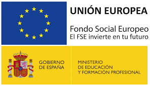

# Mòdul Llenguatges de Marques i Sistemes de Gestió d’Informació

Durada total: **128 hores**.
Component formatiu: **0373 – Llenguatges de Marques i SGI**

{: .text-center }

**Cofinançat pel Fons Social Europeu**

## Resultats d'Aprenentatge

**RA1. Reconeixement de llenguatges de marques**

* Identificar què són els llenguatges de marques (HTML, XML, JSON), la seua estructura i principals usos.

**RA2. Llenguatges de marques en entorns web**

* Crear i utilitzar documents HTML/XHTML i aplicar CSS per a la presentació en pàgines web.

**RA3. Sindicació i compartició de continguts**

* Treballar amb RSS/Atom per distribuir informació i conéixer alternatives actuals (APIs REST/JSON Feed).

**RA4. Esquemes i validació en XML**

* Definir i validar documents amb DTD i XML Schema; introducció a JSON Schema com a paral·lel modern.

**RA5. Conversió i transformació de documents**

* Adaptar i transformar XML amb XSLT i altres tècniques per generar diferents formats de sortida.

**RA6. Emmagatzematge i consulta d’informació**

* Guardar i consultar informació estructurada amb XML (XPath/XQuery) i formats d’intercanvi com JSON.

**RA7. Sistemes de gestió empresarial**

* Conéixer i usar ERP/CRM per a la gestió d’informació i la integració de dades en l’empresa.

---

En resum, **aprendrem a crear, transformar, validar i consumir documents basats en llenguatges de marques (HTML, XML, JSON), i a integrar-los en aplicacions i sistemes de gestió d’informació del món real.**

---

## Criteris de qualificació

Per a superar el mòdul cal obtindre una nota mínima de **5 sobre 10** en cadascun dels resultats d’aprenentatge (RA1, RA2, RA3, RA4, RA5, RA6 i RA7).

L’avaluació de cada RA es farà mitjançant **activitats pràctiques** i un **examen teòric-pràctic final**.

* Les pràctiques, projectes i treballs es qualificaran com **apte** o **no apte**.
* Els exàmens seran **escrits** i de tipus **teòric i pràctic**, i determinaran la nota de cada RA.

L’alumnat disposarà de **dues convocatòries** per superar el mòdul:

* **Primera convocatòria**: avaluació contínua.
* **Segona convocatòria**: avaluació extraordinària dels **RA no superats**.

### Procés de recuperació

No hi haurà recuperacions parcials durant el curs. Al final de curs es realitzarà un **examen específic per a cada RA pendent**.

En cas de perdre el dret a l’avaluació contínua, l’alumnat haurà de presentar-se a **tots els RA** en la convocatòria ordinària. Si tampoc els supera, haurà de presentar-se a la convocatòria extraordinària.

---

## Assistència i justificació d’absències

* Les faltes d’assistència només es podran justificar amb documents oficials presentats per escrit.
* L’alumnat pot faltar un màxim del **15% de les hores totals del mòdul**. Si supera aquest límit, **perdrà el dret a l’avaluació contínua** i haurà de presentar-se a tots els RA en la convocatòria ordinària.
* Si les faltes acumulades superen el **15% de les hores totals del cicle formatiu**, l’alumnat causarà **baixa automàtica**.

---

