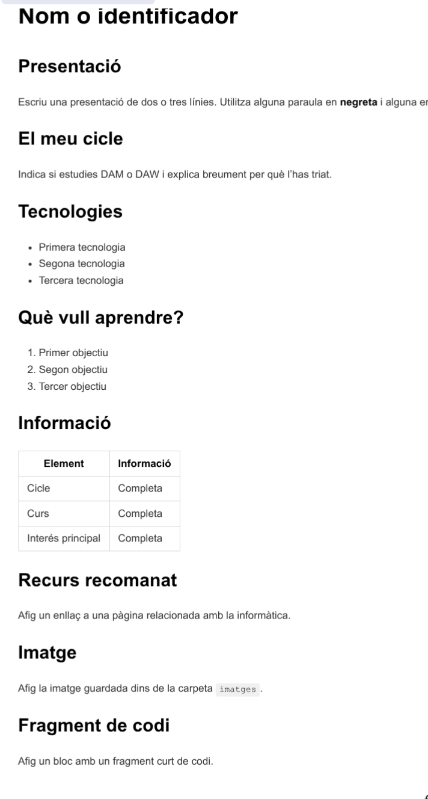

## REPTE 3 — LA TEUA PRIMERA PÀGINA EN MARKDOWN

### OBJECTIU

Crearàs una pàgina de presentació personal utilitzant Markdown.

El document s’anomenarà:

```text
README.md
```

---

### CAIXA D’EINES — MARKDOWN

En els requadres apareix exactament el que has d’escriure.

#### Títols

```markdown
# Títol principal
## Apartat
### Subapartat
```

* `#` crea el títol principal.
* `##` crea un apartat.
* `###` crea un subapartat.
* Deixa sempre un espai després de `#`.

#### Negreta i cursiva

```markdown
**Text en negreta**
*Text en cursiva*
```

#### Llistes

```markdown
- Java
- Python
- JavaScript
```

Per crear una llista numerada:

```markdown
1. Aprendre programació
2. Crear aplicacions
3. Treballar en equip
```

#### Enllaços

```markdown
[Visitar GitHub](https://github.com)
```

* Entre `[ ]` s’escriu el text visible.
* Entre `( )` s’escriu l’adreça web.

#### Imatges

```markdown

```

La imatge ha d’estar dins de la carpeta `imatges`:

```text
repte-3-markdown/
├── README.md
└── imatges/
    └── perfil.png
```

El nom i l’extensió de la imatge han de coincidir exactament amb els que apareixen en el document.

#### Codi

Per mostrar una instrucció curta:

```markdown
El document s’anomena `README.md`.
```

Per mostrar diverses línies:

````markdown
```python
print("Hola")
print("Soc estudiant de DAM")
```
````

Després dels tres accents greus pots indicar el llenguatge: `java`, `python`, `html`, `xml`, `javascript` o `text`.

#### Taules

```markdown
| Tecnologia | Coneixement |
|---|---|
| Java | Inicial |
| HTML | Bàsic |
| Git | Encara no l’he utilitzat |
```

* Les barres `|` separen les columnes.
* La línia `|---|---|` és obligatòria.

---

### EL REPTE

Crea una **pàgina digital de presentació com a estudiant de DAM o DAW**.

#### Pas 1. Prepara la carpeta

Crea esta estructura:

```text
repte-3-markdown/
├── README.md
└── imatges/
    └── la-teua-imatge.png
```

La imatge pot ser un avatar, una icona, un dibuix o una imatge relacionada amb la informàtica. No és necessari utilitzar una fotografia personal.

#### Pas 2. Completa el document

Crea el següent document en  `README.md`, però has de substituir les indicacions per la teua informació:



---


###  S’HA D’ENTREGAR

La carpeta completa:

```text
repte-3-markdown/
├── README.md
└── imatges/
    └── la-teua-imatge.png
```
