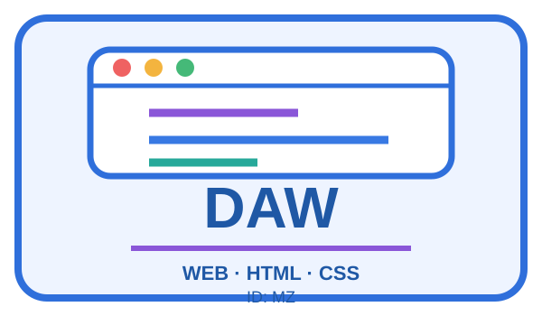

## REPTE 6 — CONSTRUEIX AMB MARQUES

### CAIXA D’EINES 6 — SVG

SVG significa **Scalable Vector Graphics**. És un llenguatge de marques que permet dibuixar gràfics amb etiquetes.

Un fitxer SVG necessita sempre un element principal `<svg>`. Les figures s’escriuen **dins** d’este element.

```xml
<svg xmlns="http://www.w3.org/2000/svg"
     width="600"
     height="350"
     viewBox="0 0 600 350">

    <!-- Les figures s’escriuen ací -->

</svg>
```

`width` i `height` indiquen la grandària de la imatge. `viewBox` definix el sistema de coordenades: en este cas, des de `0,0` fins a `600,350`.

> Tot el que dibuixem ha d’estar entre `<svg>` i `</svg>`.

---

### PREPARACIÓ

1. Crea en WebStorm un fitxer anomenat `prova.svg`.
2. Copia l’estructura anterior.
3. Guarda el fitxer.
4. Fes clic amb el botó dret sobre `prova.svg` i selecciona **Open In → Browser**.

Cada vegada que modifiques el codi:

**MODIFICA → GUARDA → ACTUALITZA EL NAVEGADOR → OBSERVA**

---

### MINIEXPERIMENT 1 — RECTANGLE

Afig abans de `</svg>`:

```xml
<rect
    x="50"
    y="50"
    width="220"
    height="120"
    fill="orange" />
```

Modifica **un atribut cada vegada**:

| Canvia   | Prova   | Observa                     |
| -------- | ------- | --------------------------- |
| `x`      | `150`   | Es desplaça horitzontalment |
| `y`      | `120`   | Es desplaça verticalment    |
| `width`  | `350`   | Canvia l’amplària           |
| `height` | `180`   | Canvia l’altura             |
| `fill`   | `green` | Canvia el color interior    |

Per arredonir les cantonades, afig:

```xml
rx="20"
```

---

### MINIEXPERIMENT 2 — CERCLE

Sense eliminar el rectangle, afig:

```xml
<circle
    cx="400"
    cy="110"
    r="60"
    fill="blue" />
```

Experimenta:

| Canvia | Prova    | Observa                       |
| ------ | -------- | ----------------------------- |
| `cx`   | `300`    | Mou el centre horitzontalment |
| `cy`   | `220`    | Mou el centre verticalment    |
| `r`    | `90`     | Canvia el radi                |
| `fill` | `purple` | Canvia el color interior      |

---

### MINIEXPERIMENT 3 — LÍNIA

Afig:

```xml
<line
    x1="80"
    y1="260"
    x2="500"
    y2="260"
    stroke="black"
    stroke-width="8" />
```

Experimenta:

| Canvia         | Prova         | Observa              |
| -------------- | ------------- | -------------------- |
| `x1`, `y1`     | Altres valors | Mou el primer extrem |
| `x2`, `y2`     | Altres valors | Mou el segon extrem  |
| `stroke`       | `red`         | Canvia el color      |
| `stroke-width` | `20`          | Canvia el grossor    |

---

### MINIEXPERIMENT 4 — TEXT

Afig:

```xml
<text
    x="300"
    y="325"
    text-anchor="middle"
    font-size="36"
    font-family="Arial"
    font-weight="bold"
    fill="black">
    DAM/DAW
</text>
```

Experimenta:

| Canvia      | Prova         | Observa             |
| ----------- | ------------- | ------------------- |
| `x`, `y`    | Altres valors | Mou el text         |
| `font-size` | `60`          | Canvia la grandària |
| `fill`      | `darkgreen`   | Canvia el color     |
| `DAM`       | `DAW`         | Canvia el contingut |

---

### MINIEXPERIMENT 5 — AGRUPAR ELEMENTS

L’etiqueta `<g>` permet agrupar diverses figures.

```xml
<g id="simbol-central">
    <circle cx="300" cy="150" r="70" fill="lightgreen" />
    <text x="300" y="165"
          text-anchor="middle"
          font-size="40">
        &lt;/&gt;
    </text>
</g>
```

---

### RESUM D’ETIQUETES I ATRIBUTS

| Element   | Etiqueta   | Atributs principals                              |
| --------- | ---------- | ------------------------------------------------ |
| Rectangle | `<rect>`   | `x`, `y`, `width`, `height`, `rx`, `fill`        |
| Cercle    | `<circle>` | `cx`, `cy`, `r`, `fill`                          |
| Línia     | `<line>`   | `x1`, `y1`, `x2`, `y2`, `stroke`, `stroke-width` |
| Text      | `<text>`   | `x`, `y`, `font-size`, `fill`, `text-anchor`     |
| Grup      | `<g>`      | `id`                                             |

---

## EL REPTE — TRANSFORMA UNA INSÍGNIA

No has de construir una insígnia des de zero.

Partiràs d’una **plantilla SVG que ja funciona** i la transformaràs modificant les seues marques i atributs.

Crea:

```text
insignia.svg
```

i copia esta plantilla:

```xml
<svg xmlns="http://www.w3.org/2000/svg"
     width="600"
     height="350"
     viewBox="0 0 600 350">

    <rect
        x="20"
        y="20"
        width="560"
        height="310"
        rx="30"
        fill="lightgray" />

    <g id="simbol">
        <circle
            cx="300"
            cy="130"
            r="70"
            fill="orange" />

        <line
            x1="250" y1="150"
            x2="300" y2="90"
            stroke="black"
            stroke-width="8" />

        <line
            x1="300" y1="90"
            x2="350" y2="150"
            stroke="black"
            stroke-width="8" />
    </g>

    <text
        x="300"
        y="245"
        text-anchor="middle"
        font-size="48"
        font-weight="bold"
        fill="black">
        DAM
    </text>

    <text
        x="300"
        y="295"
        text-anchor="middle"
        font-size="24"
        fill="black">
        ABC
    </text>

</svg>
```

Obri-la en el navegador.

A partir d’ara:

**CANVIA → GUARDA → ACTUALITZA → OBSERVA**

---

### 1. PERSONALITZA EL FONS

Modifica almenys:

* `fill`;
* `rx`;
* `width` o `height`.

Observa què controla cada atribut.

---

### 2. TRANSFORMA EL CERCLE

Modifica almenys:

* `cx` o `cy`;
* `r`;
* `fill`.

El cercle no ha de quedar igual que en la plantilla.

---

### 3. MODIFICA LES LÍNIES

Canvia:

* alguna coordenada;
* `stroke`;
* `stroke-width`.

Intenta crear una forma diferent amb les dues línies.

---

### 4. PERSONALITZA ELS TEXTOS

Canvia:

```text
DAM
```

per `DAM` o `DAW`, segons el teu cicle.

Substituïx:

```text
ABC
```

per les teues inicials o un identificador.

Modifica també algun atribut com:

`font-size` · `fill` · `x` · `y`

---

### 5. AFIG DOS ELEMENTS

Copia i adapta **dos elements nous**.

Pots utilitzar:

```xml
<rect ... />
<circle ... />
<line ... />
```

Canvia els seus atributs perquè formen part del teu disseny.

No han de quedar damunt exactament dels elements originals.

---

### MODELS ORIENTATIUS

Els models següents mostren possibles resultats.

**No has de reproduir-los.** Servixen únicament per veure fins on es pot transformar la plantilla combinant formes senzilles.


---

### FINS ON POTS ARRIBAR?

#### NIVELL MÍNIM

* Canviar els colors.
* Modificar el cercle.
* Modificar les línies.
* Posar `DAM` o `DAW`.
* Posar les teues inicials o identificador.

#### NIVELL COMPLET

A més:

* afegir dos elements;
* crear algun símbol relacionat amb la informàtica;
* utilitzar almenys tres colors;
* aconseguir que el resultat siga clarament diferent de la plantilla inicial.

#### NIVELL AVANÇAT

A més:

* redistribuir els elements;
* crear nous grups `<g>`;
* afegir més figures o textos;
* transformar completament la plantilla en una insígnia pròpia.

---

### EXPLICA QUÈ HAS FET

Completa una taula breu:

| Element          | Què he modificat? | Quin efecte ha tingut?       |
| ---------------- | ----------------- | ---------------------------- |
| Rectangle        | `fill`            | Ha canviat el color del fons |
| Cercle           | `r`               | Ha canviat la mida           |
| Línia            | `stroke-width`    | Ha canviat el grossor        |
| Text             | `font-size`       | Ha canviat la grandària      |
| Un element propi | ...               | ...                          |

---

### PRODUCTE

Entrega:

```text
insignia.svg
```

i la taula:

**ELEMENT → QUÈ HE MODIFICAT → QUIN EFECTE HA TINGUT**


exemple:

