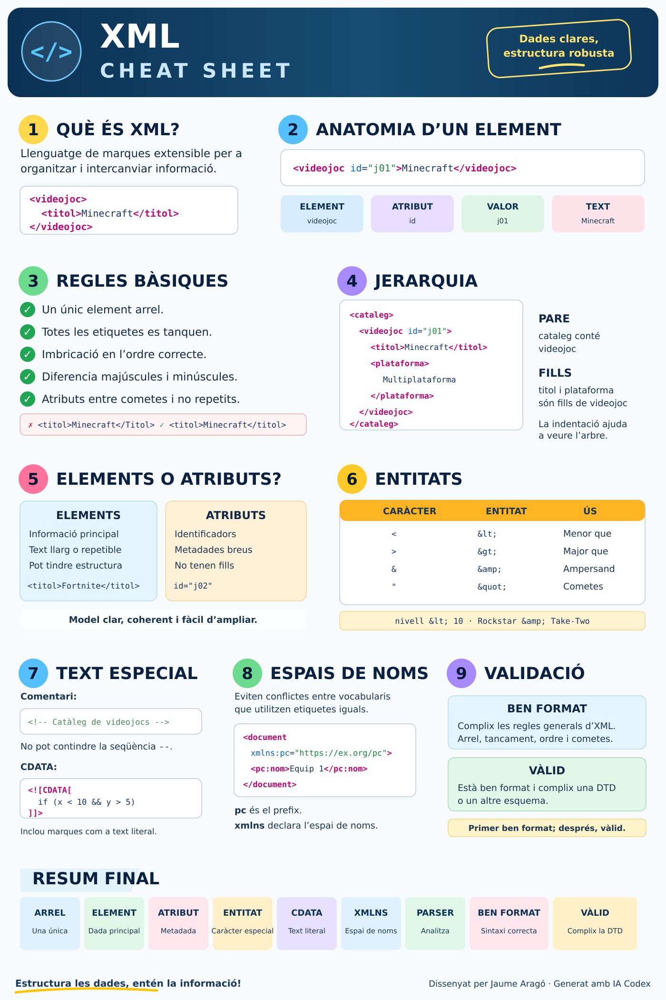

---

title: Resum d'XML
parent: 1.1.- XML - Definició, estructura i regles bàsiques
nav_order: 2
---

# Resum d’XML

XML és un llenguatge de marques que permet guardar, organitzar i intercanviar informació de manera estructurada.

Les sigles XML corresponen a:

**eXtensible Markup Language**

XML és extensible perquè no proporciona una llista tancada d’etiquetes. Cada document pot definir les etiquetes que necessita segons la informació representada.

```xml
<videojoc>
    <titol>Minecraft</titol>
    <plataforma>Multiplataforma</plataforma>
</videojoc>
```

XML no és un llenguatge de programació i tampoc definix necessàriament com es mostra la informació. La seua funció principal és descriure què representa cada dada.

## 1. Estructura d’un document XML

Un document XML es guarda habitualment en un fitxer amb extensió `.xml`.

```xml
<?xml version="1.0" encoding="UTF-8"?>

<cataleg>
    <videojoc id="j01">
        <titol>Minecraft</titol>
        <plataforma>Multiplataforma</plataforma>
    </videojoc>
</cataleg>
```

### Parts principals

| Part | Exemple | Funció |
|---|---|---|
| Declaració | `<?xml version="1.0" encoding="UTF-8"?>` | Indica la versió i la codificació |
| Element arrel | `<cataleg>...</cataleg>` | Conté la resta del document |
| Etiqueta d’obertura | `<titol>` | Indica l’inici d’un element |
| Etiqueta de tancament | `</titol>` | Indica el final d’un element |
| Element | `<titol>Minecraft</titol>` | Agrupa les etiquetes i el contingut |
| Text | `Minecraft` | Contingut de l’element |
| Atribut | `id="j01"` | Afig informació a un element |
| Element buit | `<imatge/>` | Element sense contingut |

### Estructura jeràrquica

Els elements XML formen una estructura en arbre.

- `cataleg`
  - `videojoc`
    - `titol`
    - `plataforma`

En esta estructura:

- `<cataleg>` és el pare de `<videojoc>`;
- `<videojoc>` és fill de `<cataleg>`;
- `<titol>` i `<plataforma>` són germans;
- la indentació facilita la lectura, però no crea la jerarquia.

## 2. Regles d’un document ben format

Un document XML està ben format quan complix les regles sintàctiques del llenguatge.

### Una única arrel

Incorrecte:

```xml
<videojoc>Minecraft</videojoc>
<videojoc>Fortnite</videojoc>
```

Correcte:

```xml
<cataleg>
    <videojoc>Minecraft</videojoc>
    <videojoc>Fortnite</videojoc>
</cataleg>
```

### Totes les etiquetes s’han de tancar

```xml
<titol>Minecraft</titol>
```

### Imbricació correcta

Incorrecte:

```xml
<videojoc><titol>Minecraft</videojoc></titol>
```

Correcte:

```xml
<videojoc><titol>Minecraft</titol></videojoc>
```

### Majúscules i minúscules

XML diferencia entre majúscules i minúscules.

```xml
<titol>Minecraft</titol>
```

No es pot tancar amb:

```xml
</Titol>
```

### Noms correctes

Els noms:

- no poden contindre espais;
- no poden començar amb una xifra;
- no han de començar per `xml`;
- han de ser clars i descriptius.

En els documents del curs s’utilitzaran preferentment noms en minúscules, sense accents i amb `_` per separar paraules.

```xml
<sistema_operatiu>LliureX</sistema_operatiu>
```

### Atributs entre cometes i sense repeticions

Correcte:

```xml
<videojoc id="j01" disponible="si">
```

Incorrecte:

```xml
<videojoc id=j01 id="j02">
```

## 3. Elements i atributs

Els elements representen normalment la informació principal.

```xml
<videojoc>
    <titol>Mario Kart 8 Deluxe</titol>
    <plataforma>Nintendo Switch</plataforma>
</videojoc>
```

Els atributs solen representar identificadors, classificacions o metadades breus.

```xml
<videojoc id="j03" disponible="si">
    <titol>Mario Kart 8 Deluxe</titol>
</videojoc>
```

També es poden combinar:

```xml
<preu moneda="EUR">49.99</preu>
```

| Elements | Atributs |
|---|---|
| Informació principal | Identificadors i metadades |
| Poden repetir-se | Un nom d’atribut no es pot repetir |
| Poden contindre altres elements | No poden contindre estructura interna |
| Adequats per a textos llargs | Adequats per a valors breus |

No sempre existix una única solució correcta. El model ha de ser coherent, clar i fàcil d’ampliar.

## 4. Text i continguts especials

### Entitats predefinides

Alguns caràcters tenen un significat especial en XML.

| Caràcter | Entitat |
|---|---|
| `<` | `&lt;` |
| `>` | `&gt;` |
| `&` | `&amp;` |
| `"` | `&quot;` |
| `'` | `&apos;` |

```xml
<condicio>nivell &lt; 10</condicio>
<empresa>Rockstar &amp; Take-Two</empresa>
```

### Comentaris

```xml
<!-- Catàleg de videojocs -->
```

Els comentaris:

- comencen amb `<!--`;
- acaben amb `-->`;
- no poden contindre `--`;
- no es poden situar dins d’una etiqueta.

### Seccions CDATA

CDATA permet incloure text amb molts caràcters especials sense substituir-los per entitats.

```xml
<codi><![CDATA[
if (nivell < 10 && punts > 100) {
    System.out.println("Puja de nivell");
}
]]></codi>
```

Una secció CDATA no pot contindre la seqüència `]]>`.

## 5. Espais de noms

Els espais de noms eviten conflictes quan un document combina vocabularis diferents.

```xml
<document
    xmlns:centre="https://exemple.org/centre"
    xmlns:pc="https://exemple.org/ordinadors">

    <centre:nom>IES Benigasló</centre:nom>
    <pc:nom>Equip aula 1</pc:nom>
</document>
```

En este exemple:

- `centre` i `pc` són prefixos;
- `nom` és el nom local;
- els URI identifiquen els vocabularis;
- tots els prefixos utilitzats han d’estar declarats.

### Espai de noms per defecte

```xml
<cataleg xmlns="https://exemple.org/videojocs">
    <videojoc>
        <titol>Minecraft</titol>
    </videojoc>
</cataleg>
```

L’espai de noms per defecte s’aplica als elements sense prefix, però no als atributs sense prefix.

SVG utilitza este espai de noms:

```xml
<svg xmlns="http://www.w3.org/2000/svg">
</svg>
```

## 6. Ben format i vàlid

Un analitzador XML o *parser* llig el document i pot detectar errors com:

- etiquetes sense tancar;
- imbricació incorrecta;
- més d’un element arrel;
- atributs sense cometes;
- atributs repetits;
- prefixos no declarats.

### Document ben format

Complix les regles generals d’XML.

```xml
<videojoc>
    <titol>Minecraft</titol>
</videojoc>
```

### Document vàlid

A més d’estar ben format, complix unes regles definides en una DTD o un altre esquema.

Per exemple, una DTD podria establir que `<videojoc>` ha de contindre obligatòriament:

1. `<titol>`;
2. `<plataforma>`;
3. `<genere>`.

> **Idea clau**
>
> Primer es comprova si el document està ben format. Després es comprova si és vàlid respecte d’unes regles.

## 7. Comprovació final

- [ ] El fitxer té extensió `.xml`.
- [ ] La declaració XML està al principi.
- [ ] El document està guardat en UTF-8.
- [ ] Hi ha un únic element arrel.
- [ ] Totes les etiquetes estan tancades.
- [ ] Les etiquetes estan correctament imbricades.
- [ ] Coincidixen les majúscules i les minúscules.
- [ ] Els noms no contenen espais ni comencen amb una xifra.
- [ ] Els atributs apareixen en l’etiqueta d’obertura.
- [ ] Els valors dels atributs estan entre cometes.
- [ ] No hi ha atributs repetits.
- [ ] Els caràcters especials estan representats correctament.
- [ ] Els prefixos dels espais de noms estan declarats.
- [ ] La indentació permet entendre la jerarquia.

---



*Dissenyat per Jaume Aragó · Generat amb IA Codex*
