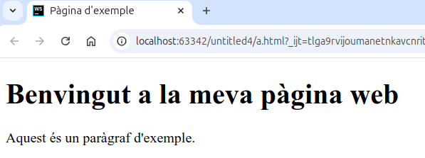

# Definició de documents HTML

HTML es un estàndard del World Wide Web Consortium (W3C), és un llenguatge dissenyat per publicar  informació de forma global a través de la web.
Pensat per compartir documents de manera que es vegin de forma semblant en diferents navegadors i sistemes operatius.
Com a principals característiques d’HTML trobem:

- Té número d'etiquetes limitat.
- Cada etiqueta està pensada per representar documents d'una forma determinada o per marcar-ne l'estructura.
- HTML descriu l'estructura d'una pàgina web.
- HTML consta d'una sèrie d'elements que li diuen al navegador com mostrar el contingut.
- Els elements HTML etiqueten parts de contingut com "això és un encapçalat", "això és un paràgraf", "això és un enllaç", etc.
- 	Amb els atributs afegim informació addicional.
- Es pot afegir format amb atributs, etiquetes d'estil i fulles CSS.

## structura básica HTML:

Tot document HTML ha de tindre 3 elements: Declaració, Capçalera  o <head> i cos del document o <body>
    
 ```html

<!DOCTYPE html>

    <head>     
        <title> Titol </title>    
    </head>

    <body>    
        <p>Aci va el contingut.</p>
    </body>

</html>
```
On:
- La delaració `<!DOCTYPE html>`: Indica al navegador que el document és HTML5.
- L’element `<html>` és l’element arrel d’una pàgina HTML
- `<head>`: Dóna metainformació sobre la pàgina i en general de tot el que no es veu. Com a mínim ha de contenir un `<title>`.
  
- `<title>`: Defineix el títol de la pàgina que es mostra en la barra de títol del navegador.
- `<body>` Conté el contingut de la pàgina web. (El cos del document), es a dir, tot allò que es veu al navegador.

## Exemple de document HTML

```html 
<!DOCTYPE html>
<html>
    <head>
        <title>Pàgina d'exemple</title>
    </head>
    <body>
        <h1>Benvingut a la meva pàgina web</h1>
        <p>Aquest és un paràgraf d'exemple.</p>
    </body>
</html>
```
En el navegador es veuria així:

--- 
{: .text-center }

---


