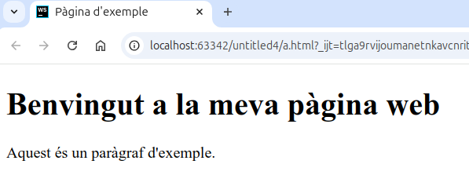

---

title:  2.1.- Estructura d'un document HTML
parent: 2.- HTML
grand_parent: Llenguatges de Marques
has_children: true
layout: default
nav_order: 10

---


# 1.- Definició de documents HTML

HTML és un estàndard del World Wide Web Consortium (W3C), dissenyat per publicar informació de manera accessible a través de la web, amb un comportament uniforme en diferents navegadors i sistemes operatius.

### Característiques principals d'HTML:

- Té un conjunt limitat d'etiquetes pensades per estructurar documents i donar-los format.
- HTML descriu l'estructura d'una pàgina web.
- Els elements HTML etiqueten parts de contingut com "això és un encapçalament", "això és un paràgraf", "això és un enllaç", etc.
- Els atributs permeten afegir informació addicional a les etiquetes.
- És possible afegir format amb atributs, etiquetes d'estil, i fulls CSS.


### Estructura básica HTML:

Tot document HTML ha de tenir tres elements principals:

1. **Declaració: `<!DOCTYPE html>`**, indica al navegador que està treballant amb HTML5.
2. **Capçalera (`<head>`)**: Defineix informació sobre el document, com el títol i els enllaços a fulls d'estil.
3. **Cos (`<body>`)**: Conté el contingut visible de la pàgina, com text, imatges i enllaços. 

     

## Exemple de document HTML

```html 
<!DOCTYPE html>
<html>
    <head>
        <title>Pàgina d'exemple</title>
    </head>
    <body>
        <h1>Benvingut a la meva pàgina web</h1>
        <p>Aquest és un paràgraf d'exemple.</p>
    </body>
</html>
```

On:
- La delaració **`<!DOCTYPE html>`**: Indica al navegador que el document és HTML5.
- L’element **`<html>`** és l’element arrel d’una pàgina HTML
- **`<head>`**: Dóna metainformació sobre la pàgina i en general de tot el que no es veu. Com a mínim ha de contenir un `<title>`.
  
- **`<title>`**: Defineix el títol de la pàgina que es mostra en la barra de títol del navegador.
- **`<body>`** Conté el contingut de la pàgina web. (El cos del document), es a dir, tot allò que es veu al navegador.
- Tabé conté un encapçalament especial **`<h1>`** i un paràgraf **`<p>`**.

En el navegador es veuria així:

--- 
{: .text-center }


---


## Etiquetes bàsiques i d'Estil en HTML
Tots els elements s’escriuen amb un inici d'etiqueta i amb un final d'etiqueta, el contingut el posem entre l’inici i el fi.

--- 
{: .text-center }


--- 


### Etiquetes Bàsiques 

- `<h1>` a `<h6>`: Defineixen capçaleres de diferents nivells, de `<h1>` com a capçalera principal a `<h6>` com la de nivell més baix.
- `<p>`: Crea un paràgraf de text.
- `<hr>`: Insereix una línia horitzontal per separar contingut.
- `<br>`: Afegeix un salt de línia dins del text.
- `<pre>`: Mostra text preformatat, respectant espais i salts de línia.

### Atributs de Disseny per Estilitzar Elements

- `style`: Atribut utilitzat per aplicar estils CSS directament sobre elements HTML.
    - `background-color`: Defineix el color de fons d’un element.
    - `color`: Estableix el color del text dins de l’element.
    - `font-family`: Selecciona la font de text.
    - `font-size`: Especifica la mida del text.
    - `text-align`: Alinea el text dins de l’element (esquerra, dreta, centre, justificar).

Per exemple:

```html
<!DOCTYPE html>
<html lang="ca">
<head>
    <meta charset="UTF-8">
    <meta name="viewport" content="width=device-width, initial-scale=1.0">
    <title>Exemple d'Etiquetes i Estils</title>
</head>
<body>

    <!-- Títol principal amb capçalera -->
    <h1 style="color: #2c3e50; text-align: center;">Benvinguts al meu lloc web</h1>

    <!-- Paràgraf amb estil de fons i color de text -->
    <p style="background-color: #ecf0f1; color: #34495e; font-size: 18px; font-family: Arial, sans-serif;">
        Aquest és un exemple de paràgraf amb estil. Aquí podem veure com aplicar un color de fons, color de text, mida de font i una font específica.
    </p>

    <!-- Línia horitzontal per separar seccions -->
    <hr>

    <!-- Capçalera de segon nivell -->
    <h2 style="text-align: left;">Sobre Nosaltres</h2>

    <!-- Paràgraf amb salt de línia -->
    <p style="font-size: 16px;">
        Som un equip dedicat a <br> oferir serveis d’alta qualitat. El nostre objectiu és satisfer els nostres clients. 
    </p>

    <!-- Text preformatat -->
    <pre style="background-color: #f7f9fa; padding: 10px;">
        Aquest text apareix exactament com s'escriu,
        respectant els espais i els salts de línia.
    </pre>

</body>
</html>
```

En el navegador es mostraria així:

--- 
{: .text-center }


---
**On:**
- `<h1>` i `<h2>` defineixen capçaleres amb diferent importància.
- `<p>` crea paràgrafs amb estils que inclouen color de fons, color de text, font i alineació.
- `<hr>` insereix una línia horitzontal per separar seccions.
- `<br>` s'utilitza dins d'un paràgraf per afegir un salt de línia.
- `<pre>` mostra text preformatat, mantenint la seva estructura original de salts de línia i espais.