---

title:  2.3.- Cos del document - BODY
parent: 2.- HTML
grand_parent: Llenguatges de Marques
has_children: true
layout: default
nav_order: 30
has_toc: true
toc_max_heading_level: 2


---

# Cos del document `<body> </body>` 

La secció `<body>` és on es col·loca el contingut visible d’una pàgina. Inclou elements com **capçaleres**, **paràgrafs**, **imatges** i **enllaços**.

* Table of contents
{:toc}


## Capçaleres

HTML defineix 6 nivells de capçaleres: `<h1>` a `<h6>`

```html
<body>

    <h1> Nivell 1 - Títol Principal </h1>
    <h2> Nivell 2 - Subtítol </h2>
    <h3> Nivell 3 - Altres Títol </h3>
    <h4> Nivell 4 - Títol Menor </h4>
    <h5> Nivell 5 - Encara Menys </h5>
    <h6> Nivell 6 - L'Últim Títol </h6> 

</body>
```
---
{: .text-center }
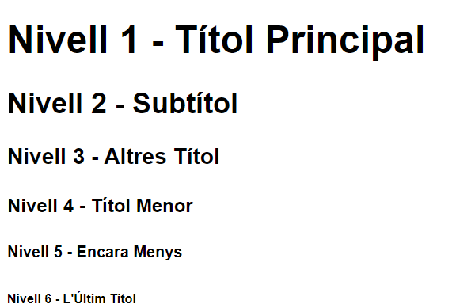

---

## Paràgrafs

`<p>` per a definir els paràgrafs    

`<br>` per a fer salts de línia 

## Formats

Aquí tens el text amb la descripció de cada etiqueta HTML:

- `<b>` - Text en **negreta**
- `<strong>` - Text **important**
- `<i>` - Text en *cursiva*
- `<em>` - Text *emfatitzat*
- `<mark>` - Text **marcat**
- `<small>` - Text més *xicotet*
- `<del>` - Text ~~eliminat~~
- `<ins>` - Text **subratllat**
- `<sub>` - Text en subíndex,  o X₂
- `<sup>` - Text en superíndex, o X²

   
    
**Al navegador es mostraria:**


{: .text-center }
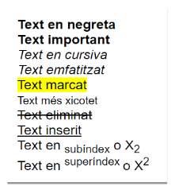


---

**La diferència entre `<b>` i `<strong>`:**
- `<b>`: Indica que el text ha de ser representat en **negreta**.
- `<strong>`: Posa el text en **negreta** i el marca com a important des del punt de vista del contingut i l'estructura del document. 
Aquesta etiqueta s'utilitza per donar importància semàntica i pot ser utilitzada per motors de cerca i tecnologies d'accessibilitat.

---

**La diferència entre `<i>` i `<em>`:**
- `<i>`: Indica que el text ha de ser representat en **cursiva**.
- `<em>`: S’utilitza per indicar que el text ha de ser **emfatitzat** per raons semàntiques, donant una indicació al navegador i altres agents de processament que aquesta part del text té un pes semàntic addicional. Això pot ser útil per a motors de cerca, llocs web d'accessibilitat i altres tecnologies que interpreten la informació continguda en una pàgina web.

---


**Exemple:**


```html
<!DOCTYPE html>
<html lang="ca">
<head>
    <meta charset="UTF-8">
    <title>Exemple de Text Formatat</title>
</head>
<body>
    <p>Aquest text té una paraula <em>emfatitzada</em>, <br> una altra <strong>destacada</strong>, i una <b>en negreta</b>.</p>
    <p>Segon paràgraf amb més text i <br> un <mark>salt</mark> de línia.</p>
</body>
</html>

```

### En el codi anterior:
- `<em>` emfatitza la paraula fent-la **cursiva**.
- `<strong>` destaca la paraula en **negreta** i aporta importància semàntica.
- `<b>` aplica **negreta** sense importància semàntica.
- `<mark>` ressalta el text amb un fons destacat (normalment groc).
- `<br>` insereix un salt de línia dins del paràgraf. 


## Citacions

Les etiquetes `<blockquote>`, `<q>` i `<cite>` són utilitzades per gestionar citacions i indicar l’origen del contingut citat:


```html
<!DOCTYPE html>
<html lang="ca">
<head>
    <meta charset="UTF-8">
    <title>Exemple de citacions</title>
</head>
<body>

<h1>Exemple de citacions en HTML</h1>

<!-- Exemple de bloc de citació amb blockquote -->
<blockquote>
    "La ciència mai resol un problema sense crear-ne deu més."
    <cite>— George Bernard Shaw</cite>
</blockquote>

<p>
    Durant una entrevista, el científic va dir: 
    <q>La investigació és essencial per al progrés humà.</q> 
    Aquesta frase reflecteix la seva creença profunda en el valor de la ciència.
</p>

</body>
</html>
```

**Al navegador es mostraria així:**

{: .text-center }
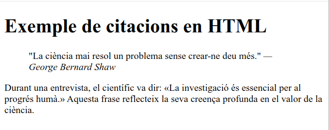

### Explicació:


1. **`<blockquote>`**:
   - **Funció**: S'utilitza per a crear blocs de citació o per citar un text llarg.
   - **Visualització**: És un element de bloc, de manera que ocupa tota l'amplada disponible i normalment introdueix un salt de línia abans i després. Sovint, els navegadors l'estilen amb una indentació per indicar que és una citació.
   - **Ús**: És ideal per a citacions llargues o paràgrafs de text que representen una cita extensa.

2. **`<q>`**:
   - **Funció**: S'utilitza per a cites breus dins d'un paràgraf de text.
   - **Visualització**: És un element en línia (inline), el que significa que no introdueix salts de línia abans ni després del contingut. Els navegadors solen afegir cometes automàticament al voltant del text dins de `<q>`.
   - **Ús**: Ideal per a cites curtes dins d'un paràgraf o una frase.

3. **`<cite>`**:
   - **Funció**: S'utilitza per indicar la font d'una citació o el títol d'una obra (com un llibre, article, etc.) i, en alguns casos, el nom de l'autor.
   - **Visualització**: És un element en línia i sovint es mostra en cursiva per defecte, encara que no tots els navegadors ho fan automàticament.
   - **Ús**: Ideal per citar l'origen d'una frase o obra. Pot anar dins d'un `<blockquote>` o d'un `<q>` per donar context a la citació.

### EnResum 

| Etiqueta        | Tipus         | Ús principal                             | Estil per defecte                  |
|-----------------|---------------|------------------------------------------|------------------------------------|
| `<blockquote>`  | Bloc          | Citacions llargues o paràgrafs citats    | Indentació i salt de línia         |
| `<q>`           | En línia      | Cites curtes dins de text                | Cometes automàtiques               |
| `<cite>`        | En línia      | Indicar font o autor de la citació       | Cursiva (en alguns navegadors)     |

## Abreviacions i Definicions

Les etiquetes `<abbr>` i `<dfn>` són utilitzades per indicar abreviacions i definicions respectivament.

```html

<body>
<blockquote><p>La <q>citació en bloc</q> pot ser utilitzada per ressaltar información
    important.</p>
    <p>Aquesta citació és de <cite>Pere Gil</cite>.</p></blockquote>
<p>En un document acadèmic, pot ser útil definir acrònims.
    Per exemple, <abbr title="World Wide Web Consortium">W3C</abbr> estableix estàndards web.
</p>

<p><dfn title="Un sistema d'operació de codi obert">Linux</dfn> és conegut per la seva estabilitat.</p>


</body>

```

{: .text-center }
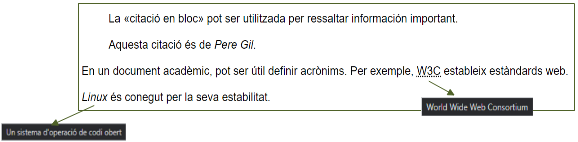


## Text Preformatat


Disposem d'eines en HTML per **evitar que s'aplique format al text** i mantenir la seva estructura original. Aquestes etiquetes són molt útils per **mostrar codi o text que requereix una alineació específica**.

- **`<pre>`**: Conserva tots els **espais i salts de línia tal com es troben en el codi HTML**. A més, el text dins d’un `<pre>` té una mida de lletra fixa, i **no s'ajusta automàticament al marge**.
  
- **`<code>`**: Utilitzem esta etiquetaper **marcar fragments de codi dins d'un text**, mantenint l'estructura i presentació original del codi. És habitual utilitzar `<code>` dins d'un `<pre>` per mostrar codi formatat.

### Exemple en HTML

```html
<body>

<pre>
    Aquest és un exemple
    de text preformatat.
    Les línies es mostraran
    tal com s'han escrit.
</pre>
<p>
    A continuació, es mostra un bloc de codi en Java preformatat:
</p>

<pre>
    <code>
        public class HelloWorld {
           public static void main(String[] args) {
              System.out.println("Hola, món!");
           }
        }
    </code>
</pre>


<p>El codi anterior és un senzill exemple d'un programa "Hola, món!" en Java.    
</p>

</body>

```
**L'eixida en el navegador seria:**
---
{: .text-center }
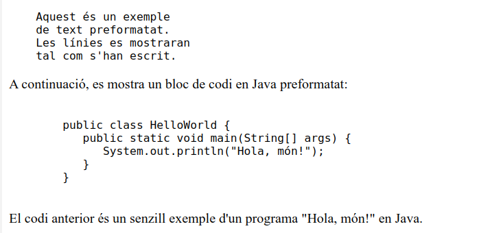

---


### A l'exemple anterior:

- El primer bloc `<pre>` conté text preformatat. Cada espai i salt de línia es mostren exactament tal com estan escrits dins del codi HTML.
- El segon bloc utilitza `<pre><code>` per mostrar un exemple de codi en Java. La combinació de `<pre>` i `<code>` permet que el codi es mostre amb espais conservats i en una font de mida fixa, fent-lo més llegible.

### Ús combinat de `<pre>` i `<code>`
En alguns casos, és preferible combinar `<pre>' i ''<code>` per mostrar el codi d'una manera estructurada i formatada correctament. Si sol utilizem `<code>` el codi java de l'exemple anterior apareixeria tot en una linea.

---
{: .text-center }
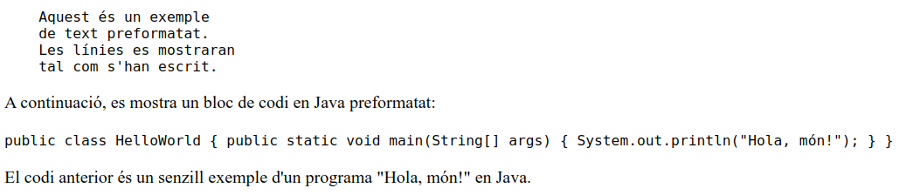

---


## Llistes d'Elements


### Correcció i Ampliació

Les etiquetes per a **crear llistes HTML** permeten estructurar el contingut en **formats ordenats i desordenats**, així com c**rear llistes de descripció** per representar termes amb definicions.

- **Etiquetes Principals per a Llistes:**
    - `<ol>`: Crea una **llista ordenada**, en la qual els elements es numeren automàticament.
    - `<ul>`: Crea una **llista desordenada**, en la qual els elements es mostren amb punts o símbols.
    - `<li>`: **Defineix un element dins d'una llista**, ja sigui ordenada o desordenada.
    - `<dl>`: Defineix una llista de descripció, que conté termes amb les seves definicions.
    - `<dt>`: Defineix un terme dins d'una llista de descripció.
    - `<dd>`: Defineix la descripció d'un terme en una llista de descripció.

- **Atributs Comuns:**
    - `type` (per a `<ol>`): Permet definir el tipus de numeració (1, A, a, I, i).
    - `start` (per a `<ol>`): Especifica el número inicial en una llista ordenada.
    - `value` (per a `<li>` en llistes ordenades): Estableix un valor específic per a un element individual.

### Exemples en HTML

---
{: .text-center }


---

```html

    <!-- Exemple de Llista Ordenada -->
    <p><b>Llista Ordenada</b></p>
    <ol>
        <li>Element 1</li>
        <li>Element 2</li>
        <li>Element 3</li>
    </ol>
```
---
{: .text-center }
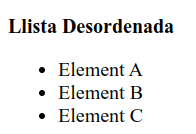

---

```html
    <!-- Exemple de Llista Desordenada -->
    <p><b>Llista Desordenada</b></p>
    <ul>
        <li>Element A</li>
        <li>Element B</li>
        <li>Element C</li>
    </ul>
```

---
{: .text-center }
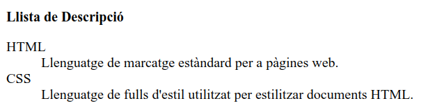

---


```html
    <!-- Exemple de Llista de Descripció -->
    <p><b>Llista de Descripció</b></p>
    <dl>
        <dt>HTML</dt>
        <dd>Llenguatge de marcatge estàndard per a pàgines web.</dd>
        <dt>CSS</dt>
        <dd>Llenguatge de fulls d'estil utilitzat per estilitzar documents HTML.</dd>
    </dl>
```

---
{: .text-center }
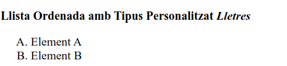

---

```html
    <!-- Llista Ordenada amb Tipus Personalitzat -->
    <p><b>Llista Ordenada amb Tipus Personalitzat <i> Lletres</i></b></p>
    <ol type="A">
        <li>Element A</li>
        <li>Element B</li>
    </ol>
```
---
{: .text-center }
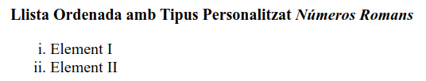

---


```html
    <p><b>Llista Ordenada amb Tipus Personalitzat <i> Números Romans</i></b></p>
    <ol type="i">
        <li>Element I</li>
        <li>Element II</li>
    </ol>
```

---
{: .text-center }
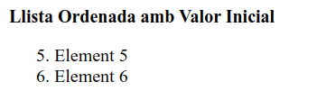

---

```html

    <!-- Llista Ordenada amb Valor Inicial -->
    <p><b>Llista Ordenada amb Valor Inicial</b></p>
    <ol start="5">
        <li>Element 5</li>
        <li>Element 6</li>
    </ol>
```

---
{: .text-center }
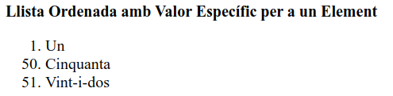

---


```html

    <!-- Llista Ordenada amb Valor Específic per a un Element -->
    <p><b>Llista Ordenada amb Valor Específic per a un Element</b></p>
    <ol>
        <li>Un</li>
        <li value="50">Cinquanta</li>
        <li>Vint-i-dos</li>
    </ol>

```


### Consideracions sobre les llistes

- **Ús Semàntic de les Llistes:** Quan es dissenyen interfícies web, és **recomanable utilitzar llistes per agrupar continguts relacionats**, com menús o punts clau, per millorar la llegibilitat i l’accessibilitat.
- **Llistes Imbricades:** És possible crear llistes imbricades **(llistes dins de llistes)** per representar estructures jeràrquiques de contingut.
- **Atributs HTML5:** En HTML5, els atributs com `type`, `start`, i `value` són vàlids, però **es recomana utilitzar CSS** per a personalitzacions d’estil en lloc d'aquests atributs quan sigui possible.


## Taules


Les taules en HTML s’utilitzen per **estructurar i organitzar dades en format de files i columnes**, sent útils per mostrar informació tabular de manera clara i estructurada.

---
{: .text-center }
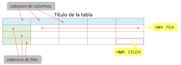

---

### Etiquetes per a Taules:

- `<table>`: Defineix una taula.
- `<caption>`: Proporciona un títol o llegenda per a la taula, generalment mostrada a sobre.
- `<tr>`: Defineix una fila dins de la taula.
- `<th>`: Defineix una cel·la d'encapçalament (capçalera) dins de la taula.
- `<td>`: Defineix una cel·la de dades dins de la taula.

**Exemple bàsic d’una taula:**
```html
<table border="1" width="250">
    <caption>Caption o Capçalera</caption>
    <tr>
        <th>Header 1</th>
        <th>Header 2</th>
    </tr>
    <tr>
        <td>Fila 1, Cel·la 1</td>
        <td>Fila 1, Cel·la 2</td>
    </tr>
    <tr>
        <td>Fila 2, Cel·la 1</td>
        <td>Fila 2, Cel·la 2</td>
    </tr>
</table>
```
---
{: .text-center }
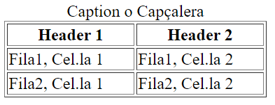

---


### Fusió de Cel·les amb `colspan` i `rowspan`

Podem unir (fusionar)  cel·les tant horitzontalment (**files**) com verticalment (**columnes**) amb els atributs `colspan` i `rowspan`.
"stos atributs s’utilitzen amb `<th>` (cel·la de encapçalament) i  `<td>` (cel·la de dades)  amb l’objectiu de fusionar les cel·les:

- **`colspan`**: Fusiona cel·les horitzontalment. Indica el número de columnes que ha d'ocupar la cel·la.
  ```html
  <td colspan="2">Aquesta cel·la ocupa dues columnes</td>
  <th colspan="3">Capçalera ampliada</th>
  ```
- **`rowspan`**: Fusiona cel·les verticalment. Indica el nombre de files que ha d'ocupar la cel·la.
  ```html
  <td rowspan="2">Aquesta cel·la ocupa dues files</td>
  <th rowspan="3">Capçalera ampliada</th>
  ```

**Exemple de Taula amb Fusió de Cel·les:**
```html
<table border="1" width="250">
    <caption>Exemple de Taula amb Fusió de Cel·les</caption>
    <tr>
        <th colspan="2">Capçalera Fusionada amb Colspan</th>
    </tr>
    <tr>
        <td rowspan="2">Fila 1 i Fila 2, Cel·la Fusionada amb Rowspan</td>
        <td>Fila 1, Cel·la 2</td>
    </tr>
    <tr>
        <td>Fila 2, Cel·la 2</td>
    </tr>
</table>
```

---
{: .text-center }
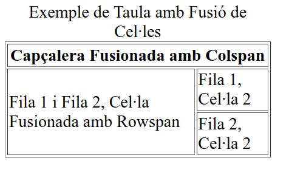

---

#### Divisió d'una Taula en Seccions

Les taules poden dividir-se en tres seccions amb `<thead>`, `<tfoot>` i `<tbody>`, millorant la llegibilitat i l'organització.

- **`<thead>`**: Conté les capçaleres de la taula (files i cel·les).
- **`<tfoot>`**: Conté els peus de taula. Aquesta secció ha d'aparèixer abans de `<tbody>` en l'estructura HTML.
- **`<tbody>`**: Conté el cos principal de la taula amb les dades. S'usa per separar les capçaleres i peus de taula del contingut principal.

**Exemple de Taula amb Seccions:**
```html
<table border="1">
    <thead>
        <tr>
            <th>Capçalera 1</th>
            <th>Capçalera 2</th>
        </tr>
    </thead>
    <tfoot>
        <tr>
            <td colspan="2">Peu de la Taula</td>
        </tr>
    </tfoot>
    <tbody>
        <tr>
            <td>Contingut 1</td>
            <td>Contingut 2</td>
        </tr>
        <tr>
            <td>Contingut 3</td>
            <td>Contingut 4</td>
        </tr>
    </tbody>
</table>
```

---
{: .text-center }
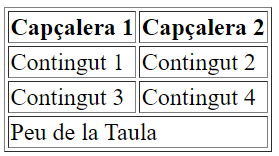

---


### Principals Atributs per a Taules

A continuació es detallen els atributs més comuns per donar estil i format a les taules.

- **`border`**: Estableix el grossor de les vores de la taula.
  ```html
  <table border="1">
  ```
- **`width`**: Defineix l'amplada de la taula en píxels o percentatge.
  ```html
  <table width="100%">
  ```
- **`cellpadding`**: Estableix l'espai interior de les cel·les respecte al seu contingut.
  ```html
  <table cellpadding="10">
  ```
- **`cellspacing`**: Defineix l'espai entre les cel·les de la taula.
  ```html
  <table cellspacing="5">
  ```
- **`summary`**: Proporciona una breu descripció del contingut de la taula per millorar l'accessibilitat.
  ```html
  <table summary="Descripció de la Taula">
  ```
- **`align`**: Alinea la taula respecte al seu context (left, right, center).
  ```html
  <table align="center">
  ```
- **`bgcolor`**: Estableix el color de fons de la taula.
  ```html
  <table bgcolor="#f2f2f2">
  ```
- **`bordercolor`**: Defineix el color de les vores de la taula.
  ```html
  <table bordercolor="#333333">
  ```
- **`class`**: Assigna una classe CSS a la taula per a estils addicionals.
  ```html
  <table class="taula-estil">
  ```
- **`id`**: Assigna un identificador únic a la taula.
  ```html
  <table id="taula-principal">
  ```

**Nota important**: Alguns dels anteriors atributs són considerats obsolets en HTML5 perquè controlen l'estil. És recomanable fer servir CSS per a la presentació per seguir les bones pràctiques modernes.


Aquí tens una revisió completa del document, amb una explicació millorada dels atributs de les imatges, diferències entre imatges de contingut i d'adornament, i un exemple complet:

---

## Imatges en HTML

HTML permet afegir imatges als documents amb l'etiqueta ``, que és essencial per a millorar l'aspecte visual i la transmissió d'informació en les pàgines web. 

Les imatges poden tenir funcions estètiques o de contingut informatiu, depenent de l'ús i la intenció.

### Estructura Bàsica de l'Element ``

L'etiqueta `` és un element en línia i auto-tancat. Els atributs principals per a inserir una imatge són:

```html

```

- **`src`**: Especifica la **ubicació o URL de l'arxiu d'imatge**. Pot ser una ruta relativa o absoluta.
- **`alt`**: Proporciona una **descripció alternativa per a la imatge.** Aquest text és fonamental per a l'accessibilitat i s'utilitza quan la imatge no es pot carregar.

### Classificació de les Imatges

Les imatges en una pàgina web es poden classificar en dos grans tipus:

1. **Imatges de Contingut**: 
   - Són imatges essencials per a la comprensió del contingut de la pàgina.
   - Aporten informació important que forma part del context i el missatge de la pàgina web.
   - Es col·loquen directament amb l'etiqueta `` i requereixen una descripció adequada en l'atribut `alt`.

2. **Imatges d'Adornament**: 
   - Són purament decoratives i no aporten informació essencial.
   - Normalment es carreguen mitjançant CSS com a part del disseny de la pàgina.
   - No necessiten descripció `alt`, ja que no són part de la informació central de la pàgina.

#### Exemples

**Imatge de Contingut (HTML):**
```html

```

Esta imatge forma part del contingut informatiu i inclou un text descriptiu en `alt` per a usuaris amb discapacitats visuals o quan la imatge no es carrega.

**Imatge d'Adornament (CSS):**
```html
<style>
.imatge-adornament {
    background-image: url('imatge_adornament.jpg');
    width: 100px;
    height: 100px;
}
</style>

<div class="imatge-adornament"></div>
```

La imatge és decorativa i es carrega mitjançant CSS. No inclou descripció, ja que el seu objectiu és només millorar l'estètica de la pàgina.

### Exemples Complets en HTML

Aquí tens un exemple complet que inclou tant una imatge de contingut amb `` com una imatge d'adornament carregada amb CSS:

```html
<!DOCTYPE html>
<html lang="ca">
<head>
    <meta charset="UTF-8">
    <title>Exemple d'Imatges en HTML</title>
    <style>
        /* Estil per a la imatge d'adornament */
        .imatge-adornament {
            background-image: url('imatge_adornament.jpg');
            width: 150px;
            height: 150px;
            border: 2px solid #ddd;
            margin: 20px;
            display: inline-block;
        }
    </style>
</head>
<body>

<h1>Exemple d'Imatges en HTML</h1>

<!-- Imatge de Contingut -->
<p>Aquesta és una imatge de contingut:</p>


<!-- Imatge d'Adornament -->
<p>Aquesta és una imatge d'adornament, carregada amb CSS:</p>
<div class="imatge-adornament"></div>

</body>
</html>
```

---
{: .text-center }
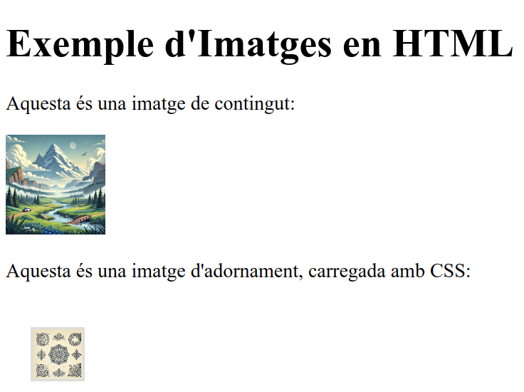

---


### Atributs Addicionals per a Imatges

- **`width` i `height`**: Defineixen l'amplada i altura de la imatge en píxels o percentatges.
- **`title`**: Mostra un text en passar el ratolí per damunt de la imatge. Això és útil per a informació addicional o comentaris.
- **`loading`**: Controla el comportament de la càrrega d'imatges. Els valors comuns són:
  - `lazy`: Carrega l'imatge quan es troba pròxima a la visualització (optimitza el rendiment).
  - `eager`: Carrega l'imatge immediatament (per a imatges importants).
- **`srcset`**: Defineix múltiples versions d'una imatge per adaptar-se a dispositius de diferents resolucions.

```html

```

### Consells per l'Ús d'Imatges en HTML

- Sempre usa una descripció `alt` significativa per millorar l'accessibilitat.
- Evita carregar imatges d'adornament amb `` i utilitza CSS per mantenir una separació entre el contingut i el disseny.
- Utilitza atributs de càrrega (`loading="lazy"`) per optimitzar el rendiment en pàgines amb moltes imatges.
  


Aquí tens el document revisat, corregit i ampliat:

---

## Enllaços en HTML

Els enllaços són una de les característiques fonamentals d'HTML, ja que **permeten connectar documents, recursos externs, o seccions dins del mateix document**. Amb els enllaços, podem crear navegació entre pàgines web, accedir a altres tipus de recursos i organitzar la informació per facilitar-ne l'accés.


### Tipus d'Enllaços

1. **Enllaços a recursos externs**: Utilitzats per incrementar les funcionalitats del document actual, com ara enllaçar a fulls d'estil CSS o scripts JavaScript.
2. **Hipervincles**: Permeten navegar a altres documents o seccions.

### Etiquetes i Seccions per a Enllaços

- En la secció `<head>`, utilitzem les etiquetes `<link>` i `<script>` per enllaçar recursos externs que s'han de carregar amb el document, com ara CSS i JavaScript.
- En la secció `<body>`, fem servir l'etiqueta `<a>` per a enllaços visibles que es poden clicar i que apareixen com a part del contingut.

### Principals Atributs d'Enllaços

- **href**: Defineix la destinació de l'enllaç. Es col·loca a l'element `<a>` per enllaçar a una pàgina, fitxer o secció específica. Exemple:

  ```html
  <a href="https://exemple.com">Visita el nostre lloc</a>
  ```

- **rel**: Especifica la relació entre el document actual i l'enllaç. Comú en enllaços a recursos externs en el `<head>`, especialment per CSS. Exemple:

  ```html
  <link rel="stylesheet" href="estil.css">
  ```

### Ús de l'Etiqueta `<a>` per a Hipervincles

L’etiqueta `<a>` s'utilitza per crear diversos tipus d'enllaços. Alguns exemples:

- **Pàgines externes**: Enllaçar amb una URL completa.

  ```html
  <a href="http://exemple.com">Visitar Exemple</a>
  ```

- **Pàgines internes**: Utilitzar un camí relatiu per enllaçar a altres pàgines dins del mateix lloc.

  ```html
  <a href="contacte.html">Contacte</a>
  ```

- **Enllaços a correu electrònic**: Amb l'esquema `mailto:` es pot obrir l'aplicació de correu electrònic predeterminada.

  ```html
  <a href="mailto:contacte@exemple.com">Envia'ns un correu</a>
  ```

- **Marcadors interns (anclatges)**: Per enllaçar a una secció específica dins de la mateixa pàgina. Per fer-ho, afegeix un atribut `id` a l'element objectiu:

  ```html
  <h1 id="inici">Inici de la Pàgina</h1>
  <a href="#inici">Tornar a l'inici</a>
  ```

### Enllaços a Recursos Externs en el `<head>`

Podem establir enllaços a recursos externs com CSS i JavaScript directament dins de la secció `<head>`, perquè es carreguin automàticament quan el navegador obre la pàgina.

- **L'etiqueta `<link>`**: S’utilitza per enllaçar fulls d’estil CSS.

  ```html
  <link rel="stylesheet" href="estils.css">
  ```

- **L'etiqueta `<script>`**: Per incloure codi JavaScript. Aquest codi pot estar dins del document o enllaçat des d'un fitxer extern.

  ```html
  <script src="script.js"></script>
  ```

### Atributs Addicionals de l'Etiqueta `<a>`

- **target**: Indica com s'ha d'obrir l'enllaç. Alguns valors comuns:
  - `_self`: Obre l'enllaç a la mateixa pestanya (predeterminat).
  - `_blank`: Obre l'enllaç en una nova pestanya o finestra.
  
  ```html
  <a href="https://exemple.com" target="_blank">Obrir en una nova pestanya</a>
  ```

- **title**: Mostra un text en passar el ratolí sobre l'enllaç, útil per proporcionar més informació.

  ```html
  <a href="https://exemple.com" title="Visita Exemple">Exemple</a>
  ```

### Exemple Complet

Aquí tens un exemple complet amb diversos enllaços i tipus de contingut:

```html
<!DOCTYPE html>
<html lang="ca">
<head>
    <meta charset="UTF-8">
    <title>Exemple d'Enllaços en HTML</title>

    <!-- Enllaç a un full d'estil CSS -->
    <link rel="stylesheet" href="estils.css">

    <!-- Enllaç a un arxiu javaScript -->
    <script src="script.js"></script>
</head>
<body>

<h1>Exemple d'Enllaços</h1>

<!-- Enllaç extern -->
<p><a href="https://exemple.com" target="_blank" title="Obre en una nova pestanya">Visita el nostre lloc web</a></p>

<!-- Enllaç intern a una altra pàgina -->
<p><a href="contacte.html">Pàgina de contacte</a></p>

<!-- Enllaç a correu electrònic -->
<p><a href="mailto:contacte@exemple.com">Envia'ns un correu</a></p>

<!-- Marcador intern dins de la pàgina -->
<h2 id="seccio">Secció Específica</h2>
<p>Aquesta és una secció a la qual podem accedir directament amb un marcador intern.</p>
<p><a href="#seccio">Torna a aquesta secció</a></p>

</body>
</html>
```

### En resum

- **Ús de CSS per Estilitzar Enllaços**: Els enllaços es poden personalitzar amb CSS per modificar els colors, subratllats i estats (`hover`, `visited`, etc.).
- **Accessibilitat**: És recomanable utilitzar l’atribut `title` per oferir més context a persones amb discapacitat visual.
- **SEO**: Els enllaços també són importants per a la navegació i millorar el posicionament SEO, sobretot els enllaços a recursos externs i interns ben estructurats.
  
