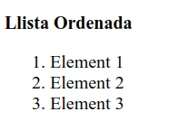

---

title:  2.3.- Cos del document - BODY
parent: 2.- HTML
grand_parent: Llenguatges de Marques
has_children: true
layout: default
nav_order: 30
has_toc: true
toc_max_heading_level: 2


---

# Cos del document `<body> </body>` 

La secció `<body>` és on es col·loca el contingut visible d’una pàgina. Inclou elements com **capçaleres**, **paràgrafs**, **imatges** i **enllaços**.

## Capçaleres

HTML defineix 6 nivells de capçaleres: `<h1>` a `<h6>`

```html
<body>

    <h1> Nivell 1 - Títol Principal </h1>
    <h2> Nivell 2 - Subtítol </h2>
    <h3> Nivell 3 - Altres Títol </h3>
    <h4> Nivell 4 - Títol Menor </h4>
    <h5> Nivell 5 - Encara Menys </h5>
    <h6> Nivell 6 - L'Últim Títol </h6> 

</body>
```
---
{: .text-center }


---

## Paràgrafs

`<p>` per a definir els paràgrafs    

`<br>` per a fer salts de línia 

## Formats

Aquí tens el text amb la descripció de cada etiqueta HTML:

- `<b>` - Text en **negreta**
- `<strong>` - Text **important**
- `<i>` - Text en *cursiva*
- `<em>` - Text *emfatitzat*
- `<mark>` - Text **marcat**
- `<small>` - Text més *xicotet*
- `<del>` - Text ~~eliminat~~
- `<ins>` - Text **subratllat**
- `<sub>` - Text en subíndex,  o X₂
- `<sup>` - Text en superíndex, o X²

   
    
**Al navegador es mostraria:**


{: .text-center }


---

**La diferència entre `<b>` i `<strong>`:**
- `<b>`: Indica que el text ha de ser representat en **negreta**.
- `<strong>`: Posa el text en **negreta** i el marca com a important des del punt de vista del contingut i l'estructura del document. 
Aquesta etiqueta s'utilitza per donar importància semàntica i pot ser utilitzada per motors de cerca i tecnologies d'accessibilitat.

---

**La diferència entre `<i>` i `<em>`:**
- `<i>`: Indica que el text ha de ser representat en **cursiva**.
- `<em>`: S’utilitza per indicar que el text ha de ser **emfatitzat** per raons semàntiques, donant una indicació al navegador i altres agents de processament que aquesta part del text té un pes semàntic addicional. Això pot ser útil per a motors de cerca, llocs web d'accessibilitat i altres tecnologies que interpreten la informació continguda en una pàgina web.

---


**Exemple:**


```html
<!DOCTYPE html>
<html lang="ca">
<head>
    <meta charset="UTF-8">
    <title>Exemple de Text Formatat</title>
</head>
<body>
    <p>Aquest text té una paraula <em>emfatitzada</em>, <br> una altra <strong>destacada</strong>, i una <b>en negreta</b>.</p>
    <p>Segon paràgraf amb més text i <br> un <mark>salt</mark> de línia.</p>
</body>
</html>

```

### En el codi anterior:
- `<em>` emfatitza la paraula fent-la **cursiva**.
- `<strong>` destaca la paraula en **negreta** i aporta importància semàntica.
- `<b>` aplica **negreta** sense importància semàntica.
- `<mark>` ressalta el text amb un fons destacat (normalment groc).
- `<br>` insereix un salt de línia dins del paràgraf. 


## Citacions

Les etiquetes `<blockquote>`, `<q>` i `<cite>` són utilitzades per gestionar citacions i indicar l’origen del contingut citat:


```html
<!DOCTYPE html>
<html lang="ca">
<head>
    <meta charset="UTF-8">
    <title>Exemple de citacions</title>
</head>
<body>

<h1>Exemple de citacions en HTML</h1>

<!-- Exemple de bloc de citació amb blockquote -->
<blockquote>
    "La ciència mai resol un problema sense crear-ne deu més."
    <cite>— George Bernard Shaw</cite>
</blockquote>

<p>
    Durant una entrevista, el científic va dir: 
    <q>La investigació és essencial per al progrés humà.</q> 
    Aquesta frase reflecteix la seva creença profunda en el valor de la ciència.
</p>

</body>
</html>
```

**Al navegador es mostraria així:**

{: .text-center }


### Explicació:


1. **`<blockquote>`**:
   - **Funció**: S'utilitza per a crear blocs de citació o per citar un text llarg.
   - **Visualització**: És un element de bloc, de manera que ocupa tota l'amplada disponible i normalment introdueix un salt de línia abans i després. Sovint, els navegadors l'estilen amb una indentació per indicar que és una citació.
   - **Ús**: És ideal per a citacions llargues o paràgrafs de text que representen una cita extensa.

2. **`<q>`**:
   - **Funció**: S'utilitza per a cites breus dins d'un paràgraf de text.
   - **Visualització**: És un element en línia (inline), el que significa que no introdueix salts de línia abans ni després del contingut. Els navegadors solen afegir cometes automàticament al voltant del text dins de `<q>`.
   - **Ús**: Ideal per a cites curtes dins d'un paràgraf o una frase.

3. **`<cite>`**:
   - **Funció**: S'utilitza per indicar la font d'una citació o el títol d'una obra (com un llibre, article, etc.) i, en alguns casos, el nom de l'autor.
   - **Visualització**: És un element en línia i sovint es mostra en cursiva per defecte, encara que no tots els navegadors ho fan automàticament.
   - **Ús**: Ideal per citar l'origen d'una frase o obra. Pot anar dins d'un `<blockquote>` o d'un `<q>` per donar context a la citació.

### EnResum 

| Etiqueta        | Tipus         | Ús principal                             | Estil per defecte                  |
|-----------------|---------------|------------------------------------------|------------------------------------|
| `<blockquote>`  | Bloc          | Citacions llargues o paràgrafs citats    | Indentació i salt de línia         |
| `<q>`           | En línia      | Cites curtes dins de text                | Cometes automàtiques               |
| `<cite>`        | En línia      | Indicar font o autor de la citació       | Cursiva (en alguns navegadors)     |

## Abreviacions i Definicions

Les etiquetes `<abbr>` i `<dfn>` són utilitzades per indicar abreviacions i definicions respectivament.

```html

<body>
<blockquote><p>La <q>citació en bloc</q> pot ser utilitzada per ressaltar información
    important.</p>
    <p>Aquesta citació és de <cite>Pere Gil</cite>.</p></blockquote>
<p>En un document acadèmic, pot ser útil definir acrònims.
    Per exemple, <abbr title="World Wide Web Consortium">W3C</abbr> estableix estàndards web.
</p>

<p><dfn title="Un sistema d'operació de codi obert">Linux</dfn> és conegut per la seva estabilitat.</p>


</body>

```

{: .text-center }


## Text Preformatat


Disposem d'eines en HTML per **evitar que s'aplique format al text** i mantenir la seva estructura original. Aquestes etiquetes són molt útils per **mostrar codi o text que requereix una alineació específica**.

- **`<pre>`**: Conserva tots els **espais i salts de línia tal com es troben en el codi HTML**. A més, el text dins d’un `<pre>` té una mida de lletra fixa, i **no s'ajusta automàticament al marge**.
  
- **`<code>`**: Utilitzem esta etiquetaper **marcar fragments de codi dins d'un text**, mantenint l'estructura i presentació original del codi. És habitual utilitzar `<code>` dins d'un `<pre>` per mostrar codi formatat.

### Exemple en HTML

```html
<body>

<pre>
    Aquest és un exemple
    de text preformatat.
    Les línies es mostraran
    tal com s'han escrit.
</pre>
<p>
    A continuació, es mostra un bloc de codi en Java preformatat:
</p>

<pre>
    <code>
        public class HelloWorld {
           public static void main(String[] args) {
              System.out.println("Hola, món!");
           }
        }
    </code>
</pre>


<p>El codi anterior és un senzill exemple d'un programa "Hola, món!" en Java.    
</p>

</body>

```
**L'eixida en el navegador seria:**
---
{: .text-center }


---


### A l'exemple anterior:

- El primer bloc `<pre>` conté text preformatat. Cada espai i salt de línia es mostren exactament tal com estan escrits dins del codi HTML.
- El segon bloc utilitza `<pre><code>` per mostrar un exemple de codi en Java. La combinació de `<pre>` i `<code>` permet que el codi es mostre amb espais conservats i en una font de mida fixa, fent-lo més llegible.

### Ús combinat de `<pre>` i `<code>`
En alguns casos, és preferible combinar `<pre>' i ''<code>` per mostrar el codi d'una manera estructurada i formatada correctament. Si sol utilizem `<code>` el codi java de l'exemple anterior apareixeria tot en una linea.

---
{: .text-center }


---


## Llistes d'Elements


### Correcció i Ampliació

Les etiquetes per a **crear llistes HTML** permeten estructurar el contingut en **formats ordenats i desordenats**, així com c**rear llistes de descripció** per representar termes amb definicions.

- **Etiquetes Principals per a Llistes:**
    - `<ol>`: Crea una **llista ordenada**, en la qual els elements es numeren automàticament.
    - `<ul>`: Crea una **llista desordenada**, en la qual els elements es mostren amb punts o símbols.
    - `<li>`: **Defineix un element dins d'una llista**, ja sigui ordenada o desordenada.
    - `<dl>`: Defineix una llista de descripció, que conté termes amb les seves definicions.
    - `<dt>`: Defineix un terme dins d'una llista de descripció.
    - `<dd>`: Defineix la descripció d'un terme en una llista de descripció.

- **Atributs Comuns:**
    - `type` (per a `<ol>`): Permet definir el tipus de numeració (1, A, a, I, i).
    - `start` (per a `<ol>`): Especifica el número inicial en una llista ordenada.
    - `value` (per a `<li>` en llistes ordenades): Estableix un valor específic per a un element individual.

### Exemples en HTML

---
{: .text-center }


---

```html

    <!-- Exemple de Llista Ordenada -->
    <p><b>Llista Ordenada</b></p>
    <ol>
        <li>Element 1</li>
        <li>Element 2</li>
        <li>Element 3</li>
    </ol>
```
---
{: .text-center }


---

```html
    <!-- Exemple de Llista Desordenada -->
    <p><b>Llista Desordenada</b></p>
    <ul>
        <li>Element A</li>
        <li>Element B</li>
        <li>Element C</li>
    </ul>
```

---
{: .text-center }


---


```html
    <!-- Exemple de Llista de Descripció -->
    <p><b>Llista de Descripció</b></p>
    <dl>
        <dt>HTML</dt>
        <dd>Llenguatge de marcatge estàndard per a pàgines web.</dd>
        <dt>CSS</dt>
        <dd>Llenguatge de fulls d'estil utilitzat per estilitzar documents HTML.</dd>
    </dl>
```

---
{: .text-center }


---

```html
    <!-- Llista Ordenada amb Tipus Personalitzat -->
    <p><b>Llista Ordenada amb Tipus Personalitzat <i> Lletres</i></b></p>
    <ol type="A">
        <li>Element A</li>
        <li>Element B</li>
    </ol>
```
---
{: .text-center }


---


```html
    <p><b>Llista Ordenada amb Tipus Personalitzat <i> Números Romans</i></b></p>
    <ol type="i">
        <li>Element I</li>
        <li>Element II</li>
    </ol>
```

---
{: .text-center }


---

```html

    <!-- Llista Ordenada amb Valor Inicial -->
    <p><b>Llista Ordenada amb Valor Inicial</b></p>
    <ol start="5">
        <li>Element 5</li>
        <li>Element 6</li>
    </ol>
```

---
{: .text-center }


---


```html

    <!-- Llista Ordenada amb Valor Específic per a un Element -->
    <p><b>Llista Ordenada amb Valor Específic per a un Element</b></p>
    <ol>
        <li>Un</li>
        <li value="50">Cinquanta</li>
        <li>Vint-i-dos</li>
    </ol>

```


### Consideracions sobre les llistes

- **Ús Semàntic de les Llistes:** Quan es dissenyen interfícies web, és **recomanable utilitzar llistes per agrupar continguts relacionats**, com menús o punts clau, per millorar la llegibilitat i l’accessibilitat.
- **Llistes Imbricades:** És possible crear llistes imbricades **(llistes dins de llistes)** per representar estructures jeràrquiques de contingut.
- **Atributs HTML5:** En HTML5, els atributs com `type`, `start`, i `value` són vàlids, però **es recomana utilitzar CSS** per a personalitzacions d’estil en lloc d'aquests atributs quan sigui possible.


