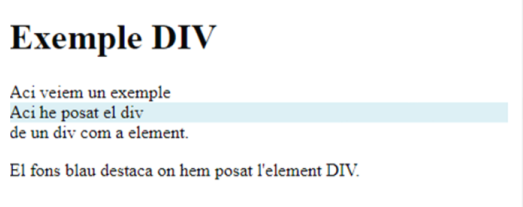
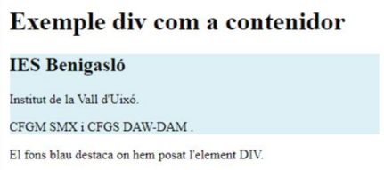
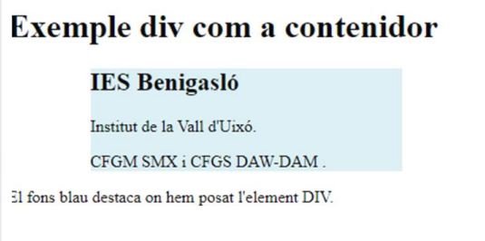
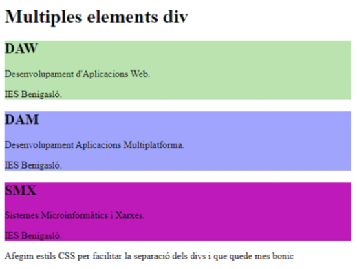
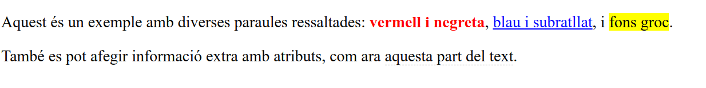

---

title:  2.4.1 - DIV-SPAN
parent: 2.4.- Etiquetes de Contenidor
grand_parent: 2.- HTML
has_children: true
layout: default
nav_order: 45
has_toc: true
toc_max_heading_level: 3


---

* Taula de Continguts
{:toc}

---


# Etiquetes de Contenidor Genèriques


## Etiqueta `<div>`

L'etiqueta `<div>` és una de les eines més utilitzades en HTML per estructurar i organitzar contingut. És un element de divisió **sense cap significat semàntic**, es a dir, **no aporta informació sobre el contingut que conté**, sinó que s'utilitza per **agrupar altres elements i crear caixes de contingut**. Això facilita l'organització visual de la pàgina i l'aplicació d'estils CSS.

### Característiques de `<div>`

- **Element de Bloc**: `<div>` és un element de bloc, cosa que significa que ocupa tota l'**amplada disponible del seu contenidor** i crea un **salt de línia** abans i després de l'element, separant-lo dels altres elements.
- **No Semàntic**: No aporta informació sobre el contingut que conté, a diferència d'elements com `<header>` o `<section>`, que sí tenen un significat específic.
- **Personalització i Estils**: Permet aplicar **estils amb CSS** directament o mitjançant les propietats `class` i `id`, per donar format i estructura als blocs de contingut.

### Exemple d'Ús de `<div>`

Aquest exemple mostra com utilitzar `<div>` per agrupar elements i aplicar-li un fons de color per a destacar-lo visualment.

```html
<!DOCTYPE html>
<html lang="ca">
<head>
    <meta charset="UTF-8">
    <title>Exemple DIV</title>
    <style>
        div {
            background-color: #daeef3;
        }
    </style>
</head>
<body>
    <h1>Exemple DIV</h1>
    <div>Aci he posat el div</div>
    <p>El fons blau destaca on hem posat l'element DIV.</p>
</body>
</html>

```
---

{. align-center }


---

### `<div>` com a Contenidor

Podem utilitzar `<div>` com a contenidor per agrupar elements relacionats dins d'una pàgina web. En aquest exemple, agrupem el nom d'un institut i la informació dels cicles que ofereix.

```html
<!DOCTYPE html>
<html lang="ca">
<head>
    <meta charset="UTF-8">
    <title>Exemple div com a contenidor</title>
    <style>
        div {
            background-color: #daeef3;
        }
    </style>
</head>
<body>
    <h1>Exemple div com a contenidor</h1>
    <div>
        <h2>IES Benigasló</h2>
        <p>Institut de la Vall d'Uixó.</p>
        <p>CFGM SMX i CFGS DAW-DAM.</p>
    </div>
    <p>El fons blau destaca on hem posat l'element DIV.</p>
</body>
</html>
```

---

{: .align-center }


---


### Centrat del Bloc `<div>`

Amb `<div>`, podem utilitzar CSS per centrar el bloc en la pàgina web amb la propietat `margin: auto;`, com es veu en aquest exemple:

```html
<!DOCTYPE html>
<html lang="ca">
<head>
    <meta charset="UTF-8">
    <title>Exemple div centrat</title>
    <style>
        div {
            background-color: #daeef3;
            width: 300px;
            margin: auto;
            padding: 10px;
        }
    </style>
</head>
<body>
    <h1>Exemple div com a contenidor centrat</h1>
    <div>
        <h2>IES Benigasló</h2>
        <p>Institut de la Vall d'Uixó.</p>
        <p>CFGM SMX i CFGS DAW-DAM.</p>
    </div>
    <p>El fons blau destaca on hem posat l'element DIV centrat.</p>
</body>
</html>
```
---

{: .align-center }


---


### Múltiples Contenidors `<div>`

Podem tenir múltiples contenidors `<div>` en el mateix document HTML, cadascun amb estils diferents per donar-los identitats visuals úniques.

```html
<!DOCTYPE html>
<html lang="ca">
<head>
    <meta charset="UTF-8">
    <title>Múltiples elements div</title>
</head>
<body>
    <h1>Múltiples elements div</h1>

    <div style="background-color:#FFF4A3; padding:10px;">
        <h2>DAW</h2>
        <p>Desenvolupament d'Aplicacions Web.</p>
        <p>IES Benigasló.</p>
    </div>

    <div style="background-color:#FFC0C7; padding:10px;">
        <h2>DAM</h2>
        <p>Desenvolupament Aplicacions Multiplataforma.</p>
        <p>IES Benigasló.</p>
    </div>

    <div style="background-color:#D9EEE1; padding:10px;">
        <h2>SMX</h2>
        <p>Sistemes Microinformàtics i Xarxes.</p>
        <p>IES Benigasló.</p>
    </div>

    <p>Afegim estils CSS per facilitar la separació dels divs i fer que visualment quede més bonic.</p>
</body>
</html>
```

---

{: .align-center }


---

## Etiqueta `<span>`

L'etiqueta `<span>` és un contenedor en HTML que, a diferència de `<div>`, és un **element en línia**. Això significa que no ocupa tot l'ample del seu contenedor ni inclou salts de línia abans o després d'ell. S'utilitza per **donar estil o format a parts específiques de text o altres elements dins d’un paràgraf** o una línia de text.

### Característiques de `<span>`

- **Element en Línia**: Ocupa només l'espai necessari per al seu contingut i no interromp el flux del text.
- **Sense Semàntica**: Igual que `<div>`, `<span>` no aporta significat semàntic i s'utilitza exclusivament per estilitzar o aplicar comportaments a parts específiques de contingut.
- **Versatilitat**: S'utilitza conjuntament amb CSS per aplicar estils únics a paraules, frases o altres elements dins d'un text.

---

### Exemple: Ús de `<span>` amb atributs HTML (estil en línia)

Aquest exemple utilitza estils en línia per destacar diverses parts d'un text. Això demostra com es pot aplicar format directament amb `style`.

```html
<!DOCTYPE html>
<html lang="ca">
<head>
    <meta charset="UTF-8">
    <title>Exemple SPAN amb HTML</title>
</head>
<body>
    <p>
        Aquest és un exemple amb diverses paraules ressaltades:
        <span style="color: red; font-weight: bold;">vermell i negreta</span>,
        <span style="color: blue; text-decoration: underline;">blau i subratllat</span>,
        i <span style="background-color: yellow;">fons groc</span>.
    </p>
    <p>
        També es pot afegir informació extra amb atributs, com ara
        <span title="Informació addicional mostrada al passar el ratolí">aquesta part del text</span>.
    </p>
</body>
</html>
```

---

{: .align-center }



---

### Exemple: Ús de `<span>` amb CSS (classes CSS)

Aquest exemple reprodueix el mateix contingut, però utilitzant **classes CSS** en lloc d'estils en línia. Aquesta pràctica és més eficient i fàcil de mantenir.

```html
<!DOCTYPE html>
<html lang="ca">
<head>
    <meta charset="UTF-8">
    <title>Exemple SPAN amb CSS</title>
    <style>
        .vermell-negreta {
            color: red;
            font-weight: bold;
        }
        .blau-subratllat {
            color: blue;
            text-decoration: underline;
        }
        .fons-groc {
            background-color: yellow;
        }
        .informació-extra {
            border-bottom: 1px dashed gray;
            cursor: help;
        }
    </style>
</head>
<body>
    <p>
        Aquest és un exemple amb diverses paraules ressaltades:
        <span class="vermell-negreta">vermell i negreta</span>,
        <span class="blau-subratllat">blau i subratllat</span>,
        i <span class="fons-groc">fons groc</span>.
    </p>
    <p>
        També es pot afegir informació extra amb atributs, com ara
        <span class="informació-extra" title="Informació addicional mostrada al passar el ratolí">aquesta part del text</span>.
    </p>
</body>
</html>
```
**El resultat visual serà el mateix que l'exemple anterior, però amb una millor pràctica de codi.**

---


## Comparativa Entre `<div>` i `<span>` i Recomanacions d'Ús

| Característica         | `<div>`                          | `<span>`                          |
|------------------------|----------------------------------|-----------------------------------|
| Tipus d'element        | Bloc                             | En línia                          |
| Comportament           | Ocupa tot l'ample disponible i inclou salts de línia | Ocupa només l'espai necessari i es manté en línia |
| Ús                     | Agrupar blocs de contingut gran o seccions completes | Donar estil a parts petites del contingut dins d'una línia |

### Recomanacions d'Ús

- **Quan usar `<div>`**: Utilitza `<div>` per estructurar la pàgina en seccions o blocs grans. És ideal per crear contenidors per a seccions completes, com encapçalaments, peus de pàgina, blocs de text, i altres seccions generals.
  
- **Quan usar `<span>`**: Utilitza `<span>` per a aplicar estils específics dins de línies de text, com ressaltar paraules, frases o icones dins d'un paràgraf o text continu.

- **Quan evitar `<div>` i `<span>`**: Si el contingut té una funció o significat específic (com una navegació, encapçalament o article), és millor utilitzar etiquetes semàntiques com `<nav>`, `<header>`, `<footer>`, etc., per millorar l'accessibilitat i el SEO.

Aquí tens una proposta per introduir l’ús de `id` i `class` amb CSS, destacant breument els seus avantatges i motivant la transició cap al tema de CSS:

---

## Atributs `id` i `class` amb CSS

En HTML, podem utilitzar els atributs `id` i `class` per identificar elements i aplicar-los estils personalitzats amb CSS. Això ens permet separar el contingut de la seva presentació, fent que el nostre codi sigui més net, fàcil de mantenir i reutilitzable.

### Què són `id` i `class`?

- **`id`**: Identifica un únic element dins de la pàgina. Cada `id` ha de ser únic i és ideal per estilitzar o manipular un element específic.
- **`class`**: S'assigna a un grup d'elements que comparteixen característiques comunes. Les classes permeten aplicar estils a múltiples elements alhora.

---

### Diferència entre `id` i `class`

Aquest exemple mostra com utilitzar `id` per estilitzar un sol element i `class` per aplicar estils a diversos elements.

```html
<!DOCTYPE html>
<html lang="ca">
<head>
    <meta charset="UTF-8">
    <title>Exemple ID i CLASS</title>
    <style>
        #títol-únic {
            color: darkblue;
            font-size: 24px;
            text-align: center;
        }
        .ressaltat {
            color: red;
            font-weight: bold;
        }
    </style>
</head>
<body>
    <h1 id="títol-únic">Títol amb ID únic</h1>
    <p class="ressaltat">Aquest text està ressaltat en roig.</p>
    <p class="ressaltat">Aquest també utilitza la mateixa classe CSS.</p>
</body>
</html>
```
---

{: .align-center }


---

### Per què usar CSS?

1. **Flexibilitat i consistència**: Amb CSS, pots definir un estil un sol cop i aplicar-lo a diversos elements. Això evita repetir codi.
2. **Mantenibilitat**: Si vols canviar un estil, només has de modificar-lo al CSS, sense tocar l'HTML.
3. **Separació de responsabilitats**: Mantens el contingut (HTML) separat de l'estil (CSS), fent el codi més organitzat.
4. **Dissenys avançats**: CSS et permet crear pàgines atractives, responsives i modernes amb menys esforç.

---

Ara que entenem com utilitzar `id` i `class` per personalitzar elements, el següent pas és explorar les **possibilitats infinites del CSS**, on aprendrem a crear dissenys visuals impactants per a les nostres pàgines web. 💡

---

