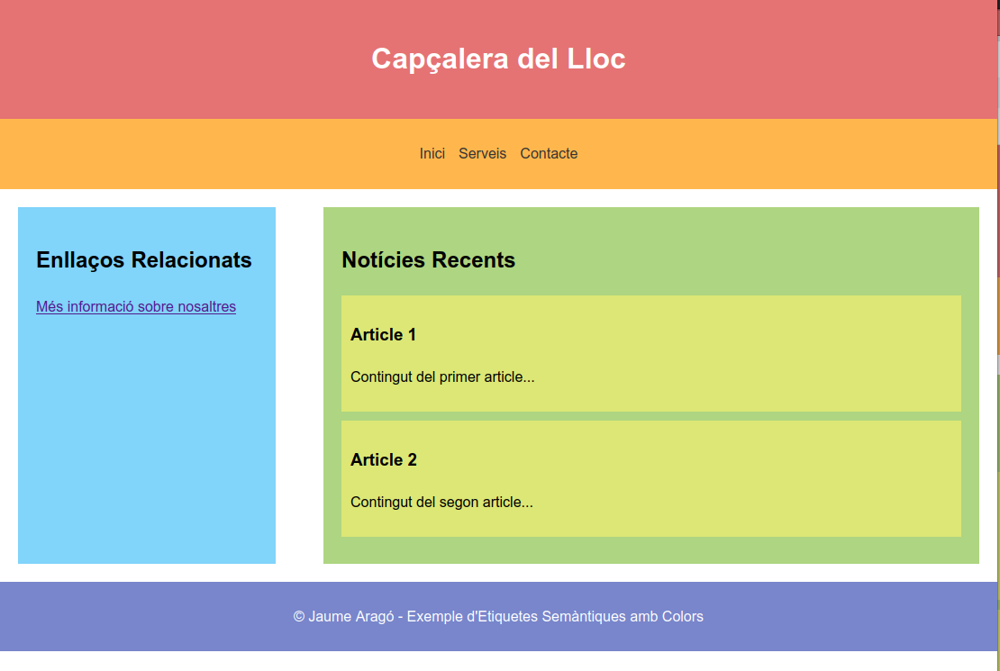

---

title:  2.4.2 - Etiquetes Semàntiques
parent: 2.4.- Etiquetes de Contenidor
grand_parent: 2.- HTML
has_children: true
layout: default
nav_order: 48
has_toc: true
toc_max_heading_level: 1


---

* Taula de Continguts
{:toc}

---


# Etiquetes Semàntiques

Les etiquetes semàntiques en HTML són elements que tenen un significat clar i específic pel navegador i els motors de cerca, i s’utilitzen per estructurar el contingut de manera més significativa. A diferència de les etiquetes generals com `<div>` o `<span>`, que només s’utilitzen per agrupar contingut sense afegir cap significat, les etiquetes semàntiques permeten a les màquines entendre millor la funció de cada part de la pàgina. Això millora l'accessibilitat i el rendiment de la pàgina web, així com la seva optimització per als motors de cerca (SEO).

## Organització de les Etiquetes Semàntiques


---

{: .align-center }


---


## 1. `<header>`

L'etiqueta `<header>` es fa servir per** definir la capçalera d'una pàgina web** o d'una secció dins d'una pàgina. Normalment, conté el títol, un logo, una barra de navegació o altres elements introductoris importants.

**Exemple:**

```html
<header>
  <h1>Benvinguts al meu lloc web</h1>
  <nav>
    <ul>
      <li><a href="#">Inici</a></li>
      <li><a href="#">Serveis</a></li>
      <li><a href="#">Contacte</a></li>
    </ul>
  </nav>
</header>
```

---

## 2. `<nav>`

L'etiqueta `<nav>` s’utilitza per **envoltar una secció de la pàgina que conté enllaços de navegació.** Aquest element ajuda a identificar les parts de la pàgina dedicades a la navegació.

**Exemple:**

```html
<nav>
  <ul>
    <li><a href="#">Inici</a></li>
    <li><a href="#">Serveis</a></li>
    <li><a href="#">Contacte</a></li>
  </ul>
</nav>
```

**Notes:**

- `<nav>` pot anar a dins de `<header>` o `<footer>`, però també pot ser una secció independent de la pàgina. El mes comú és posar-lo dins de `<header>`.

- Els enllaços dins d'un `<nav>` haurien de ser part de la navegació principal de la pàgina, la resta d'enllaços podrien anar fora d'aquesta etiqueta o en les seccions `<aside>` o `<footer>`.  


---

## 3. `<main>`

L'etiqueta `<main>` defineix el **contingut principal d’una pàgina**. Només hauria de contenir el contingut que sigui únic i essencial per a la pàgina. Això ajuda els motors de cerca a identificar el contingut més rellevant.

**Exemple:**

```html
<main>
  <h2>Notícies Recents</h2>
  <p>Últimes notícies sobre el tema...</p>
</main>
```

---

## 4. `<section>`

L'etiqueta `<section>` s’utilitza per **agrupar contingut relacionat dins d’un document**. Aquest contingut podria tenir el seu propi títol o subtítol. Es pot usar per dividir un document en parts lògiques.

**Exemple:**

```html
<section>
  <h2>Notícies de l'empresa</h2>
  <p>Informació sobre les novetats de l'empresa...</p>
</section>
```

---

## 5. `<article>`

L'etiqueta `<article>` defineix un **contingut independent que pot ser distribuït o reutilitzat en altres llocs.** Es fa servir per a articles de blog, notícies, comentaris, etc.

**Exemple:**

```html
<article>
  <h3>Nou article sobre tecnologia</h3>
  <p>En aquest article explorarem les últimes innovacions tecnològiques...</p>
</article>
```

**Nota:** Si tenim varios `<article>` relacionats es convenient agrupar-los dins d'un  `<section>`, però si són independents poden anar directament dins de `<main>` o d'altra secció.

---

## 6. `<aside>`

L'etiqueta `<aside>` s’utilitza per **definir contingut que és rellevant, però no directament relacionat amb el contingut principal de la pàgina**. És útil per a informació addicional com anuncis, enllaços relacionats o informació secundària.

**Exemple:**

```html
<aside>
  <h2>Enllaços Relacionats</h2>
  <p><a href="#">Més informació sobre tecnologia</a></p>
</aside>
```

**Nota:** Recorda que `<aside>` no substitueix un `<section>` o `<div>` si el contingut és part del flux principal de la pàgina. 
---

## 7. `<footer>`

L'etiqueta `<footer>` defineix la part final d’una pàgina o secció. Normalment conté informació de contacte, drets d'autor o enllaços a altres parts de la pàgina com la política de privacitat.

**Exemple:**

```html
<footer>
  <p>© 2023 Nom de l'empresa. Tots els drets reservats.</p>
</footer>
```

---


### Beneficis d'Ús d'Elements Semàntics

1. **Millora l’accessibilitat**: Els usuaris amb discapacitat, com les persones que utilitzen lectors de pantalla, poden entendre millor l’estructura d’una pàgina si utilitzem etiquetes semàntiques.

2. **Millora l'optimització SEO (Search Engine Optimization)**: Els motors de cerca poden entendre millor el contingut de la pàgina i, per tant, millorar el posicionament en els resultats de cerca.

3. **Codi més net i fàcil de mantenir**: Utilitzar etiquetes semàntiques fa que el codi sigui més llegible per altres desenvolupadors i per tu mateix, facilitant el manteniment i les actualitzacions.

---


# Exemple d'Ús d'Elements Semàntics

**Com l'ús d'etiquetes semàntiques i CSS millora progressivament l'estructura, la claredat i l'aspecte d'una pàgina web**

### **Exemple 1: HTML Semàntic Bàsic**

- Este exemple mostra una pàgina web amb etiquetes semàntiques bàsiques. No s'aplica estil visual, cosa que ressalta la **importància de tenir una estructura clara**.

- Ens centrem en com etiquetes com `<header>`, `<main>`, `<section>` i `<footer>` organitzen el contingut.
  
- **Important:** *Les etiquetes semàntiques no només estructuren el contingut, sinó que milloren l'accessibilitat i l'optimització per a motors de cerca (SEO).*

```html
<!DOCTYPE html>
<html lang="ca">
<head>
  <meta charset="UTF-8">
  <meta name="viewport" content="width=device-width, initial-scale=1.0">
  <title>Exemple d'Elements Semàntics</title>
</head>
<body>

<header>
  <h1>Capçalera del Lloc</h1>
  <nav>
    <ul>
      <li><a href="#">Inici</a></li>
      <li><a href="#">Serveis</a></li>
      <li><a href="#">Contacte</a></li>
    </ul>
  </nav>
</header>

<main>
  <section>
    <h2>Notícies Recents</h2>
    <article>
      <h3>Article 1</h3>
      <p>Contingut del primer article...</p>
    </article>
    <article>
      <h3>Article 2</h3>
      <p>Contingut del segon article...</p>
    </article>
  </section>

  <aside>
    <h2>Enllaços Addicionals</h2>
    <p><a href="#">Més sobre nosaltres</a></p>
  </aside>
</main>

<footer>
  <p>© 2023 Exemple d'ús d'etiquetes semàntiques</p>
</footer>

</body>
</html>
```

---
{: .align-center }


---


### **Exemple 2: HTML Semàntic amb Estil en Línia**


En este exemple afegim atributs `style` per **introduir colors i estils directament a les etiquetes**. Això dóna una millora visual immediata i ajuda a entendre com CSS pot canviar l'aspecte.

- Amb els estils en línia podem personalitzar la pàgina i millorar l'experiència visual.
  


- **Important:** *Tot i que els estils en línia són útils per a exemples senzills, fan que el codi sigui menys organitzat i més difícil de mantenir en projectes més grans.*


```html

<!DOCTYPE html>
<html lang="ca">
<head>
    <meta charset="UTF-8">
    <meta name="viewport" content="width=device-width, initial-scale=1.0">
    <title>Exemple d'Etiquetes Semàntiques</title>
</head>
<body style="font-family: Arial, sans-serif; line-height: 1.6; margin: 0; padding: 0;">

<header style="background-color: #e57373; padding: 20px; color: white; text-align: center;">
    <h1 style="margin: 0;">Capçalera del Lloc</h1>
    <nav style="background-color: #ffb74d; padding: 10px; margin-top: 10px;">
        <ul style="list-style: none; padding: 0; display: flex; justify-content: center; gap: 15px; margin: 0;">
            <li><a href="#" style="text-decoration: none; color: #333;">Inici</a></li>
            <li><a href="#" style="text-decoration: none; color: #333;">Serveis</a></li>
            <li><a href="#" style="text-decoration: none; color: #333;">Contacte</a></li>
        </ul>
    </nav>
</header>

<main style="padding: 20px;">
    <section style="background-color: #aed581; padding: 20px; margin-bottom: 20px;">
        <h2 style="margin: 0 0 10px 0;">Notícies Recents</h2>
        <article style="background-color: #dce775; padding: 10px; margin-bottom: 10px;">
            <h3 style="margin: 0 0 5px 0;">Article 1</h3>
            <p style="margin: 0;">Contingut del primer article...</p>
        </article>
        <article style="background-color: #dce775; padding: 10px; margin-bottom: 10px;">
            <h3 style="margin: 0 0 5px 0;">Article 2</h3>
            <p style="margin: 0;">Contingut del segon article...</p>
        </article>
    </section>

    <aside style="background-color: #81d4fa; padding: 20px;">
        <h2 style="margin: 0 0 10px 0;">Enllaços Addicionals</h2>
        <p style="margin: 0;"><a href="#" style="text-decoration: none; color: #007acc;">Més informació sobre nosaltres</a></p>
    </aside>
</main>

<footer style="background-color: #7986cb; padding: 10px 20px; text-align: center; color: white;">
    <p style="margin: 0;">© Jaume Aragó - Exemple d'Etiquetes Semàntiques amb Colors</p>
</footer>

</body>
</html>

```

---
{: .align-center }


---

### **Exemple 3: HTML Semàntic amb CSS en Fulls d'Estil**


En este cas utilitzem un full d'estil CSS intern per aplicar els mateixos estils de manera centralitzada. **Mostra com el CSS millora la consistència i facilita l'actualització del disseny.**

- A l'exemple es pot veure els avantatges de separar l'estil del contingut amb CSS.
  
- **Important:** *L'ús de fulls d'estil amb CSS no només fa que el codi sigui més net, sinó que també permet crear dissenys visuals més avançats i responsius.*

---

```html

<!DOCTYPE html>
<html lang="ca">
<head>
    <meta charset="UTF-8">
    <meta name="viewport" content="width=device-width, initial-scale=1.0">
    <title>Exemple d'Etiquetes Semàntiques amb Colors</title>
    <style>
        body {
            font-family: Arial, sans-serif;
            line-height: 1.6;
            margin: 0;
            padding: 0;
        }

        header {
            background-color: #e57373; /* Vermell clar */
            padding: 20px;
            text-align: center;
            color: white;
        }

        nav {
            background-color: #ffb74d; /* Taronja clar */
            padding: 10px;
        }

        nav ul {
            list-style: none;
            padding: 0;
            display: flex;
            justify-content: center;
            gap: 15px;
        }

        nav ul li a {
            text-decoration: none;
            color: #333;
        }

        main {
            display: flex;
            margin: 20px;
        }

        aside {
            background-color: #81d4fa; /* Blau clar */
            padding: 20px;
            width: 25%;
        }

        section {
            background-color: #aed581; /* Verd clar */
            padding: 20px;
            width: 70%;
            margin-left: 5%;
        }

        article {
            background-color: #dce775; /* Groc clar */
            padding: 10px;
            margin-bottom: 10px;
        }

        footer {
            background-color: #7986cb; /* Blau fosc */
            padding: 10px;
            text-align: center;
            color: white;
        }
    </style>
</head>


<body>

<header>
    <h1>Capçalera del Lloc</h1>
</header>

<nav>
    <ul>
        <li><a href="#">Inici</a></li>
        <li><a href="#">Serveis</a></li>
        <li><a href="#">Contacte</a></li>
    </ul>
</nav>

<main>
    <aside>
        <h2>Enllaços Relacionats</h2>
        <p><a href="#">Més informació sobre nosaltres</a></p>
    </aside>

    <section>
        <h2>Notícies Recents</h2>
        <article>
            <h3>Article 1</h3>
            <p>Contingut del primer article...</p>
        </article>
        <article>
            <h3>Article 2</h3>
            <p>Contingut del segon article...</p>
        </article>
    </section>
</main>

<footer>
    <p>© Jaume Aragó -  Exemple d'Etiquetes Semàntiques amb Colors</p>
</footer>

</body>
</html>

```

---

{: .align-center } 


---

### **Conclusió**


> *"L'ús combinat d'etiquetes semàntiques i CSS és essencial per crear pàgines web modernes. 
> 
> Les etiquetes semàntiques defineixen una base lògica i estructurada que millora l'accessibilitat i el SEO, mentre que el CSS transforma aquesta base en una experiència visual atractiva i funcional. 
> 
> En projectes reals, aquesta separació entre estructura i estil és clau per a la col·laboració, la mantenibilitat i el disseny avançat."*

---

