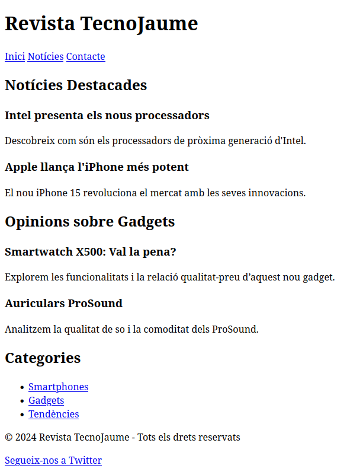
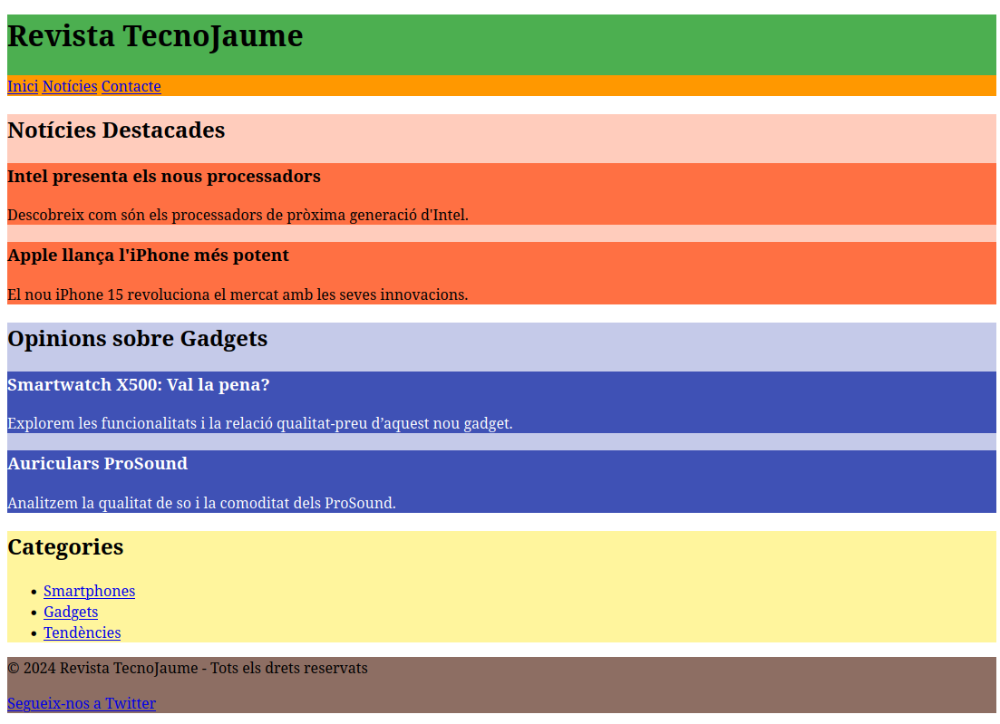
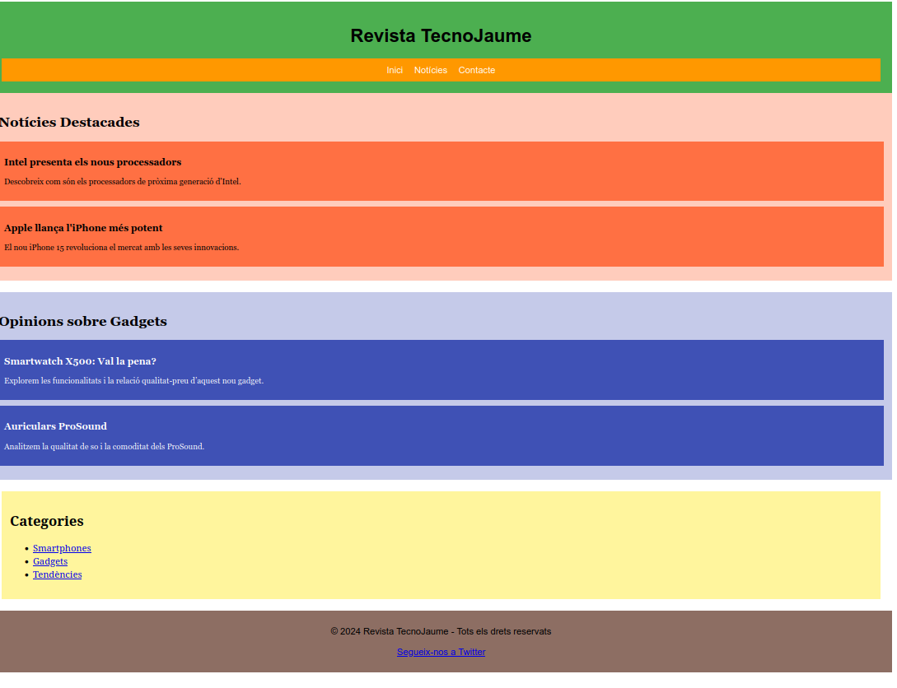

---

title:  2.4.3 - Exercicis
parent: 2.4.- Etiquetes de Contenidor
grand_parent: 2.- HTML
has_children: true
layout: default
nav_order: 50
has_toc: true

---

# **Construcció d'una Pàgina Semàntica**

Imagina que estàs creant la pàgina inicial d'una **revista digital sobre tecnologia, gadgets i tendències.** La pàgina ha d'estar ben estructurada i organitzada utilitzant etiquetes semàntiques. Els passos que hauràs de seguir són:

---

## **Requeriments de la pàgina**

1. **Capçalera principal (`<header>`):**
   - Inclou el nom de la revista: *"TecnoJaume"*.
   - Afegeix un menú de navegació (`<nav>`) amb tres enllaços: "Inici", "Notícies" i "Contacte".

2. **Cos principal (`<main>`):**
   - Contindrà dues seccions (`<section>`):
     - Una secció de **Notícies Destacades**, amb dos articles (`<article>`) sobre novetats tecnològiques.
     - Una secció de **Opinions sobre Gadgets**, amb dos articles (`<article>`) que ofereixen ressenyes de gadgets recents.

3. **Barra lateral (`<aside>`):**
   - Inclou una llista de categories de la revista:
     - "Smartphones"
     - "Gadgets"
     - "Tendències"

4. **Peu de pàgina (`<footer>`):**
   - Inclou una línia amb els drets d'autor: *© 2024 TecnoJaume - Tots els drets reservats*.
   - Afegeix un enllaç a les xarxes socials: *Segueix-nos a Twitter*.

**Fins aci ha de semblar-se a la imatge:**

---

{: .align-center }

---

5. **Afegir colors de fons:**
   - Assigna un color de fons diferent a cada secció semàntica per fer-la visualment més clara:
     - **`<header>`:** Verd (#4CAF50).
     - **`<nav>`:** Taronja (#FF9800).
     - **Secció de Notícies Destacades:** Taronja clar (#FFCCBC) i articles taronja intens (#FF7043).
     - **Secció de Opinions sobre Gadgets:** Blau clar (#C5CAE9) i articles blau fosc (#3F51B5).
     - **`<aside>`:** Groc clar (#FFF59D).
     - **`<footer>`:** Marró (#8D6E63).

**Una volta postas els colors hauria de quedar així:**

---
{: .align-center }

---

## **Ampliació - Personalització Visual d’una Pàgina Semàntica**

### **Enunciat**

A la pagina anterior anem a aplicar **paddings**, **marges** i **estils tipogràfics** per millorar-ne l’aspecte visual. T

En cada etiqueta has de posar l'atribut `style` amb els estils corresponents. A continuació, es mostren els estils que s'han de configurar per a cada part de la pàgina.

Recorda que l'estructura de cada atribut `style` ha de ser: `style="proprietat: valor;"`, i si hi ha més d'una propietat, s'han de separar per punt i coma (`;`). Per exemple: `style="color: red; font-size: 16px;"`.

---

#### **1. Capçalera (`<header>` i `<nav>`):**
- **`<header>`:**
  - Afegir un espai intern: `padding: 20px`.
  - Centrar el text: `text-align: center`.
  - Configurar la tipografia: `font-family: Arial, sans-serif`.

- **`<nav>`:**
  - Afegir espais interns als enllaços: `padding: 10px`.
  - Configurar els enllaços perquè tinguin text blanc i no estiguin subratllats: `color: white; text-decoration: none`.
  - Separar els enllaços amb un marge dret: `margin-right: 15px`.

---

#### **2. Seccions del cos principal (`<section>` i `<article>`):**
- **`<section>`:**
  - Espai intern: `padding: 15px`.
  - Separació entre seccions: `margin-bottom: 20px`.
  - Tipografia: `font-family: Georgia, serif`.

- **`<article>`:**
  - Espai intern per al contingut: `padding: 10px`.
  - Separació entre articles: `margin-bottom: 10px`.
  - Mida de la lletra més petita: `font-size: 14px`.

---

#### **3. Barra lateral (`<aside>`):**
- Espai intern: `padding: 15px`.
- Separació del contingut de la pàgina principal: `margin: 20px`.
- Alineació del contingut a l'esquerra (sense centrat): **No apliquis `text-align: center` o alineacions centrades**.

---

#### **4. Peu de pàgina (`<footer>`):**
- Espai intern: `padding: 10px`.
- Centrar el text: `text-align: center`.
- Tipografia: `font-family: Arial, sans-serif`.

---

**Resultat Final**

---

{: .align-center }

---