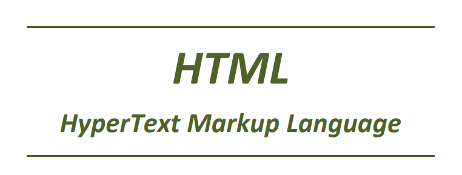
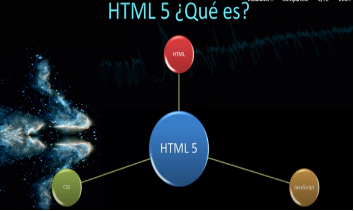
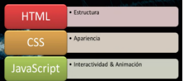

---

title: 2.- HTML
layout: default
parent: Llenguatges de Marques
nav_order: 3
has_children: true
has_toc: true

---

{: .text-center }

{:toc}
    

# Introducció

Html (HyperText Markup Language) és un llenguatge de marques que s'utilitza per a crear pàgines web. És un llenguatge format per **etiquetes** que permeten definir **l'estructura de la pàgina web**, així com el seu contingut. Aquestes etiquetes són interpretades pels navegadors web, que s'encarreguen de mostrar la pàgina de forma visual.    

És com l'esquelet' de la web, ja que defineix l'estructura bàsica de la pàgina, com ara els títols, els paràgrafs, les imatges, els enllaços, etc. A més, també permet incloure altres elements com ara scripts, estils, formularis, etc.

En resum, amb HTML **ens assegurem que tot estiga en el lloc correcte** i que els navegadors puguen interpretar-ho per mostrar el contingut de manera coherent i atractiva.
     
         
## Un poc d’Història

HTML va ser creat per Tim Berners-Lee el 1991. La primera versió de HTML va ser publicada el 1993. Des de llavors, s'han anat publicant diverses versions de HTML, cadascuna amb noves característiques i millores. La versió més recent és **HTML5**, que va ser publicada el 2014. HTML5 inclou noves etiquetes i funcionalitats que permeten crear pàgines web més interactives i atractives.

La primera versió de HTML, anomenada HTML 1.0, va ser llançada el 1991 com a part del paquet WorldWideWeb (més tard anomenat Nexus), el primer navegador web creat per Berners-Lee. Aquesta primera versió de HTML tenia un conjunt molt bàsic d'etiquetes i funcionalitats.

A mesura que la web va créixer en popularitat i complexitat, es van fer diverses actualitzacions i millores a HTML. HTML 2.0 va ser llançat el 1995, i va introduir noves característiques com formularis i suport per taules.

Amb l'evolució constant d'Internet, HTML va continuar millorant. HTML 3.2 es va estandarditzar el 1997 i va afegir suport per scripts i applets Java. La versió següent, HTML 4.01, va sortir el 1999 i va ser una revisió important amb més funcionalitats i millora de la semàntica.

{: .text-center }

No obstant això, el desenvolupament web estava evolucionant ràpidament, i la necessitat de suport per a continguts multimèdia i altres tecnologies va fer evident que calia una nova versió. Així va sorgir HTML5, una revisió important del llenguatge que va ser finalitzada com a recomanació del W3C (World Wide Web Consortium) l'any 2014. HTML5 introdueix etiquetes semàntiques, suport multimèdia natiu, API de JavaScript millorades i altres característiques per fer la web més potent i interactiva.

**Des de llavors, HTML5 ha estat àmpliament adoptat i és la versió més utilitzada del llenguatge fins avui.**

{: .text-center }

---
### Per tant, quan parlem d’HTML5 en realitat ens referim a la combinació d’**HTML** + **CSS** + **JavaScript** + **APIs**. 

---

Aquestes tecnologies treballen juntes per a crear pàgines web interactives i atractives. 
- **HTML** s'encarrega de l'estructura i el contingut de la pàgina.
- **CSS** es centra en l'estil i l'aparença.
- **JavaScript** ens porporciona  interactivitat i animacions.
- Les **APIs** permeten accedir a funcionalitats del navegador com la geolocalització, la càmera, el micròfon, etc.  
