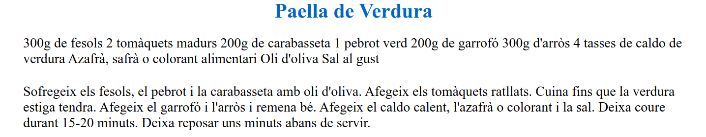

---

title: 3.1.- Introducció a CSS
layout: default
parent: 3.- CSS
nav_order: 10
has_children: true

---


# **1. Introducció**

**Cascading Style Sheets (CSS)** és un llenguatge de marques utilitzat per donar format i estils al contingut d'una pàgina web. És una part essencial del desenvolupament web modern, ja que permet als desenvolupadors controlar l'aparença dels seus llocs i garantir una experiència d'usuari agradable.

**CSS** opera conjuntament amb llenguatges de marques com **HTML** i **XML** i proporciona mecanismes per definir c**om es presenten els elements marcats**. Amb **CSS**, podem especificar com volem que es mostren cadascun dels elements d’una pàgina web, incloent **fonts, colors, mides, marges** i moltes altres propietats.

**CSS** facilita la s**eparació entre contingut i estil**, la qual cosa proporciona:

    - Major flexibilitat en la creació de llocs web i simplifició de les tasques de manteniment i actualització. 
    - Aquesta separació permet reutilitzar els mateixos estils en diferents pàgines o projectes, incrementant l'eficiència.

No obstant això, és important tenir en compte que **no tots els navegadors tracten CSS de la mateixa manera**, ja que poden existir diferències en la implementació. Per aquest motiu, és recomanable provar els documents en diferents navegadors per assegurar que es visualitzen correctament.

---

### **2. Versions de CSS**

- **CSS 1:** Va ser la primera versió del llenguatge, amb capacitats bàsiques per definir estils, però ja no està suportada pel W3C.
- **CSS 2:** Va ampliar les funcionalitats de CSS 1, afegint noves característiques com taules, posicionament absolut/relatiu i suport per a tipus de mitjans (pantalla, impressió, etc.).
- **CSS 3:** És la versió més utilitzada actualment i es defineix en mòduls, permetent un control molt més potent i precís de la visualització dels documents. Inclou característiques avançades com animacions, transicions, gradients i dissenys responsius.

---

### **3. Tipus de llenguatges de marques amb CSS**

#### **HTML (HyperText Markup Language)**
- És el llenguatge de marques estàndard per a la creació de pàgines web.
- Amb CSS, podem estilitzar tots els elements HTML, com ara encapçalaments, paràgrafs, llistes, taules i altres components.

#### **XML (Extensible Markup Language)**
- És un llenguatge de marques utilitzat principalment per a la transferència i l'emmagatzematge de dades.
- CSS es pot aplicar a documents XML per donar-los format visual i facilitar-ne la lectura per part dels usuaris.

#### **SVG (Scalable Vector Graphics)**
- És un llenguatge basat en XML per descriure gràfics vectorials escalables.
- CSS pot estilitzar elements SVG, permetent controlar l'aparença de gràfics i il·lustracions, com colors, línies i ombres.

---

### **4. Visualització d’XML i HTML**

#### **HTML**
Els navegadors web interpreten i representen etiquetes HTML amb un estil predeterminat. Per exemple:
- L'etiqueta `<h1>` apareix, per defecte, amb una mida de font gran (per exemple, 26px) i en negreta.

#### **XML**
- A diferència d'HTML, XML no té estils predeterminats perquè pot contenir etiquetes personalitzades amb noms i estructures completament lliures.
- Els navegadors mostren els documents XML tal com estan escrits, sense format visual, ja que el seu objectiu principal és emmagatzemar dades i no ser llegits directament per humans.

---

### **5. Vocabularis XML comuns per a la visualització**
Per mostrar dades XML de manera comprensible, s'utilitzen vocabularis o formats especialitzats:
- **SVG:** Per mostrar gràfics vectorials 2D.
- **XHTML:** Una extensió d'HTML que combina la simplicitat d'HTML amb l'estricte format d'XML.
- **MathML:** Per representar fórmules matemàtiques.
- **Altres:** Formats personalitzats per aplicacions específiques.

---

### **6. Opcions per visualitzar dades XML**

### **XSLT (eXtensible Stylesheet Language Transformations)**
- És un llenguatge que permet transformar documents XML a altres formats com HTML, PDF, o altres estructures llegibles.
- Molt útil per a aplicacions que necessiten transformar dades en temps real o generar informes.

### **CSS**
- Permet especificar com es mostren les dades en un document XML.
- Encara que no té la flexibilitat de XSLT per transformar estructures, és suficient per donar un format bàsic i visualitzar les dades en un navegador web.

---

### **7. Avantatges d'usar CSS**
1. **Separa contingut i presentació:** Facilita el manteniment i permet aplicar diferents estils a la mateixa estructura.
2. **Reutilització:** Els mateixos estils es poden aplicar a múltiples pàgines.
3. **Disseny responsiu:** Amb CSS modern (CSS3), és possible adaptar el contingut a diferents dispositius i mides de pantalla.
4. **Animacions i transicions:** Milloren la interactivitat i l'experiència d'usuari.
5. **Compatibilitat:** Funciona amb diversos llenguatges de marques com HTML, XML i SVG.

---

## **2. Associar CSS amb documents XML i HTML**

---


Per aplicar fulles d'estil CSS a documents **XML**, es fa servir l'etiqueta especial `xml-stylesheet`, que sempre s'ha de definir després de l'etiqueta de definició d'XML. 

Esta etiqueta indica al navegador quin **fitxer CSS** ha d'utilitzar per donar estil al contingut XML.

**Exemple de definició d'una fulla d'estil CSS en un document XML:**

```xml
<?xml version="1.0" encoding="UTF-8"?>
<?xml-stylesheet type="text/css" href="estil.css"?>
```

**Atributs opcionals de l'etiqueta `xml-stylesheet`:**
- **`title`:** Defineix el nom o el títol del full d'estil.
- **`media`:** Indica el tipus de dispositiu per al qual s'aplicarà el CSS (per exemple: `screen`, `print`, `braille`, `handheld`, o `all` si és aplicable a tots els dispositius).
- **`charset`:** Defineix el joc de caràcters utilitzat al CSS (per exemple, `UTF-8`).
- **`alternate`:** Indica si el full d'estil és preferit (`yes`) o alternatiu (`no`). Per defecte, és `no`.

---

### **Exemple pràctic d'XML amb CSS**

**Document XML (`recepta.xml`):**

```xml
<?xml version="1.0" encoding="UTF-8"?>
<?xml-stylesheet type="text/css" href="estil.css"?>
<recepta>
    <titol>Paella de Verdura</titol>
    <ingredients>
        <ingredient>300g de fesols</ingredient>
        <ingredient>2 tomàquets madurs</ingredient>
        <ingredient>200g de carabasseta</ingredient>
        <ingredient>1 pebrot verd</ingredient>
        <ingredient>200g de garrofó</ingredient>
        <ingredient>300g d'arròs</ingredient>
        <ingredient>4 tasses de caldo de verdura</ingredient>
        <ingredient>Azafrà, safrà o colorant alimentari</ingredient>
        <ingredient>Oli d'oliva</ingredient>
        <ingredient>Sal al gust</ingredient>
    </ingredients>
    <instruccions>
        <pas>Sofregeix els fesols, el pebrot i la carabasseta amb oli d'oliva.</pas>
        <pas>Afegeix els tomàquets ratllats.</pas>
        <pas>Cuina fins que la verdura estiga tendra.</pas>
        <pas>Afegeix el garrofó i l'arròs i remena bé.</pas>
        <pas>Afegeix el caldo calent, l'azafrà o colorant i la sal.</pas>
        <pas>Deixa coure durant 15-20 minuts.</pas>
        <pas>Deixa reposar uns minuts abans de servir.</pas>
    </instruccions>
</recepta>
```

**Full d'estil CSS (`estil.css`):**

```css
recepta {
    display: flex;
    flex-direction: column;
    align-items: center;
}

titol {
    font-size: 24px;
    font-weight: bold;
    color: #0066cc;
    text-align: center;
    margin-bottom: 15px;
}

ingredients, instruccions {
    width: 70%;
    margin-bottom: 20px;
}

ingredient, pas {
    margin-bottom: 10px;
}
```
{: .text-center}


**Nota:** Els navegadors no suporten directament CSS incrustat en documents XML com ho fan amb HTML. És necessari carregar el document XML des d'un servidor web o utilitzar eines específiques.

---

## **CSS i HTML**

Hi ha dues maneres principals d'associar CSS amb documents HTML: amb un fitxer extern o amb CSS incrustat en el document HTML.

---

### **1. CSS Incrustat**
Aquesta no és la forma més recomanada, ja que dificulta la compartició, manteniment i flexibilitat dels estils. S'utilitza principalment per a proves o aplicacions senzilles.

- **Etiqueta `<style>`:** Permet definir regles CSS dins del document HTML

```html
<style type="text/css">
    ... regles ...
</style>

```


**Exemple:**

```html
<!DOCTYPE html>
<html lang="ca">
<head>
    <meta charset="UTF-8">
    <title>Exemple CSS Incrustat</title>
    <style type="text/css">
        body {
            font-family: Arial, sans-serif;
            color: #333;
            background-color: #f0f0f0;
        }
        h1 {
            color: #006600;
            text-align: center;
        }
        p {
            font-size: 16px;
            color: #555;
        }
    </style>
</head>
<body>
    <h1>Benvingut!</h1>
    <p>Aquesta és una pàgina d'exemple amb CSS incrustat.</p>
</body>
</html>
```

- **Atribut `style`:** Defineix regles CSS específiques per a un element individual.

**Exemple:**

```html
<p style="color: green; font-size: 14px;">Text amb estil específic.</p>
```

---

### **2. CSS Extern**
Aquest és el mètode més recomanat, ja que permet separar l'estil del contingut, millorant la reutilització i el manteniment.

- **Etiqueta `<link>`:** Serveix per associar un fitxer CSS extern amb el document HTML.

**Exemple:**

```html
<!DOCTYPE html>
<html lang="ca">
<head>
    <meta charset="UTF-8">
    <title>Exemple CSS Extern</title>
    <link rel="stylesheet" type="text/css" href="estil.css">
</head>
<body>
    <h1>Benvingut!</h1>
    <p>Aquesta és una pàgina d'exemple amb CSS extern.</p>
</body>
</html>
```

**Atributs d’`<link>`:**
- **`rel`:** Indica la relació amb el document HTML (`stylesheet` per als CSS).
- **`type`:** Defineix el tipus de fitxer (`text/css` per als CSS).
- **`href`:** Ruta al fitxer CSS.

---

### **Comparació CSS i XML vs. HTML**
| Característica              | XML                                   | HTML                                |
|-----------------------------|---------------------------------------|-------------------------------------|
| **Associació amb CSS**      | Amb `xml-stylesheet`.                 | Amb `<style>` o `<link>`.           |
| **Estils predeterminats**   | No té estils predeterminats.          | Té estils predeterminats.           |
| **Compatibilitat**          | Necessita eines o configuració web.   | Suportat directament pels navegadors.|

