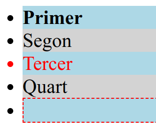

---

title: 3.2.- Regles CSS - Selectors
layout: default
parent: 3.- CSS
nav_order: 20
has_children: true

---

# **Regles CSS: Estructura i Funcionament**


### **1. Estructura d'una regla CSS**
Un conjunt de regles CSS està format per un **selector** i un **bloc de declaració**.

```css

selector {
    propietat: valor;
}
```
{: .text-center}


- **Selector:** Apunta a l'etiqueta o elements HTML als quals volem aplicar un estil.
- **Bloc de declaració:** Conté una o més **declaracions CSS**, separades per punt i coma (`;`).
    - **Declaració:** Cada declaració especifica una propietat CSS i el seu valor, separats per dos punts (`:`).
    - **Blocs de declaració:** Es delimiten amb claus (`{}`).

---

**Exemple bàsic**
```css

h1 {
    font-family: Arial;
    font-weight: bold;
    color: #FF0000; /* Roig */
    background-color: #00FF00; /* Verd */
}
```

**L'anterior regla:**
- Estilitza tots els elements `<h1>`:
  - Canvia la font a Arial.
  - Fa el text negreta.
  - Pinta el text de color roig.
  - Estableix un fons verd darrere del text.

---

### **2. Herència en CSS**

La "C" de **CSS** significa **Cascading**, que indica que els **estils poden ser heretats** pels elements **fill**. Es a dir, les propietats aplicades a un element també poden afectar els seus elements descendents.

#### **Exemple d'herència:**
```css
h1, h2 {
    font-family: Arial;
    font-weight: bold;
    color: #FF0000; /* Vermell */
    background-color: #00FF00; /* Verd */
}

h2 {
    font-style: italic;
}
```

**Com funciona?**
- Els elements `<h1>` i `<h2>` hereten les propietats comunes definides a la primera regla.
- L'element `<h2>` tindrà, a més, un estil de font **cursiva** gràcies a la segona regla.

---

### **3. Resolució de conflictes**

Quan es defineixen múltiples regles per al mateix element i propietat, **l'última regla en el mateix nivell és la que preval**.

**Exemple:**
```css

nom {
    font-family: Arial;
    color: blue;
}

nom {
    color: red;
}
```

**Resultat:**
- El text dins de l'element `<nom>` es mostrarà de **color roig**, ja que la segona regla sobreescriu la primera.

---

### **4. Ordenació de l'aplicació d'estils (Cascade)**

**CSS** utilitza un **sistema de prioritat**s per decidir quina regla aplicar si hi ha conflictes. Els factors són:

1. **Especificitat del selector:**
   - Selectors més específics tenen més prioritat.
   - Per exemple: `#id` > `.class` > `tag`.

2. **Ordre de les regles:**
   - Si dues regles tenen la mateixa especificitat, l'última definida en el codi serà la que preval.

3. **Estils en línia:**
   - Els estils definits amb l'atribut `style` dins de l'element HTML tenen prioritat sobre els estils externs o incrustats.

4. **!important:**
   - Una declaració amb `!important` sobreescriu qualsevol altra regla, independentment de l'ordre o especificitat.

### **Exemple:**
```css
.nom {
    color: blue !important;
}

.nom {
    color: red;
}
```

**Resultat:**
- Tot i que la segona regla està definida posteriorment, el text serà **blau** perquè té `!important`.

---

### **5. Bones pràctiques per evitar conflictes**
- Defineix els estils de manera jeràrquica, agrupant regles comcomuns en selectors compartits.
- Evita sobreescriure estils de manera innecessària.
- Fes ús dels **noms de classes** per a elements específics, en lloc d'aplicar estils directament a etiquetes.

---


# Selectors CSS

Els **selectors CSS** són patrons que permeten seleccionar els elements HTML als quals volem aplicar estils. Hi ha diversos tipus de selectors, cadascun amb una funcionalitat específica.

## **Tipus de Selectors CSS (regles)**

---

### **1. Selector per Element**
Aplica estils a tots els elements d'un tipus específic.

```css
p {
    color: blue;
}
```

**exemple:**

```html
<h2>Exemple: Selector per Element</h2>
<p>Este text serà blau.</p>
<p>Este també.</p>
```

- Selecciona tots els elements `<p>` i els aplica un text de color blau.

---
{. align-center}

---

### **2. Selector per Classe**
Selecciona tots els elements que tenen una **classe específica**. Les classes es defineixen amb un punt (`.`).

```css

.classe {
    font-size: 24px;
}
```

**HTML:**
```html
<p class="classe">Este text tindrà una mida de 24px.</p>
<p class="classe">Este també.</p>
<p>Este no!!.</p>
```

- Només afecta els elements amb la classe `classe`, independentment del tipus d'etiqueta.

---
    {. align-center}
    
---

### **3. Selector per ID**

Selecciona un element únic identificat amb un **ID específic**. Els IDs es defineixen amb una coixinet (`#`).

```css

#identificador {
    background-color: lightgray;
}
```

**HTML:**
```html
<div id="identificador">Este element tindrà un fons gris clar.
</div>
<div >Este element NO!!
</div>

```
---

{. align-center}

---

- Aplica l'estil només a l'element amb l'ID `identificador`.

---

### **4. Selector de Descendents**
Selecciona elements que són descendents d'un altre element, separats per un espai.

```css
article p {
    font-style: italic;
}
```

**HTML:**
```html
<article>
    <p>Este paràgraf estarà en cursiva.</p>
</article>
<p>Este no es veurà afectat.</p>
```
---
    
{. align-center}


---

- Aplica estil en cursiva només als paràgrafs (`<p>`) dins d'un element `<article>`.

---

### **5. Selector de Grups**
Agrupa diversos selectors en una sola regla.

```css
h1, h2, h4 {
    text-align: center;
}
```

**HTML:**
```html
<h1>Títol 1</h1>
<h2>Títol 2</h2>
<h3>Títol 3</h3>
<h4>Títol 4</h4>
```
---
{. align-center}


- Centra tots els encapçalaments `<h1>`, `<h2>` i `<h4>`, `<h3>` no està al grup.

---

### **6. Selector Universal**
Selecciona tots els elements HTML de la pàgina.

```css
* {
    margin: 0;
    padding: 0;
}
```

- Elimina el marge i el padding predeterminats de **tots els elements de la pàgina**.

---


## **Pseudoselectors**
Els **pseudoselectors** són selectors CSS especials que permeten aplicar estils a parts específiques d'un element o reaccionar al seu estat.

---

## ** Pseudoselectors Bàsics**
     
### **`:first-line`**
- Aplica estils a la **primera línia** del text d'un element bloc.
- Ideal per destacar la primera línia d'un paràgraf o secció.

### **`:first-letter`**
- Aplica estils a la **primera lletra** del text d'un element bloc.
- Utilitzat sovint per dissenys decoratius o inicials grans.

### **`:before` i `:after`**
- **`:before`:** Insereix contingut abans del contingut real d'un element.
- **`:after`:** Insereix contingut després del contingut real d'un element.
- S'utilitzen conjuntament amb la propietat `content`.

### Exemple:
```css

p:first-line {
    font-weight: bold;
    color: blue;
}

p:before {
    content: " HOLA!!.  ";
    color: green;
}

p:first-letter {
    font-size: 24px;
    color: red;
}

p:after {
    content: " [Final del text]";
    color: gray;
    font-style: italic;
}
```

**HTML**

```html
<h1>Pseudoselectors Bàsics</h1>
<p>
    Aquesta és una línia de prova per mostrar els pseudoselectors bàsics. Aquí veuràs com funciona la primera línia en negreta i de color blau, mentre que la primera lletra és més gran i vermella. A més, s'ha afegit contingut abans i després del paràgraf amb pseudoelements.
</p>
```

---

{. align-center}


---


- La primera línia del paràgraf estarà en **negreta** i serà **blava**.
- La primera lletra del paràgraf serà de color **vermell** i de mida gran (24px).
- S'insereix la paraula **HOLA!!.** abans del text i `[Final del text]` en cursiva i gris al final.

---

### **2. Pseudoclases d'Estat**
Les pseudoclases d'estat permeten aplicar estils segons l'estat d'interacció d'un element.

#### **`:hover`**
- Quan el ratolí està sobre un element.

#### **`:focus`**
- Quan un element (com un camp de formulari) està enfocat.

#### **`:active`**
- Quan un element està sent clicat o activat.

##### Exemple:
```css
button {
    background-color: lightgray;
    color: black;
    border: 1px solid black;
    padding: 10px;
    cursor: pointer;
}

button:hover {
    background-color: blue;
    color: white;
}

button:focus {
    border-color: red;
    outline: none;
}

button:active {
    background-color: navy;
}
```

```html
<button>Clica'm</button>
```


- El botó canviarà de color quan el ratolí passi per sobre (**fons blau**, **text blanc**).
- Quan el botó estigui enfocat, el **contorn** serà de color vermell.
- Quan es clica, el fons es tornarà **blau marí**.

---

### **3. Pseudoclases Estructurals**
Les pseudoclases estructurals seleccionen elements basats en la seva posició dins del DOM.

#### **`:nth-child(n)`**
- Selecciona el fill `n-è` d'un element pare.

#### **`:nth-last-child(n)`**
- Selecciona el fill `n-è` començant des del final.

#### **`:first-child` i `:last-child`**
- **`:first-child`:** Selecciona el primer fill d'un element.
- **`:last-child`:** Selecciona l'últim fill.

#### **`:only-child`**
- Selecciona un element que és l'únic fill del seu pare.

##### Exemple:
```css
li:nth-child(odd) {
    background-color: lightblue;
}

li:nth-child(even) {
    background-color: lightgray;
}

li:nth-child(3) {
    color: red;
}

li:first-child {
    font-weight: bold;
}

li:last-child {
    font-style: italic;
}
```

```html
<ul>
    <li>Primer</li>
    <li>Segon</li>
    <li>Tercer</li>
    <li>Quart</li>
</ul>
```

---

{. align-center}


---


- Els elements imparells tindran un fons **blau clar**.
- Els parells tindran un fons **gris clar**.
- El tercer element serà de color **roig**.
- El primer element estarà en **negreta**.
- L'últim element tindrà **cursiva**.

---

### **Selectors Avançats**

#### **Selector de Fills Immediats (`>`):**
- Selecciona només els fills directes d'un element.

##### Exemple:
```css
div > p {
    color: green;
}
```

```html
<div>
    <p>Verd (fill directe)</p>
    <div>
        <p>No afectat</p>
    </div>
</div>
```

---

#### **Selector d'Elements Adjacents (`+`):**
- Selecciona l'element que ve immediatament després d'un altre.

##### Exemple:
```css
h1 + p {
    margin-top: 10px;
}
```

```html
<h1>Títol</h1>
<p>Paràgraf formatat.</p>
<p>No afectat.</p>
```

---

#### **Selector de Germans Generals (`~`):**
- Selecciona tots els germans posteriors d'un element.

### Exemple:
```css
h1 ~ p {
    color: gray;
}
```

```html
<h1>Títol</h1>
<p>Primer germà</p>
<p>Segon germà</p>
```

---

## **Selectors d'Atributs**
Permeten aplicar estils en funció dels atributs dels elements HTML.

### **Selector per Atribut:**

Selecciona elements que tenen un atribut determinat, independentment del valor.

**Exemple:**

```css
input[type="text"] {
    border: 1px solid black;
}
```

- Selecciona tots els elements <input> amb l'atribut type="text".
- La propietat border aplica una vora negra amb un gruix de 2 píxels.


**HTML:**

```html
<input type="text" placeholder="Text">
<input type="password" placeholder="Contrasenya">
<input type="checkbox">
```

- Només l'input amb `type="text"` tindrà una vora negra. Els altres no es veuran afectats.

---

### **Selector per Valor Exacte (`[atribut="valor"]`)**
Selecciona els elements que tenen un atribut amb un **valor exacte**.

**Exemple:**

```css
a[href="https://example.com"] {
    color: green;
    font-weight: bold;
}
```
- Selecciona només els enllaços (`<a>`) amb l'atribut `href` exactament igual a `"https://example.com"`.

**HTML:**

```html
<a href="https://example.com">Enllaç segur</a>
<a href="https://altre.com">Enllaç alternatiu</a>
```

- Només el primer enllaç serà de color **verd** i tindrà **negreta**.

---


## **Selector per Valor Parcial:**
```css
a[href^="https"] {
    color: green;
}
```

```html
<input type="text" placeholder="Escriu aquí">
<a href="https://example.com">Enllaç segur</a>
<a href="http://example.com">Enllaç no segur</a>
```

**Resultat:**
- Els camps de text tindran una vora negra.
- Els enllaços amb `https` seran **verds**.


---

### Selector per Valor Parcial**
- **`^=` (Comença amb)**
Selecciona els elements en què el valor de l'atribut **comença amb una cadena específica**.

**Exemple:**
```css
a[href^="https"] {
    color: blue;
}
```

- Selecciona els enllaços amb un `href` que comenci per `https`.

**HTML:**
```html
<a href="https://example.com">Enllaç segur</a>
<a href="http://example.com">Enllaç no segur</a>
<a href="ftp://example.com">Alt tipus d'enllaç</a>
```

- Només l'enllaç amb `https://` tindrà el text de color **blau**.

---

- **`$=` (Acaba amb)**
Selecciona els elements en què el valor de l'atribut **acaba amb una cadena específica**.

**Exemple:**
```css
img[src$=".jpg"] {
    border: 5px solid red;
}
```

- Selecciona totes les imatges amb un `src` que acabi en `.jpg`.

**HTML:**
```html


```


- Només les imatges amb extensió `.jpg` tindran una vora de 5 píxels i color **vermell**.

---

- **`*=` (Conté)**
Selecciona els elements en què el valor de l'atribut **conté una cadena específica**.

**Exemple:**

```css
a[href*="example"] {
    text-decoration: underline;
    color: purple;
}
```

- Selecciona tots els enllaços amb un `href` que inclogui la paraula `example`.

**HTML:**
```html
<a href="https://example.com">Enllaç principal</a>
<a href="https://sub.example.com">Subenllaç</a>
<a href="https://altresite.com">Altres</a>
```

- Els dos primers enllaços tindran el text de color **porpra** i subratllat perquè contenen `example` en l'atribut `href`.

---

- **Selector per Existència de l'Atribut**
Selecciona elements que **tenen un atribut determinat**, sense importar el valor.

**Exemple:**

```css
input[required] {
    border: 2px solid orange;
}
```

- Selecciona qualsevol `<input>` que tingui l'atribut `required` (que indica que és obligatori).

**HTML:**
```html
<input type="text" required placeholder="Obligatori">
<input type="email" placeholder="Opcional">
<input type="password" required placeholder="Obligatori">
```

- Els inputs amb l'atribut `required` tindran una vora **taronja**.

---

**Selector per Atribut Separat per Espais (`[atribut~="valor"]`)**
Selecciona els elements on el valor de l'atribut inclou un valor específic separat per espais.

**Exemple:**

```css
div[class~="destacat"] {
    background-color: yellow;
}
```


- Selecciona qualsevol element `<div>` amb una classe que contingui la paraula exacta `destacat` dins de la llista de classes.

**HTML:**

```html
<div class="normal destacat">Contingut destacat</div>
<div class="normal">Contingut normal</div>
```

- Només el primer `<div>` tindrà un fons **groc**.

---

- **elector per Valor amb Prefix (`[atribut|="prefix"]`)**
Selecciona elements amb un atribut que **comenci amb un prefix** o amb el prefix seguit d'un guió (`-`).

**Exemple:**

```css
[lang|="en"] {
    font-style: italic;
}
```

- Selecciona elements amb l'atribut `lang` igual a `en` o que comenci amb `en-` (com `en-US` o `en-GB`).

**HTML:**
```html
<p lang="en">Text en anglès.</p>
<p lang="en-US">Text en anglès americà.</p>
<p lang="es">Text en castellà.</p>
```
- Els dos primers paràgrafs estaran en **cursiva**.


**i molts més...**

---


## **Chuleta de Selectors CSS**

### **1. Selectors Bàsics**
- **Per element:**  
  ```css
  p { color: blue; }
  ```
- **Per classe (`.`):**  
  ```css
  .classe { font-size: 18px; }
  ```
- **Per ID (`#`):**  
  ```css
  #id { background: lightgray; }
  ```

---

### **2. Selectors Jeràrquics**
- **Descendents:**  
  ```css
  div p { color: green; }
  ```
- **Fills directes (`>`):**  
  ```css
  div > p { color: red; }
  ```
- **Adjacents (`+`):**  
  ```css
  h1 + p { margin-top: 10px; }
  ```
- **Germans generals (`~`):**  
  ```css
  h1 ~ p { color: gray; }
  ```

---

### **3. Selectors Especials**
- **Universal (`*`):**  
  ```css
  * { margin: 0; padding: 0; }
  ```

---

### **4. Pseudoselectors**
- **Primera línia:**  
  ```css
  p:first-line { font-weight: bold; }
  ```
- **Primera lletra:**  
  ```css
  p:first-letter { font-size: 24px; }
  ```
- **Abans i després:**  
  ```css
  p:before { content: "🔹 "; }
  p:after { content: "[Final]"; }
  ```

---

### **5. Pseudoclases d'Estat**
- **Ratolí sobre (`:hover`):**  
  ```css
  button:hover { background: blue; }
  ```
- **Element enfocat (`:focus`):**  
  ```css
  input:focus { border: 2px solid red; }
  ```
- **Element clicat (`:active`):**  
  ```css
  a:active { color: orange; }
  ```

---

### **6. Pseudoclases Estructurals**
- **N-è fill:**  
  ```css
  li:nth-child(2) { color: red; }
  ```
- **Primer/últim fill:**  
  ```css
  li:first-child { font-weight: bold; }
  li:last-child { font-style: italic; }
  ```
- **Fill únic:**  
  ```css
  p:only-child { color: purple; }
  ```

---

### **7. Selectors d'Atributs**
- **Per atribut:**  
  ```css
  input[required] { border: 2px solid orange; }
  ```
- **Comença amb (`^=`):**  
  ```css
  a[href^="https"] { color: blue; }
  ```
- **Acaba amb (`$=`):**  
  ```css
  img[src$=".jpg"] { border: 2px solid red; }
  ```
- **Conté (`*=`):**  
  ```css
  a[href*="example"] { text-decoration: underline; }
  ```
- **Separat per espais (`~=`):**  
  ```css
  div[class~="destacat"] { background: yellow; }
  ```
- **Prefix (`|=`):**  
  ```css
  [lang|="en"] { font-style: italic; }
  ```

---


----------
-
-
-
-

------------


```markdown
# Pràctica de Selectors CSS

## HTML Base per al Quiz
```html
<!DOCTYPE html>
<html lang="en">
<head>
    <meta charset="UTF-8">
    <meta name="viewport" content="width=device-width, initial-scale=1.0">
    <title>Pràctica de Selectors CSS</title>
</head>
<body>
    <header id="main-header">
        <h1 class="title">Benvinguts</h1>
        <p class="intro">Aprendre CSS pot ser divertit.</p>
    </header>
    <section>
        <h2 class="subtitle">Secció 1</h2>
        <p>
            Aquest és un <span class="highlight">text destacat</span>.
        </p>
    </section>
    <section>
        <h2 class="subtitle">Secció 2</h2>
        <p>
            Un altre paràgraf amb un <span class="highlight special">span especial</span>.
        </p>
    </section>
    <footer>
        <p class="footer-text">Text del peu de pàgina.</p>
    </footer>
</body>
</html>
```

---

### Exercicis i Solucions

<details>
<summary>**1. Selecciona totes les etiquetes `<h2>`.**</summary>

**Selector:** `h2`  
**Línies seleccionades:**

```html
<h2 class="subtitle">Secció 1</h2>
<h2 class="subtitle">Secció 2</h2>
```
</details>

---

<details>
<summary>**2. Selecciona totes les etiquetes amb la classe `highlight`.**</summary>

**Selector:** `.highlight`  
**Línies seleccionades:**
```html
<span class="highlight">text destacat</span>
<span class="highlight special">span especial</span>
```
</details>

---

<details>
<summary>**3. Selecciona l'element amb l'ID `main-header`.**</summary>

**Selector:** `#main-header`  
**Línia seleccionada:**
```html
<header id="main-header">
```
</details>

---

<details>
<summary>**4. Selecciona tots els elements `<p>` que siguen descendents d'un `<section>`.**</summary>

**Selector:** `section p`  
**Línies seleccionades:**
```html
<p>
    Aquest és un <span class="highlight">text destacat</span>.
</p>
<p>
    Un altre paràgraf amb un <span class="highlight special">span especial</span>.
</p>
```
</details>

---

<details>
<summary>**5. Selecciona el primer `<h2>` del document.**</summary>

**Selector:** `h2:first-of-type`  
**Línia seleccionada:**
```html
<h2 class="subtitle">Secció 1</h2>
```
</details>

---

<details>
<summary>**6. Selecciona l'últim `<p>` del document.**</summary>

**Selector:** `p:last-of-type`  
**Línia seleccionada:**
```html
<p class="footer-text">Text del peu de pàgina.</p>
```
</details>

---

<details>
<summary>**7. Selecciona tots els `<span>` que siguen descendents d'un `<section>`.**</summary>

**Selector:** `section span`  
**Línies seleccionades:**
```html
<span class="highlight">text destacat</span>
<span class="highlight special">span especial</span>
```
</details>

---

<details>
<summary>**8. Selecciona totes les etiquetes `<h2>` i tots els elements amb la classe `highlight`.**</summary>

**Selector:** `h2, .highlight`  
**Línies seleccionades:**
```html
<h2 class="subtitle">Secció 1</h2>
<h2 class="subtitle">Secció 2</h2>
<span class="highlight">text destacat</span>
<span class="highlight special">span especial</span>
```
</details>

---

<details>
<summary>**9. Selecciona la primera línia de text de cada paràgraf `<p>`.**</summary>

**Selector:** `p:first-line`  
**Línies seleccionades:**  
Visualment, només es seleccionaria la primera línia de cada `<p>` (no és visible directament en l'HTML).
</details>

---

<details>
<summary>**10. Selecciona la primera lletra de cada paràgraf `<p>`.**</summary>

**Selector:** `p:first-letter`  
**Línies seleccionades:**  
Visualment, només es seleccionaria la primera lletra de cada `<p>` (no és visible directament en l'HTML).
</details>

---

<details>
<summary>**11. Selecciona els elements amb classe `highlight` i afegeix contingut abans d'ells.**</summary>

**Selector:** `.highlight:before`  
**Línies seleccionades:**
```html
<span class="highlight">text destacat</span>
<span class="highlight special">span especial</span>
```
**Nota:** El contingut "abans" s'afegeix amb CSS.
</details>

---

<details>
<summary>**12. Selecciona els elements amb classe `special` i afegeix contingut després d'ells.**</summary>

**Selector:** `.special:after`  
**Línia seleccionada:**
```html
<span class="highlight special">span especial</span>
```
**Nota:** El contingut "després" s'afegeix amb CSS.
</details>

---

<details>
<summary>**13. Selecciona tots els elements del document.**</summary>

**Selector:** `*`  
**Línies seleccionades:**  
Totes les etiquetes del document són seleccionades, per exemple:
```html
<!DOCTYPE html>
<html lang="en">
<head>...</head>
<body>...</body>
<header>...</header>
<h1>...</h1>
<p>...</p>
<section>...</section>
<h2>...</h2>
<span>...</span>
<footer>...</footer>
```
</details>

---


# Pràctica Avançada de Selectors CSS

## HTML Base per al Quiz
```html
<!DOCTYPE html>
<html lang="en">
<head>
    <meta charset="UTF-8">
    <meta name="viewport" content="width=device-width, initial-scale=1.0">
    <title>Pràctica Avançada de Selectors</title>
</head>
<body>
    <header id="site-header">
        <h1 class="main-title">Benvingut al Quiz</h1>
        <nav>
            <ul class="menu">
                <li class="menu-item"><a href="#home">Inici</a></li>
                <li class="menu-item"><a href="#about">Sobre nosaltres</a></li>
                <li class="menu-item active"><a href="#contact">Contacte</a></li>
            </ul>
        </nav>
    </header>
    <main>
        <section id="about-section">
            <h2 class="section-title">Sobre Nosaltres</h2>
            <p class="section-text">Aquesta és una descripció sobre la nostra missió.</p>
            <p class="section-text">Els nostres valors estan reflectits ací.</p>
        </section>
        <section id="services-section">
            <h2 class="section-title">Serveis</h2>
            <ul>
                <li>Consultoria</li>
                <li>Desenvolupament Web</li>
                <li class="highlight">Màrqueting Digital</li>
            </ul>
        </section>
    </main>
    <footer>
        <p>© 2024 Quiz CSS. Tots els drets reservats.</p>
    </footer>
</body>
</html>
```

---

## Exercicis i Solucions

<details>
<summary>**1. Selecciona totes les etiquetes `<h2>`.**</summary>

**Selector:** `h2`  
**Línies seleccionades:**
```html
<h2 class="section-title">Sobre Nosaltres</h2>
<h2 class="section-title">Serveis</h2>
```
</details>

<details>
<summary>**2. Selecciona l'element amb ID `services-section`.**</summary>

**Selector:** `#services-section`  
**Línia seleccionada:**
```html
<section id="services-section">
```
</details>

<details>
<summary>**3. Selecciona totes les etiquetes amb la classe `menu-item`.**</summary>

**Selector:** `.menu-item`  
**Línies seleccionades:**
```html
<li class="menu-item"><a href="#home">Inici</a></li>
<li class="menu-item"><a href="#about">Sobre nosaltres</a></li>
<li class="menu-item active"><a href="#contact">Contacte</a></li>
```
</details>

<details>
<summary>**4. Selecciona només el tercer `<li>` dins del menú (`<ul>`).**</summary>

**Selector:** `.menu-item:nth-of-type(3)`  
**Línia seleccionada:**
```html
<li class="menu-item active"><a href="#contact">Contacte</a></li>
```
</details>

<details>
<summary>**5. Selecciona tots els enllaços (`<a>`) dins del menú (`<ul>`).**</summary>

**Selector:** `.menu a`  
**Línies seleccionades:**
```html
<a href="#home">Inici</a>
<a href="#about">Sobre nosaltres</a>
<a href="#contact">Contacte</a>
```
</details>

<details>
<summary>**6. Selecciona els elements amb classe `section-text` que siguen descendents de l'element amb ID `about-section`.**</summary>

**Selector:** `#about-section .section-text`  
**Línies seleccionades:**
```html
<p class="section-text">Aquesta és una descripció sobre la nostra missió.</p>
<p class="section-text">Els nostres valors estan reflectits ací.</p>
```
</details>

<details>
<summary>**7. Selecciona tots els elements `<li>` que siguen descendents de l'element amb ID `services-section`.**</summary>

**Selector:** `#services-section li`  
**Línies seleccionades:**
```html
<li>Consultoria</li>
<li>Desenvolupament Web</li>
<li class="highlight">Màrqueting Digital</li>
```
</details>

<details>
<summary>**8. Selecciona totes les etiquetes `<h1>` i `<h2>`.**</summary>

**Selector:** `h1, h2`  
**Línies seleccionades:**
```html
<h1 class="main-title">Benvingut al Quiz</h1>
<h2 class="section-title">Sobre Nosaltres</h2>
<h2 class="section-title">Serveis</h2>
```
</details>

<details>
<summary>**9. Selecciona l'últim `<li>` dins del menú (`<ul>`).**</summary>

**Selector:** `.menu-item:last-child`  
**Línia seleccionada:**
```html
<li class="menu-item active"><a href="#contact">Contacte</a></li>
```
</details>

<details>
<summary>**10. Selecciona el primer paràgraf dins de l'element amb ID `about-section`.**</summary>

**Selector:** `#about-section p:first-of-type`  
**Línia seleccionada:**
```html
<p class="section-text">Aquesta és una descripció sobre la nostra missió.</p>
```
</details>

<details>
<summary>**11. Selecciona el text de la primera línia de cada paràgraf (`<p>`).**</summary>

**Selector:** `p:first-line`  
**Línies seleccionades:**  
Visualment, només es seleccionaria la primera línia de cada paràgraf (no és visible directament en l'HTML).
</details>

<details>
<summary>**12. Selecciona la primera lletra de cada paràgraf (`<p>`).**</summary>

**Selector:** `p:first-letter`  
**Línies seleccionades:**  
Visualment, només es seleccionaria la primera lletra de cada paràgraf (no és visible directament en l'HTML).
</details>

<details>
<summary>**13. Selecciona tots els elements del document.**</summary>

**Selector:** `*`  
**Línies seleccionades:**  
Totes les etiquetes del document són seleccionades, per exemple:
```html
<!DOCTYPE html>
<html>
<head>...</head>
<body>...</body>
<header>...</header>
<nav>...</nav>
<ul>...</ul>
<section>...</section>
<footer>...</footer>
```
</details>

<details>
<summary>**14. Afegeix contingut abans i després de cada element `<li>` amb classe `highlight`.**</summary>

**Selector:** `.highlight:before` i `.highlight:after`  
**Línies seleccionades:**
```html
<li class="highlight">Màrqueting Digital</li>
```
**Nota:** El contingut afegit es gestiona amb CSS, per exemple:
```css
.highlight:before {
    content: "★ ";
}
.highlight:after {
    content: " ★";
}
``
