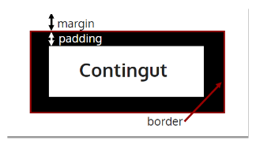

---

title: 3.3.- Regles CSS - Disseny
layout: default
parent: 3.- CSS
nav_order: 30
has_children: true

---

# **Regles CSS: Disseny i Propietats**


# 3.3. Regles CSS - Disseny

## **Model de Caixa**

En CSS es treballa amb el concepte de "caixes", ajustant el seu tamany, color, posició, etc. Es pot pensar en els elements HTML com blocs o caixes apilades una damunt de l’altra.

Quan es visualitza qualsevol element amb CSS, es tracta com si estigués dins d'una caixa rectangular. Cada caixa té **quatre** components principals:

- **Contingut:** El contingut que es mostra dins de l'element.
- **Emplenament (*padding*):** L'espai entre el contingut i la vora de l'element.
- **Marc (*border*):** La línia que envolta l'element.
- **Marge (*margin*):** L'espai exterior de l'element, fora del marc.


{: .align-center}



### Exemple bàsic:
```css
.element {
    width: 300px;
    height: 150px;
    padding: 10px;
    border: 2px solid black;
    margin: 15px;
}
```
On:
- `width` i `height` defineixen les dimensions de la caixa.
- `padding` defineix l'espai entre el contingut i el marc.
- `border` és el marc que envolta l'element (estil, amplada i color).
- `margin` defineix l'espai entre l'element i altres elements.


---

### **Amplada i altura**
Les propietats `width` i `height` permeten definir les dimensions de la caixa.

Exemple:
```css
.nom {
    width: 300px; /* Amplada */
    height: 100px; /* Altura */
}
```

---

### **Disseny de marges, emplenaments i marc**
Per defecte, els valors de `margin`, `padding` i `border` són zero. Aquests es poden modificar amb propietats específiques:

#### **Marges**
Defineixen l'espai fora de l'element:
```css
.nom {
    margin: 10px; /* Tots els marges a 10 píxels */
    margin-top: 15px; /* Màrgens superior específic */
}
```

#### **Emplenaments**
Defineixen l'espai interior entre el contingut i el marc:
```css
.nom {
    padding: 5px; /* Emplenament igual a tots els costats */
    padding-left: 10px; /* Emplenament específic a l'esquerra */
}
```

#### **Marc**
El marc envolta l'element i té diverses subproprietats:
- **`border-style:`** Estil del marc (`none`, `solid`, `dashed`, `dotted`, etc.).
- **`border-width:`** Amplada del marc (en píxels).
- **`border-color:`** Color del marc.

Exemple:
```css
.nom {
    border-style: solid;
    border-width: 2px;
    border-color: red;
}
```

Propietat abreujada:
```css
.nom {
    border: 2px dashed blue;
}
```

---

## 3.4. Regles CSS - Propietats

CSS defineix moltes propietats agrupades en categories. Algunes comunes inclouen:

### **Tipus de lletres**
- **`font-family:`** Família tipogràfica. És recomanable especificar opcions alternatives:
    ```css
    p {
        font-family: "Arial", "Helvetica", sans-serif;
    }
    ```
- **`font-size:`** Grandària de la lletra.
    ```css
    h2 {
        font-size: 16px; /* Pixels */
    }
    ```
- **`font-weight:`** Gruix de la lletra (`normal`, `bold`, `lighter`, etc.).
    ```css
    span {
        font-weight: bold;
    }
    ```

### **Colors i fons**
- **`color:`** Color del text.
- **`background-color:`** Color de fons.

Es pot usar un valor en RGB, HEX, HSL, o el nom predefinit:
```css
.element {
    color: rgb(255, 0, 0); /* Roig pur */
    background-color: #f0f0f0; /* Gris clar */
}
```

#### **Fons avançats**
- **`background-image:`** Defineix una imatge de fons.
    ```css
    background-image: url('imatge.jpg');
    ```
- **`background-size:`** Controla la mida de la imatge (`cover`, `contain`, etc.).

### **Propietats de caixes**
- **`box-sizing:`** Defineix si `border` i `padding` es compten dins de `width` i `height`:
    ```css
    .element {
        box-sizing: border-box;
    }
    ```
```

Amb aquestes millores, el contingut és més clar, estructurat i lliure d'errors, facilitant l'aprenentatge del CSS.


### **Colors i contingut**
Per modificar el color de fons o del text dins d'un element:
- **`background-color:`** Defineix el color de fons.
- **`color:`** Defineix el color del text.

Exemple:
```css
.element {
    background-color: #f0f0f0;
    color: #333333;
}
```