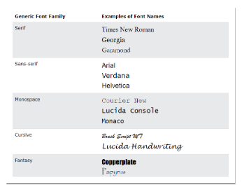

---

title: 3.3.- Regles CSS - Disseny
layout: default
parent: 3.- CSS
nav_order: 30
has_children: true

---


# 3.3. Regles CSS - Disseny

## **Model de Caixa**

En CSS es treballa amb el concepte de "caixes", ajustant el seu tamany, color, posició, etc. Es pot pensar en els **elements HTML com blocs o caixes apilades una damunt de l’altra**.

Quan es visualitza qualsevol element amb CSS, es tracta com si estigués dins d'una caixa rectangular. Cada caixa té **quatre** components principals:

- **Contingut:** El contingut que es mostra dins de l'element.
- **Emplenament (*padding*):** L'espai entre el contingut i la vora de l'element.
- **Marc (*border*):** La línia que envolta l'element.
- **Marge (*margin*):** L'espai exterior de l'element, fora del marc.


{: .text-center}


---

## **Propietat important del Model de Caixa: `box-sizing`**

Per defecte, el navegador calcula l’ample d’un element **sumant** el `content + padding + border`. Açò pot complicar el disseny.

La propietat `box-sizing` permet canviar este comportament:

```css
/* Mode per defecte */
box-sizing: content-box;

/* Mode més fàcil per maquetar */
box-sizing: border-box;
```

### Explicació:

* **content-box**: l’amplada NO inclou padding ni border.
  → L’element creix més del previst.
* **border-box**: l’amplada **sí** inclou padding i border.
  → Resultat més intuïtiu per al disseny.

Recomanació habitual:

```css
* {
    box-sizing: border-box;
}
```

---


### **Exemple general del Model de Caixa**
```css
.element {
    width: 300px;
    height: 150px;
    padding: 10px;
    border: 2px solid black;
    margin: 15px;
}
```
On:
- `width` i `height` defineixen les dimensions de la caixa.
- `padding` defineix l'espai entre el contingut i el marc.
- `border` és el marc que envolta l'element (estil, amplada i color).
- `margin` defineix l'espai entre l'element i altres elements.


---

## **Amplada i altura**
Les propietats `width` i `height` permeten definir les dimensions de la caixa.

**Exemple:**
```css
.nom {
    width: 300px; /* Amplada */
    height: 100px; /* Altura */
}
```
{: .text-center}


---

### **Unitats permeses**

* **Absolutes:** px, cm, in, pt…
* **Relatives:** %, em, rem, vh, vw, auto…

On: 


| **Unitat** | **Significat**              | **Explicació breu**                                                                                   |
| ---------- | --------------------------- | ----------------------------------------------------------------------------------------------------- |
| **%**      | Percentatge                 | Relativa al **contenidor pare**. Exemple: `width: 50%` és la meitat de l'ample del pare.              |
| **em**     | *Mida relativa al pare*     | `1em` = mida de lletra del **pare**. Exemple: si el pare té `font-size: 20px`, `1em = 20px`.          |
| **rem**    | *Mida relativa al document* | `1rem` = mida de lletra del **html**. No depén del pare. Exemple: si `html` té `16px`, `1rem = 16px`. |
| **vh**     | Viewport Height             | `1vh` = 1% de l’**altura de la finestra** del navegador.                                              |
| **vw**     | Viewport Width              | `1vw` = 1% de l’**amplada de la finestra** del navegador.                                             |
| **auto**   | Automàtic                   | El navegador calcula automàticament la mida o posició. Exemple: `margin: auto` centra l’element.      |

---


**Exemple amb dimensions relatives:**


```css
.nom {
    width: 50%;            /* La meitat del contenidor pare */
    height: 100vh;         /* 100% de l'altura visible de la finestra */
    
    font-size: 1.2rem;     /* 1.2 vegades la mida base del document (html) */
    padding: 2em;          /* 2 vegades la mida de lletra del pare */
    
    max-width: 80vw;       /* Com a màxim, el 80% de l'amplada de la finestra */
    min-height: 20vmin;    /* L'altura mínima serà el 20% del costat més menut de la finestra */
    
    margin: auto;          /* Centrat horitzontalment */
    border-radius: 1vmax;  /* Arrodoniment basat en el costat més gran del viewport */
}

```

---

### **Min, Max i Ajust Automàtic**

Per controlar si un element pot créixer o reduir-se:

```css
div {
    min-width: 200px;
    max-width: 600px;
    height: auto;
}
```

* **min-width**: l’element no serà més menut del valor indicat.
* **max-width**: molt útil en disseny responsive.
* **auto**: el navegador adapta la mida al contingut.


---

## **Disseny de marges, emplenaments i marc**
Per defecte, els valors de `margin`, `padding` i `border` són zero. Aquests es poden modificar amb propietats específiques:


{: .text-center}


### **Marges (`margin`)**
Defineixen l'espai fora de l'element, es a dir, l'espai entre l'element i altres elements
Utilitzem la propietat `margin` que pot tindre els següents valors:

- **`margin:`** Tots els marges a la vegada.
- **`margin-top:`** Marge superior.
- **`margin-right:`** Marge dret.
- **`margin-bottom:`** Marge inferior.
- **`margin-left:`** Marge esquerre.
- **`margin: top right bottom left;`** Per especificar tots els marges a la vegada.

**Per exemple:**

```css
.nom {
    margin: 10px; /* Tots els marges a 10 píxels */
    margin-top: 15px; /* Màrgens superior específic */
}
```

En este cas, l'element tindrà un marge de 10 píxels a tots els costats, excepte a la part superior, on el marge serà de 15 píxels.

**Altre exemple:**

```css
div {
 margin-top: 20px;
 margin-right: 30px;
 margin-bottom: 40px;
 margin-left: 50px;
}
```

o també es pot fer de la següent manera:

```css
div {
 margin: 20px 30px 40px 50px;   /* top, right, bottom, left */
}
```

{. .text-center}


---


### **Emplenaments (`padding`)**
La propietat `padding` defineix l'espai entre el contingut i el marc de l'element. Es pot utilitzar de la mateixa manera que `margin`:

- **`padding:`** Tots els emplenaments a la vegada.
- **`padding-top:`** Emplenament superior.
- **`padding-right:`** Emplenament dret.
- **`padding-bottom:`** Emplenament inferior.
- **`padding-left:`** Emplenament esquerre.

i també tot junt:

- **`padding: top right bottom left;`** Per especificar tots els emplenaments a la vegada.


{. .text-center}


**Exemples:**

```css
.nom {
    padding: 5px; /* Emplenament igual a tots els costats */
    padding-left: 10px; /* Emplenament específic a l'esquerra */
}
```

En este cas, l'element tindrà un emplenament de 5 píxels a tots els costats, excepte a la part esquerra, on l'emplenament serà de 10 píxels.

**Altre exemple:**

```css

div {
 padding-top: 80px;
 padding-right: 100px;
 padding-bottom: 120px;
 padding-left: 140px;
}
```

o també es pot fer de la següent manera:

```css
div {
 padding: 80px 100px 120px 140px;
}
```

{. .text-center}


---


## **Marc (`border`)**

El border és la línia que envolta l'element. Es pot personalitzar amb les propietats `border-style`, `border-width` i `border-color`.

El marc envolta l'element i té diverses subproprietats:


- **`border-style:`** Estil del marc (`none`, `solid`, `dashed`, `dotted`, etc.).
- **`border-width:`** Amplada del marc (en píxels).
- **`border-color:`** Color del marc.

Exemple:
```css
.nom {
    border-style: solid;
    border-width: 2px;
    border-color: red;
}
```

**Propietat abreujada:**

```css
.nom {
    border: 2px dashed blue;
}
```

En este cas, l'element tindrà un marc de 2 píxels d'ample, de color blau i amb un estil de **línia puntejada**.

Les propietats `border-top`, `border-right`, `border-bottom` i `border-left` permeten definir el marc de cada costat de l'element.

exemple:
```css
.nom {
    border-top: 2px solid red;
    border-bottom: 2px solid blue;
}
```

L'element tindrà una vora de 2 píxels d'ample a la part superior de color vermell i a la part inferior de color blau.

### Estils de la línia:

- `none`: Sense marc.
- `dotted`: Línia de punts.
- `dashed`: Línia puntejada.
- `solid`: Línia sòlida.
- `double`: Doble línia.
- `groove`: Línia en relleu.
- `ridge`: Línia en relleu invers.
- `inset`: Línia en relleu intern.
- `outset`: Línia en relleu extern.
- `hidden`: Línia oculta.


{. _text-center}


### Arrodonir Vores

Una altra propietat molt usada és `border-radius` que permet arrodonir les vores dels elements.

```css 
.nom {
    border-radius: 10px;
}
```

---

### **Propietat `overflow`**

Indica què ocorre quan el contingut és més gran que la caixa.

```css
overflow: visible;   /* Per defecte */
overflow: hidden;    /* Amaga el contingut sobrant */
overflow: scroll;    /* Barra de scroll sempre */
overflow: auto;      /* Barra només si cal */
```

---


### **Exemple complet de `overflow`**

- **HTML**

```html
<div class="caixa overflow-visible">
    <h3>visible</h3>
    Lorem ipsum dolor sit amet, consectetur adipiscing elit. Donec non sem nisi. Sed vitae ligula...
</div>

<div class="caixa overflow-hidden">
    <h3>hidden</h3>
    Lorem ipsum dolor sit amet, consectetur adipiscing elit. Donec non sem nisi. Sed vitae ligula...
</div>

<div class="caixa overflow-scroll">
    <h3>scroll</h3>
    Lorem ipsum dolor sit amet, consectetur adipiscing elit. Donec non sem nisi. Sed vitae ligula...
</div>

<div class="caixa overflow-auto">
    <h3>auto</h3>
    Lorem ipsum dolor sit amet, consectetur adipiscing elit. Donec non sem nisi. Sed vitae ligula...
</div>
```

---

- **CSS**

```css
.caixa {
    width: 200px;
    height: 80px;
    border: 2px solid #000;
    margin: 20px;
    padding: 10px;
    background-color: #f2f2f2;
}

/* Es mostra el contingut encara que ixca de la caixa */
.overflow-visible {
    overflow: visible; 
}

/* El contingut sobrant s'oculta */
.overflow-hidden {
    overflow: hidden;
}

/* Sempre mostra barres de desplaçament */
.overflow-scroll {
    overflow: scroll;
}

/* Només mostra barres si cal */
.overflow-auto {
    overflow: auto;
}
```

---


| Classe               | Comportament                                                      |
| -------------------- | ----------------------------------------------------------------- |
| **overflow-visible** | El text ix de la caixa i es veu tot i desbordant-la.              |
| **overflow-hidden**  | El text extra queda ocult. Només es veu el que cap dins la caixa. |
| **overflow-scroll**  | La caixa mostra barres de scroll encara que no facen falta.       |
| **overflow-auto**    | Mostra barres **només si el contingut no cap**.                   |


## 3.4. Regles CSS - Propietats

CSS defineix moltes propietats agrupades en categories. 

### **Unitats**

Existeixen molts tipus d’unitats en CSS, les podem utilitzar cadascuna d’elles en funció de les nostres necessitats:

**Longitud**

- **Pixels (px)**, **ems (em)**, **percentatge (%)**, **punts (pt)**, **polzades (in)**, **centímetres (cm)**

- **em**:  Relativa a la mida de lletra del pare.

Si `body` té `font-size: 16px`:

* `1em = 16px`
* `2em = 32px`

- **rem**  Relativa a la mida de lletra del document (`html`), no del pare.

Recomanat per a disseny consistent.

**Exemple:**

```css
html { font-size: 16px; }

p { font-size: 1.2em; }  /* Depén del pare */
h1 { font-size: 2rem; }  /* Sempre 32px */
```

---


### **Tipus de lletres**

- **`font-family:`** Defineix la família de tipus de lletres (font) a utilitzar. Pot incloure múltiples noms de famílies separats per comes, en cas que la primera no estiga disponible:

    ```css
    p {
        font-family: "Arial", "Helvetica", sans-serif;
    }
    ```
- **`font-size:`** Grandària de la lletra.  Pot ser especificada en diferents unitats (px), (em), (%), (pt), (in), (cm).

    ```css
    h2 {
        font-size: 16px; /* Pixels */
    }
    ```
- **`font-weight:`** Especifica el gruix de la lletra, els valors poden ser numèrics, o predefinits com:
  - **normal**: És el gruix per defecte de la font (normalment equivalent a 400).
  - **bold**: Aplica un estil de lletra en negreta (equivalent a 700).
  - **lighter**: Fa que el text sigui més fi que el gruix heretat de l'element pare.
  - **bolder**: Fa que el text sigui més gruixut que el gruix heretat de l'element pare.


```css
    span {
        font-weight: bold;
    }
 ```
 

- **`font-variant`**:  
  Especifica si el tipus de lletra ha de ser mostrat en versió normal o amb majúscules petites (*small-caps*).  
  ```css
  h3 {
      font-variant: small-caps;
  }
  ```

- **`font-style`**:  
  Defineix l'estil del tipus de lletra. Pot ser **normal**, **italic** o **oblique**.  
  ```css
  p {
      font-style: italic;
  }
  ```

- **`font` (mètode abreujat)**:  
- 
  Permet especificar múltiples propietats relacionades amb el tipus de lletra en una sola línia:  

  ```css
  h1 {
      font: bold small-caps 24px/1.5 "Arial", sans-serif;
  }
  ```
  **Nota**: `24px/1.5` estableix la grandària del text a **24px** i l'altura de la línia dins del bloc de text a **1.5** (**line-height**).

---


En CSS, les **famílies de fonts** són grups de tipus de lletra amb característiques semblants (serif, sans-serif, monospace, etc.). Quan indiquem una font, és recomanable posar **alternatives** per si la primera no està disponible.


```css
font-family: "Courier New", Arial, sans-serif;
```

```css
font-family: "Comic Sans MS", "Trebuchet MS", cursive;
```

```css
font-family: "Courier New", "Lucida Console", monospace;
```

En una declaració `font-family`:

1. **Primera font** → la que vols utilitzar.
2. **Fonts alternatives** → per compatibilitat.
3. **Família genèrica** → últim recurs obligatori.
4. Fa falta **cometes** si la font té més d’una paraula.


{: .text-center}



---

### **Colors en CSS**

| Propietat              | Descripció                                 | Exemple                        |
| ---------------------- | ------------------------------------------ | ------------------------------ |
| **`color`**            | Defineix el color del text                 | `color: red;`                  |
| **`background-color`** | Defineix el color de fons                  | `background-color: #00ff88;`   |
| **`opacity`**          | Controla la transparència de tot l’element | `opacity: 0.6;`                |
| **`rgba`**             | Color amb canal alfa (transparència)       | `color: rgba(255, 0, 0, 0.5);` |

---

- On **`opacity`** controla **la transparència de tot l’element**, incloent text, fons, imatges i contingut interior.
Els valors van de:

* **0** → completament transparent
* **1** → completament opac

**Exemple:**

```css
.box {
    opacity: 0.5; /* L'element es veu al 50% */
}
```

---

- **`rgba`** defineix **un color** utilitzant el model **Red, Green, Blue + Alpha** (transparència).
A diferència de `opacity`, **només fa transparent el color**, no tot l’element.

Format:
`rgba(r, g, b, a)`

* **a** és l’alfa (0 = transparent, 1 = opac).

**Exemple:**

```css
.box {
    background-color: rgba(255, 0, 0, 0.3); /* Roig amb 30% d'opacitat */
}
```

Els colors es poden definir de varies maneres en CSS:

* Noms predefinits
* RGB
* Hexadecimal
* HSL
* RGBA
* HSLA


---


### **Exemples de noms predefinits:**


{: .text-center}


**Nota**: Existeixen més de 140 noms de colors predefinits en CSS.

---

### **Fons avançats**

- **`background-image:`**  
  Defineix una imatge de fons.  
  ```css
  background-image: url('imatge.jpg');
  ```
  **Valors:** `url`, `none`.

- **`background-size:`**  
  Controla la mida de la imatge de fons. Permet ajustar la imatge perquè cobreixi el contenidor o perquè es mostri completament.  
  ```css
  background-size: cover;
  background-size: contain;
  ```
  **Valors:** `auto`, `cover`, `contain`, longitud (ex.: `50px`, `50%`).

- **`background-repeat:`**  
  Controla si la imatge de fons es repeteix horitzontalment, verticalment, o no es repeteix.  
  ```css
  background-repeat: repeat-x; /* Repeteix només en l'eix X */
  background-repeat: no-repeat; /* No repeteix la imatge */
  ```
  **Valors:** `repeat`, `repeat-x`, `repeat-y`, `no-repeat`, `space`, `round`.

- **`background-position:`**  
  Defineix la posició inicial de la imatge de fons. Es pot utilitzar valors com percentatges, paraules clau o coordenades.  
  ```css
  background-position: center top;
  background-position: 50% 0%; /* Centrat horitzontalment, dalt de tot */
  ```
  **Valors:** `top`, `bottom`, `left`, `right`, `center`, `%`, `x-pos y-pos`.

- **`background-attachment:`**  
  Especifica si la imatge de fons es desplaça amb la pàgina o queda fixa en el seu lloc.  
  ```css
  background-attachment: fixed; /* La imatge roman fixa */
  background-attachment: scroll; /* La imatge es mou amb el contingut */
  background-attachment: local; /* La imatge es mou amb l'element */
  ```
  **Valors:** `scroll`, `fixed`, `local`.

- **`background:`**  
  Una propietat abreujada que permet combinar color de fons, imatge, repetició, posició i més.  
  ```css
  background: #f0f0f0 url('imatge.jpg') no-repeat center top;
  ```
  **Valors:** `color`, `image`, `repeat`, `attachment`, `position/size`, `origin`, `clip`.

  ---

### **Propietats de caixes**
Les propietats de caixa CSS permeten controlar l'aspecte de les caixes HTML. Aquestes propietats són útils per controlar la mida, el color, la posició, etc. de les caixes.

Les propietats de caixa CSS més comunes són:

Les ja vistes anteriorment com:

- **`width:`** Amplada de la caixa.
- **`height:`** Altura de la caixa.
- **`margin:`** Marge exterior de la caixa.
- **`padding:`** Espai entre el contingut i el marc de la caixa.
- **`border:`** Marc de la caixa.
- **`background-color:`** Color de fons de la caixa.
- **`color:`** Color del text de la caixa.
- **I la resta de propietats de fonts i text.**

Altres propietats de caixa CSS són:

- **`box-sizing:`** Controla com es calcula la mida total de l'element (amplada i altura) tenint en compte els marges, el "padding" i les vores.  
    ```css
    box-sizing: border-box;
    ```

    **Valors possibles:** `content-box`, `border-box`, `initial`, `inherit`

---

- **`display:`** Defineix com es mostra l'element dins del flux de la pàgina. Controla si l'element es mostra com un bloc, una línia o altres formes.  
    ```css
    display: block;
    ```

    **Valors possibles:** `block`, `inline`, `inline-block`, `none`, `flex`, `grid`, `inline-flex`, `inline-grid`, `initial`, `inherit`

---

- **`position:`** Controla la posició de l'element dins del contenidor pare.  
    ```css
    position: relative;
    ```

    **Valors possibles:** `static`, `relative`, `absolute`, `fixed`, `sticky`, `initial`, `inherit`

---

- **`float:`** Permet "flotar" un element cap a l'esquerra o la dreta, permetent que altres elements se situen al seu costat.  
    ```css
    float: left;
    ```

    **Valors possibles:** `left`, `right`, `none`, `initial`, `inherit`

---

- **`clear:`** S'utilitza per "netejar" o evitar que altres elements flotants afecten l'element actual.  
    ```css
    clear: both;
    ```

    **Valors possibles:** `none`, `left`, `right`, `both`, `initial`, `inherit`

---

- **`visibility:`** Controla si l'element és visible o no. A diferència de `display: none`, l'element continua ocupant espai a la pàgina.  
    ```css
    visibility: visible; /* L'element serà visible */
    visibility: hidden;  /* L'element estarà ocult, però continuarà ocupant el seu espai */
    ```

    **Valors possibles:** `visible`, `hidden`, `collapse` (només per taules), `initial`, `inherit`


## **Exemple Complet Propietats de Caixa**
```html
<!DOCTYPE html>
<html lang="ca">
<head>
    <meta charset="UTF-8">
    <meta name="viewport" content="width=device-width, initial-scale=1.0">
    <title>Exemple de Propietats de Caixa</title>
    <link rel="stylesheet" href="styles.css">
</head>
<body>

    <h1>Exemple Visual de les Propietats de Caixa</h1>

    <div class="contenidor">
        
        <div class="caixa" id="caixa1">
            width i height
        </div>
        
        <div class="caixa" id="caixa2">
            margin
        </div>
        
        <div class="caixa" id="caixa3">
            padding
        </div>
        
        <div class="caixa" id="caixa4">
            border
        </div>

        <div class="caixa" id="caixa5">
            border-radius
        </div>

        <div class="caixa" id="caixa6">
            box-shadow
        </div>

    </div>

</body>
</html>
```

---

### **CSS (Estils per a la visualització de la caixa)**
```css
/* Estils generals */
body {
    font-family: Arial, sans-serif;
    background-color: #f4f4f9;
    margin: 0;
    padding: 0;
}

h1 {
    text-align: center;
    color: #333;
    margin: 20px 0;
}

.contenidor {
    display: flex;
    flex-wrap: wrap;
    justify-content: center;
    gap: 20px;
    padding: 20px;
}

.caixa {
    width: 150px;              /* Amplada de la caixa */
    height: 150px;             /* Altura de la caixa */
    padding: 10px;             /* Espai intern entre el contingut i la vora */
    margin: 10px;              /* Espai extern al voltant de la caixa */
    border: 2px solid #000;    /* Vora de 2px de color negre */
    display: flex;             /* Display en mode flex per centrar el text */
    justify-content: center;   /* Centra horitzontalment el text */
    align-items: center;       /* Centra verticalment el text */
    text-align: center;        /* Text centrat dins de la caixa */
    background-color: #FF6347; /* Color de fons (tomàquet) */
    color: #fff;               /* Color del text (blanc) */
    font-size: 16px;           /* Grandària de la lletra */
    font-weight: bold;         /* Text en negreta */
}

/* Estils personalitzats per a cada caixa */
#caixa1 {
    width: 200px;
    height: 100px;
    background-color: #4CAF50; /* Verd */
}

#caixa2 {
    background-color: #2196F3; /* Blau */
    margin: 30px;
}

#caixa3 {
    background-color: #FF9800; /* Taronja */
    padding: 30px;
}

#caixa4 {
    background-color: #E91E63; /* Rosa */
    border: 8px solid #000;
}

#caixa5 {
    background-color: #9C27B0; /* Morat */
    border-radius: 15px;
}

#caixa6 {
    background-color: #795548; /* Marró */
    box-shadow: 10px 10px 20px rgba(0,0,0,0.25);
}
```

---


{: .text-center}


---

Cada **caixa** demostra una propietat de la **caixa CSS**. Es poden observar visualment les diferències en cada propietat.

1. **Caixa 1** - `width` i `height`
   - Aquesta caixa té un **width de 200px** i un **height de 100px**.
   - Color de fons: **Verd**.

2. **Caixa 2** - `margin`
   - La **marge extern** d'aquesta caixa és de **30px**.
   - Significa que l'espai al voltant de la caixa és de 30 píxels.
   - Color de fons: **Blau**.

3. **Caixa 3** - `padding`
   - La **padding interna** d'aquesta caixa és de **30px**.
   - El contingut (el text) està separat de la vora.
   - Color de fons: **Taronja**.

4. **Caixa 4** - `border`
   - La vora d'aquesta caixa és de **8 píxels** de color **negre**.
   - Crea una vora ampla i clara al voltant de la caixa.
   - Color de fons: **Rosa**.

5. **Caixa 5** - `border-radius`
   - Aquesta caixa té un **border-radius de 15px**.
   - Les vores estan arrodonides, creant una forma més suau.
   - Color de fons: **Morat**.

6. **Caixa 6** - `box-shadow`
   - Aquesta caixa té una **ombra** creada amb la propietat `box-shadow`.
   - L'ombra és de **10px x 10px** i té una difusió de **20px**.
   - Color de fons: **Marró**.

---


Aquest disseny mostra sis caixes alineades en dues files de 3 elements. Cada caixa mostra visualment l'efecte d'una propietat CSS relacionada amb les **caixes**.

| **Propietat**    | **Caixa** | **Descripció Visual**                            |
|-----------------|------------|-------------------------------------------------|
| **`width` i `height`** | **Caixa 1** | Caixa amb una mida diferent (200x100 px)    |
| **`margin`**         | **Caixa 2** | Espai extra al voltant de la caixa (30px)   |
| **`padding`**        | **Caixa 3** | El contingut està separat de la vora (30px) |
| **`border`**         | **Caixa 4** | Vora ampla de 8px de color negre            |
| **`border-radius`**  | **Caixa 5** | Vores arrodonides (15px)                    |
| **`box-shadow`**     | **Caixa 6** | Ombra de 10px x 10px amb difusió de 20px    |

---
