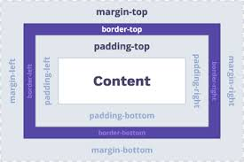

---

title: 3.3.- Regles CSS - Disseny
layout: default
parent: 3.- CSS
nav_order: 30
has_children: true

---


# 3.3. Regles CSS - Disseny

## **Model de Caixa**

En CSS es treballa amb el concepte de "caixes", ajustant el seu tamany, color, posició, etc. Es pot pensar en els **elements HTML com blocs o caixes apilades una damunt de l’altra**.

Quan es visualitza qualsevol element amb CSS, es tracta com si estigués dins d'una caixa rectangular. Cada caixa té **quatre** components principals:

- **Contingut:** El contingut que es mostra dins de l'element.
- **Emplenament (*padding*):** L'espai entre el contingut i la vora de l'element.
- **Marc (*border*):** La línia que envolta l'element.
- **Marge (*margin*):** L'espai exterior de l'element, fora del marc.


{: .text-center}


### Exemple:
```css
.element {
    width: 300px;
    height: 150px;
    padding: 10px;
    border: 2px solid black;
    margin: 15px;
}
```
On:
- `width` i `height` defineixen les dimensions de la caixa.
- `padding` defineix l'espai entre el contingut i el marc.
- `border` és el marc que envolta l'element (estil, amplada i color).
- `margin` defineix l'espai entre l'element i altres elements.


---

### **Amplada i altura**
Les propietats `width` i `height` permeten definir les dimensions de la caixa.

**Exemple:**
```css
.nom {
    width: 300px; /* Amplada */
    height: 100px; /* Altura */
}
```
{: .text-center}


---
Els valors poden ser en píxels **(px)**, centímetres **(cm)**, polzades **(in)**, etc. També es poden usar **valors relatius** com el percentatge (**%**) o **`auto`** (L'element s'ajusta automàticament a l'ample o l'altura del seu contenidor).


**Exemple amb dimensions relatives:**

```css
.nom {
    width: 50%; /* La meitat de l'ample del contenidor */
    height: 100vh; /* 100% de l'altura de la finestra */
}
```
On `100vh` és equivalent a l'altura de la finestra del navegador.
auto: L'element s'ajusta automàticament a l'ample o l'altura del seu contenidor.


---

### **Disseny de marges, emplenaments i marc**
Per defecte, els valors de `margin`, `padding` i `border` són zero. Aquests es poden modificar amb propietats específiques:


{: .text-center}


### **Marges (`margin`)**
Defineixen l'espai fora de l'element, es a dir, l'espai entre l'element i altres elements
Utilitzem la propietat `margin` que pot tindre els següents valors:

- **`margin:`** Tots els marges a la vegada.
- **`margin-top:`** Marge superior.
- **`margin-right:`** Marge dret.
- **`margin-bottom:`** Marge inferior.
- **`margin-left:`** Marge esquerre.
- **`margin: top right bottom left;`** Per especificar tots els marges a la vegada.

**Per exemple:**

```css
.nom {
    margin: 10px; /* Tots els marges a 10 píxels */
    margin-top: 15px; /* Màrgens superior específic */
}
```

En este cas, l'element tindrà un marge de 10 píxels a tots els costats, excepte a la part superior, on el marge serà de 15 píxels.

**Altre exemple:**

```css
div {
 margin-top: 20px;
 margin-right: 30px;
 margin-bottom: 40px;
 margin-left: 50px;
}
```

o també es pot fer de la següent manera:

```css
div {
 margin: 20px 30px 40px 50px;
}
```

{. .text-center}


---


### **Emplenaments (`padding`)**
La propietat `padding` defineix l'espai entre el contingut i el marc de l'element. Es pot utilitzar de la mateixa manera que `margin`:

- **`padding:`** Tots els emplenaments a la vegada.
- **`padding-top:`** Emplenament superior.
- **`padding-right:`** Emplenament dret.
- **`padding-bottom:`** Emplenament inferior.
- **`padding-left:`** Emplenament esquerre.
- **`padding: top right bottom left;`** Per especificar tots els emplenaments a la vegada.


{. .text-center}


**Exemples:**

```css
.nom {
    padding: 5px; /* Emplenament igual a tots els costats */
    padding-left: 10px; /* Emplenament específic a l'esquerra */
}
```

En este cas, l'element tindrà un emplenament de 5 píxels a tots els costats, excepte a la part esquerra, on l'emplenament serà de 10 píxels.

**Altre exemple:**

```css

div {
 padding-top: 80px;
 padding-right: 100px;
 padding-bottom: 120px;
 padding-left: 140px;
}
```

o també es pot fer de la següent manera:

```css
div {
 padding: 80px 100px 120px 140px;
}
```

{. .text-center}


---


### **Marc (`border`)**

El border és la línia que envolta l'element. Es pot personalitzar amb les propietats `border-style`, `border-width` i `border-color`.

El marc envolta l'element i té diverses subproprietats:
- **`border-style:`** Estil del marc (`none`, `solid`, `dashed`, `dotted`, etc.).
- **`border-width:`** Amplada del marc (en píxels).
- **`border-color:`** Color del marc.

Exemple:
```css
.nom {
    border-style: solid;
    border-width: 2px;
    border-color: red;
}
```

Propietat abreujada:
```css
.nom {
    border: 2px dashed blue;
}
```

En este cas, l'element tindrà un marc de 2 píxels d'ample, de color blau i amb un estil de línia puntejada.

Les propietats `border-top`, `border-right`, `border-bottom` i `border-left` permeten definir el marc de cada costat de l'element.

exemple:
```css
.nom {
    border-top: 2px solid red;
    border-bottom: 2px solid blue;
}
```

L'element tindrà una vora de 2 píxels d'ample a la part superior de color vermell i a la part inferior de color blau.

El estil del marc o `border-style` pot ser:
- `none`: Sense marc.
- `dotted`: Línia de punts.
- `dashed`: Línia puntejada.
- `solid`: Línia sòlida.
- `double`: Doble línia.
- `groove`: Línia en relleu.
- `ridge`: Línia en relleu invers.
- `inset`: Línia en relleu intern.
- `outset`: Línia en relleu extern.
- `hidden`: Línia oculta.


{. _text-center}


Una altra propietat molt usada es per arredonir les vores, es la propietat `border-radius` que permet arrodonir les vores dels elements.

```css 
.nom {
    border-radius: 10px;
}
```

---

## 3.4. Regles CSS - Propietats

CSS defineix moltes propietats agrupades en categories. 

### **Unitats**

Existeixen molts tipus d’unitats en CSS, les podem utilitzar cadascuna d’elles en funció de les nostres necessitats:

### **Longitud**
- **Pixels (px)**, **ems (em)**, **percentatge (%)**, **punts (pt)**, **polzades (in)**, **centímetres (cm)**

### **Color**
- **rgb(r,g,b)**  
- **#rrggbb**  
- **#rgb**  

### Exemple:
```css
width: 744px;
margin-left: 1.25em;
left: 34%;
margin-top: 1.25in;
margin-bottom: 1.5cm;
background-color: rgb(255,0,0);
color: #FF2200;
color: #f20;
```

### **Unitat "em" en CSS**
La unitat **"em"** en CSS és relativa i es basa en la grandària de la lletra de l'element pare. Un valor de **"1em"** equival a la grandària de la lletra de l'element pare. 

Per exemple:
- Si l'element pare té una grandària de lletra de **16 píxels**, **"1em"** serà igual a **16 píxels**.
- Si apliquem **"2em"**, la grandària serà el doble de la grandària de la lletra de l'element pare.

### Exemple complet:
```css
body {    
    font-size: 16px; /* Grandària de la lletra per defecte del document */
}

p {    
    font-size: 1.2em; /* La grandària de la lletra dels paràgrafs serà 1.2 vegades la del body */
}

h1 {    
    font-size: 2em; /* La grandària de la lletra dels títols h1 serà el doble de la del body */
}
```

### **Tipus de lletres**

- **`font-family:`** Defineix la família de tipus de lletres (font) a utilitzar. Pot incloure múltiples noms de famílies separats per comes, en cas que la primera no estiga disponible:

    ```css
    p {
        font-family: "Arial", "Helvetica", sans-serif;
    }
    ```
- **`font-size:`** Grandària de la lletra.  Pot ser especificada en diferents unitats (px), (em), (%), (pt), (in), (cm).

    ```css
    h2 {
        font-size: 16px; /* Pixels */
    }
    ```
- **`font-weight:`** Especifica el gruix de la lletra, els valors poden ser numèrics, o predefinits com:
  - **normal**: És el gruix per defecte de la font (normalment equivalent a 400).
  - **bold**: Aplica un estil de lletra en negreta (equivalent a 700).
  - **lighter**: Fa que el text sigui més fi que el gruix heretat de l'element pare.
  - **bolder**: Fa que el text sigui més gruixut que el gruix heretat de l'element pare.


```css
    span {
        font-weight: bold;
    }
 ```
 

- **`font-variant`**:  
  Especifica si el tipus de lletra ha de ser mostrat en versió normal o amb majúscules petites (*small-caps*).  
  ```css
  h3 {
      font-variant: small-caps;
  }
  ```

- **`font-style`**:  
  Defineix l'estil del tipus de lletra. Pot ser **normal**, **italic** o **oblique**.  
  ```css
  p {
      font-style: italic;
  }
  ```

- **`font`**:  
- 
  Permet especificar múltiples propietats relacionades amb el tipus de lletra en una sola línia:  

  ```css
  h1 {
      font: bold small-caps 24px/1.5 "Arial", sans-serif;
  }
  ```
  **Nota**: `24px/1.5` estableix la grandària del text a **24px** i l'altura de la línia dins del bloc de text a **1.5** (**line-height**).

---


- A CSS, les **"famílies de fonts"** es refereixen a grups de tipus de lletres amb característiques similars.
- Quan especifiquem la família de fonts, és una bona pràctica proporcionar **alternatives genèriques** en cas que la primera opció no estiga disponible. Això es fa utilitzant una llista de famílies de fonts separades per comes, amb el tipus genèric al final.
- Si el nom d’una font conté més d’una paraula, cal posar-lo entre **cometes**: `"Courier New"`.

{: .text-center}


**Exemple:**
```css
p {
    font-family: "Times New Roman", Times, serif;
}
```

---

**Propietats CSS de colors**

| **Propietat**        | **Descripció**                                     | **Valors**                                                                                                                                                                                                                                   |
|-----------------------|---------------------------------------------------|--------------------------------------------------------------------------------------------------------------------------------------------------------------------------------------------------------------------------------------------|
| **`color`**           | Defineix el color del text.                       | `color: red;` Nom de color (p. ex.: `red`), valor hexadecimal (`#FF0000`), valor RGB (`rgb(255, 0, 0)`), `initial`, `inherit`.                                                                                                              |
| **`background-color`**| Estableix el color de fons.                       | `background-color: #f0f0f0;` Nom de color, valor hexadecimal, valor RGB, `transparent`, `initial`, `inherit`.                                                                                                                              |
| **`opacity`**         | Especifica la transparència.                      | `opacity: 0.5;` Valor entre: 0 (transparent) i 1 (opac), `initial`, `inherit`.                                                                                                                                                              |
| **`rgba`**            | Especifica el color en el model RGBA.             | `background-color: rgba(255, 0, 0, 0.5);` (el 0.5 és la opacitat).                                                                                                                                                                         |

---

### **Conceptes addicionals:**
- **`inherit`**: Fa que l’element prenga el valor de la propietat del seu element pare.  
  Exemple:
  ```css
  div {
      color: blue;
  }

  h2 {
      color: inherit; /* L'h2 serà blau com el div pare */
  }
  ```

- **`initial`**: Restableix la propietat a la seva configuració inicial.  
  Exemple:
  ```css
  h2 {
      border-color: green;
  }

  h2 {
      border-color: initial; /* El color de la vora de l'h2 es restableix a 'none' */
  }
  ```

---

### **Maneres de definir colors en CSS:**
Podem definir els colors utilitzant diverses opcions:
1. **Noms predefinits**  
2. **Valors RGB (`rgb`)**
3. **Valors Hexadecimals (`#RRGGBB`)**
4. **Valors HSL (`hsl`)**
5. **Model RGBA (`rgba`)**  
6. **Model HSLA (`hsla`)**

---

### **Exemples de noms predefinits:**


{: .text-center}


**Nota**: Existeixen més de 140 noms de colors predefinits en CSS.

---

### **Fons avançats**

- **`background-image:`**  
  Defineix una imatge de fons.  
  ```css
  background-image: url('imatge.jpg');
  ```
  **Valors:** `url`, `none`.

- **`background-size:`**  
  Controla la mida de la imatge de fons. Permet ajustar la imatge perquè cobreixi el contenidor o perquè es mostri completament.  
  ```css
  background-size: cover;
  background-size: contain;
  ```
  **Valors:** `auto`, `cover`, `contain`, longitud (ex.: `50px`, `50%`).

- **`background-repeat:`**  
  Controla si la imatge de fons es repeteix horitzontalment, verticalment, o no es repeteix.  
  ```css
  background-repeat: repeat-x; /* Repeteix només en l'eix X */
  background-repeat: no-repeat; /* No repeteix la imatge */
  ```
  **Valors:** `repeat`, `repeat-x`, `repeat-y`, `no-repeat`, `space`, `round`.

- **`background-position:`**  
  Defineix la posició inicial de la imatge de fons. Es pot utilitzar valors com percentatges, paraules clau o coordenades.  
  ```css
  background-position: center top;
  background-position: 50% 0%; /* Centrat horitzontalment, dalt de tot */
  ```
  **Valors:** `top`, `bottom`, `left`, `right`, `center`, `%`, `x-pos y-pos`.

- **`background-attachment:`**  
  Especifica si la imatge de fons es desplaça amb la pàgina o queda fixa en el seu lloc.  
  ```css
  background-attachment: fixed; /* La imatge roman fixa */
  background-attachment: scroll; /* La imatge es mou amb el contingut */
  background-attachment: local; /* La imatge es mou amb l'element */
  ```
  **Valors:** `scroll`, `fixed`, `local`.

- **`background:`**  
  Una propietat abreujada que permet combinar color de fons, imatge, repetició, posició i més.  
  ```css
  background: #f0f0f0 url('imatge.jpg') no-repeat center top;
  ```
  **Valors:** `color`, `image`, `repeat`, `attachment`, `position/size`, `origin`, `clip`.

  ---

### **Propietats de caixes**
Les propietats de caixa CSS permeten controlar l'aspecte de les caixes HTML. Aquestes propietats són útils per controlar la mida, el color, la posició, etc. de les caixes.

Les propietats de caixa CSS més comunes són:

Les ja vistes anteriorment com:

- **`width:`** Amplada de la caixa.
- **`height:`** Altura de la caixa.
- **`margin:`** Marge exterior de la caixa.
- **`padding:`** Espai entre el contingut i el marc de la caixa.
- **`border:`** Marc de la caixa.
- **`background-color:`** Color de fons de la caixa.
- **`color:`** Color del text de la caixa.
- **I la resta de propietats de fonts i text.**

Altres propietats de caixa CSS són:

- **`box-sizing:`** Controla com es calcula la mida total de l'element (amplada i altura) tenint en compte els marges, el "padding" i les vores.  
    ```css
    box-sizing: border-box;
    ```

    **Valors possibles:** `content-box`, `border-box`, `initial`, `inherit`

---

- **`display:`** Defineix com es mostra l'element dins del flux de la pàgina. Controla si l'element es mostra com un bloc, una línia o altres formes.  
    ```css
    display: block;
    ```

    **Valors possibles:** `block`, `inline`, `inline-block`, `none`, `flex`, `grid`, `inline-flex`, `inline-grid`, `initial`, `inherit`

---

- **`position:`** Controla la posició de l'element dins del contenidor pare.  
    ```css
    position: relative;
    ```

    **Valors possibles:** `static`, `relative`, `absolute`, `fixed`, `sticky`, `initial`, `inherit`

---

- **`float:`** Permet "flotar" un element cap a l'esquerra o la dreta, permetent que altres elements se situen al seu costat.  
    ```css
    float: left;
    ```

    **Valors possibles:** `left`, `right`, `none`, `initial`, `inherit`

---

- **`clear:`** S'utilitza per "netejar" o evitar que altres elements flotants afecten l'element actual.  
    ```css
    clear: both;
    ```

    **Valors possibles:** `none`, `left`, `right`, `both`, `initial`, `inherit`

---

- **`visibility:`** Controla si l'element és visible o no. A diferència de `display: none`, l'element continua ocupant espai a la pàgina.  
    ```css
    visibility: visible; /* L'element serà visible */
    visibility: hidden;  /* L'element estarà ocult, però continuarà ocupant el seu espai */
    ```

    **Valors possibles:** `visible`, `hidden`, `collapse` (només per taules), `initial`, `inherit`


## **Exemple Complet Propietats de Caixa**
```html
<!DOCTYPE html>
<html lang="ca">
<head>
    <meta charset="UTF-8">
    <meta name="viewport" content="width=device-width, initial-scale=1.0">
    <title>Exemple de Propietats de Caixa</title>
    <link rel="stylesheet" href="styles.css">
</head>
<body>

    <h1>Exemple Visual de les Propietats de Caixa</h1>

    <div class="contenidor">
        
        <div class="caixa" id="caixa1">
            width i height
        </div>
        
        <div class="caixa" id="caixa2">
            margin
        </div>
        
        <div class="caixa" id="caixa3">
            padding
        </div>
        
        <div class="caixa" id="caixa4">
            border
        </div>

        <div class="caixa" id="caixa5">
            border-radius
        </div>

        <div class="caixa" id="caixa6">
            box-shadow
        </div>

    </div>

</body>
</html>
```

---

### **CSS (Estils per a la visualització de la caixa)**
```css
/* Estils generals */
body {
    font-family: Arial, sans-serif;
    background-color: #f4f4f9;
    margin: 0;
    padding: 0;
}

h1 {
    text-align: center;
    color: #333;
    margin: 20px 0;
}

.contenidor {
    display: flex;
    flex-wrap: wrap;
    justify-content: center;
    gap: 20px;
    padding: 20px;
}

.caixa {
    width: 150px;              /* Amplada de la caixa */
    height: 150px;             /* Altura de la caixa */
    padding: 10px;             /* Espai intern entre el contingut i la vora */
    margin: 10px;              /* Espai extern al voltant de la caixa */
    border: 2px solid #000;    /* Vora de 2px de color negre */
    display: flex;             /* Display en mode flex per centrar el text */
    justify-content: center;   /* Centra horitzontalment el text */
    align-items: center;       /* Centra verticalment el text */
    text-align: center;        /* Text centrat dins de la caixa */
    background-color: #FF6347; /* Color de fons (tomàquet) */
    color: #fff;               /* Color del text (blanc) */
    font-size: 16px;           /* Grandària de la lletra */
    font-weight: bold;         /* Text en negreta */
}

/* Estils personalitzats per a cada caixa */
#caixa1 {
    width: 200px;
    height: 100px;
    background-color: #4CAF50; /* Verd */
}

#caixa2 {
    background-color: #2196F3; /* Blau */
    margin: 30px;
}

#caixa3 {
    background-color: #FF9800; /* Taronja */
    padding: 30px;
}

#caixa4 {
    background-color: #E91E63; /* Rosa */
    border: 8px solid #000;
}

#caixa5 {
    background-color: #9C27B0; /* Morat */
    border-radius: 15px;
}

#caixa6 {
    background-color: #795548; /* Marró */
    box-shadow: 10px 10px 20px rgba(0,0,0,0.25);
}
```

---


{: .text-center}


---

Cada **caixa** demostra una propietat de la **caixa CSS**. Es poden observar visualment les diferències en cada propietat.

1. **Caixa 1** - `width` i `height`
   - Aquesta caixa té un **width de 200px** i un **height de 100px**.
   - Color de fons: **Verd**.

2. **Caixa 2** - `margin`
   - La **marge extern** d'aquesta caixa és de **30px**.
   - Significa que l'espai al voltant de la caixa és de 30 píxels.
   - Color de fons: **Blau**.

3. **Caixa 3** - `padding`
   - La **padding interna** d'aquesta caixa és de **30px**.
   - El contingut (el text) està separat de la vora.
   - Color de fons: **Taronja**.

4. **Caixa 4** - `border`
   - La vora d'aquesta caixa és de **8 píxels** de color **negre**.
   - Crea una vora ampla i clara al voltant de la caixa.
   - Color de fons: **Rosa**.

5. **Caixa 5** - `border-radius`
   - Aquesta caixa té un **border-radius de 15px**.
   - Les vores estan arrodonides, creant una forma més suau.
   - Color de fons: **Morat**.

6. **Caixa 6** - `box-shadow`
   - Aquesta caixa té una **ombra** creada amb la propietat `box-shadow`.
   - L'ombra és de **10px x 10px** i té una difusió de **20px**.
   - Color de fons: **Marró**.

---


Aquest disseny mostra sis caixes alineades en dues files de 3 elements. Cada caixa mostra visualment l'efecte d'una propietat CSS relacionada amb les **caixes**.

| **Propietat**    | **Caixa** | **Descripció Visual**                            |
|-----------------|------------|-------------------------------------------------|
| **`width` i `height`** | **Caixa 1** | Caixa amb una mida diferent (200x100 px)    |
| **`margin`**         | **Caixa 2** | Espai extra al voltant de la caixa (30px)   |
| **`padding`**        | **Caixa 3** | El contingut està separat de la vora (30px) |
| **`border`**         | **Caixa 4** | Vora ampla de 8px de color negre            |
| **`border-radius`**  | **Caixa 5** | Vores arrodonides (15px)                    |
| **`box-shadow`**     | **Caixa 6** | Ombra de 10px x 10px amb difusió de 20px    |

---
