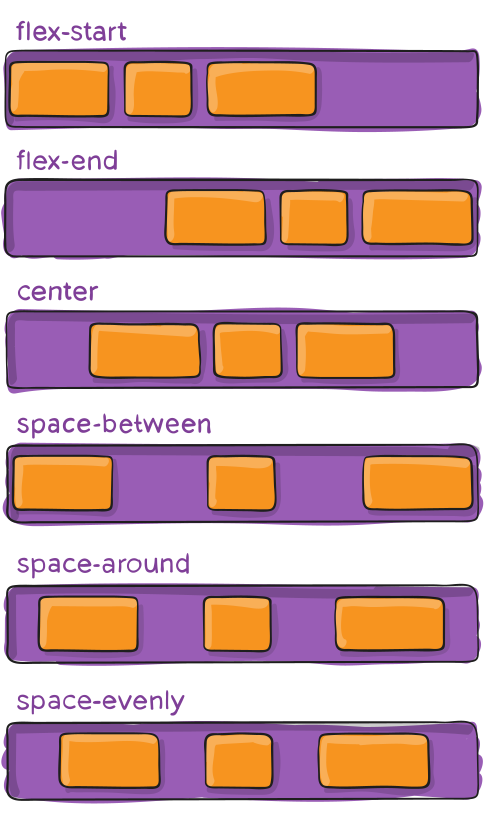

---

title: 3.4.- Flexbox
layout: default
parent: 3.- CSS
nav_order: 40
has_children: true

---


# Flexbox: Model de Disposició

El mòdul **Flexbox Layout** (o "Flexible Box"), té com a objectiu oferir una manera més eficient de distribuir, alinear i repartir l'espai entre els elements d'un contenidor, fins i tot quan la seua mida és desconeguda o dinàmica (d'ací el terme *"flex"*).

La idea principal del disseny flexbox és donar al contenidor la capacitat de **modificar l’amplària, l’alçària** (i fins i tot **l’ordre**) dels seus elements per adaptar-se millor a l’espai disponible. 
Això resulta especialment útil per acomodar-se a tota mena de dispositius i mides de pantalla. Un contenidor *flex* pot fer que els elements s’expandisquen per omplir l’espai lliure disponible o que es contraguen per evitar que es desborden del contenidor.

El més important és que el disseny flexbox **no depén de la direcció** en què es disposen els elements, a diferència dels dissenys tradicionals:
- Els dissenys de blocs (*block*) estan basats en una disposició vertical.
- Els dissenys en línia (*inline*) estan basats en una disposició horitzontal.

Tot i que estos funcionen bé per a pàgines senzilles, no són prou flexibles per donar suport a aplicacions grans o complexes, especialment quan necessitem ajustar orientacions, redimensionar, estirar o contraure elements.

> **Nota**: Flexbox és especialment adequat per a components d’una aplicació i dissenys a petita escala. En canvi, **Grid Layout** està pensat per a dissenys a major escala.


# Flexbox: Propietats i Conceptes Bàsics

Flexbox no és només una única propietat, sinó tot un mòdul amb un conjunt complet de propietats. Algunes d’estes propietats s’apliquen al **contenidor** (l’element pare, conegut com a “flex container”), mentre que altres es defineixen en els **elements fills** (anomenats “flex items”).

---

## **Terminologia de Flexbox**

Per entendre com funciona Flexbox, és important conèixer alguns conceptes essencials sobre les seues dimensions i eixos:


### **1. Main Axis i Cross Axis**
- **Main Axis**: És l’eix principal del contenidor flex, al llarg del qual es disposen els elements flexibles. Este eix no és necessàriament horitzontal; depén de la propietat `flex-direction`.
- **Cross Axis**: És l’eix perpendicular al main axis. La seua direcció també depén de l’orientació de l’eix principal.

### **2. Main-start i Main-end**
- Els **elements flex** es col·loquen dins del contenidor començant des de **main-start** i avançant cap a **main-end**.

### **3. Main Size**
- És la **mida principal** d’un element flex. Pot ser l’amplària o l’alçària, depenent de l’eix principal definit per `flex-direction`. Esta propietat es correspon amb `width` o `height`, segons el cas.

### **4. Cross-start i Cross-end**
- Les línies flexibles (flex lines) s’omplin d’elements i es col·loquen dins del contenidor començant des de **cross-start** i avançant cap a **cross-end**.

### **5. Cross Size**
- És la **mida transversal** d’un element flex, és a dir, la mida al llarg de l’eix perpendicular. També es correspon amb `width` o `height`, depenent de l’orientació de l’eix principal.

---

### **Com es disposen els elements?**
Els elements flexibles es distribueixen seguint estes regles:
1. **Main Axis**: Els elements es col·loquen des de **main-start** fins a **main-end**.
2. **Cross Axis**: Si hi ha diverses línies flexibles, estes s’organitzen des de **cross-start** fins a **cross-end**.

---

## Propietats per al Contenidor Pare (*flex container*)


### **display**
Esta propietat **defineix un contenidor flex**; pot ser en format de bloc o en línia depenent del valor assignat. Activa un context flexible per a tots els seus fills directes.

```css
.container {
  display: flex; /* o inline-flex */
}
```

**Nota**: Les columnes CSS no tenen cap efecte en un contenidor flex.

---

### **flex-direction**


Defineix l’eix principal (*main-axis*) i estableix la direcció en què es col·loquen els elements flexibles dins del contenidor. Flexbox és un model de disseny unidireccional (excepte quan s’utilitza envoltament opcional). Es pot imaginar que els elements flex es disposen en files horitzontals o en columnes verticals.

```css
.container {
  flex-direction: row | row-reverse | column | column-reverse;
}
```

- **row (per defecte)**: D’esquerra a dreta en direccions d’escriptura ltr (left-to-right); de dreta a esquerra en rtl(right-to-left).
- **`row-reverse`**: De dreta a esquerra en ltr; d’esquerra a dreta en rtl.
- **`column`**: Igual que `row`, però de dalt a baix.
- **`column-reverse`**: Igual que `row-reverse`, però de baix a dalt.

---

### **flex-wrap**


Per defecte,** tots els elements flex intentaran cabre en una sola línia**. Amb esta propietat es pot permetre que els elements es **dividisquen en múltiples línies** si cal.

```css
.container {
  flex-wrap: nowrap | wrap | wrap-reverse;
}
```

- **`nowrap` (per defecte)**: Tots els elements flex estaran en una sola línia.
- **`wrap`**: Els elements flex es dividiran en diverses línies, de dalt a baix.
- **`wrap-reverse`**: Els elements flex es dividiran en diverses línies, de baix a dalt.


[Flex-wrap Demo](https://css-tricks.com/almanac/properties/f/flex-wrap/)

---

### **flex-flow**

Propietat abreujada per a `flex-direction` i `flex-wrap`, que defineix els eixos principal i transversal del contenidor flex. El valor per defecte és `row nowrap`.

```css
.container {
  flex-flow: column wrap;
}
```

---

### **justify-content**

Defineix l’alineació al llarg de l’eix principal (*main axis*). Ajuda a distribuir l’espai extra disponible quan els elements són inflexibles o han arribat a la seua mida màxima. També controla l’alineació dels elements quan desborden la línia.





```css
.container {
  justify-content: flex-start | flex-end | center | space-between | space-around | space-evenly | start | end | left | right ... + safe | unsafe;
}
```

- **`flex-start` (per defecte)**: Els elements es col·loquen al començament de la direcció flex.
- **`flex-end`**: Els elements es col·loquen al final de la direcció flex.
- **`center`**: Els elements s’alineen al centre de la línia.
- **`space-between`**: Els elements es distribueixen equitativament; el primer està al començament i l’últim al final.
- **`space-around`**: Els elements tenen espai igual al seu voltant.
- **`space-evenly`**: L’espai entre qualsevol dos elements (i les vores) és igual.

**Nota**: Alguns navegadors tenen suport limitat per a certs valors, com `start`, `end`, `left` o `right`. Els valors més segurs són `flex-start`, `flex-end` i `center`.

---

### **align-items**

Defineix el comportament per defecte per a l’alineació dels elements flexibles al llarg de l’eix transversal (*cross axis*). És semblant a `justify-content`, però per a l’eix perpendicular.


```css
.container {
  align-items: stretch | flex-start | flex-end | center | baseline | first baseline | last baseline | start | end | self-start | self-end + ... safe | unsafe;
}
```

- **`stretch` (per defecte)**: Els elements s’estiren per omplir el contenidor (respectant `min-width`/`max-width`).
- **`flex-start` / `start` / `self-start`**: Els elements s’alineen al començament de l’eix transversal.
- **`flex-end` / `end` / `self-end`**: Els elements s’alineen al final de l’eix transversal.
- **`center`**: Els elements s’alineen al centre de l’eix transversal.
- **`baseline`**: Els elements s’alineen perquè les seues línies base coincidisquen.

---

### **align-content**

Alinea les línies flexibles dins del contenidor quan hi ha espai extra al llarg de l’eix transversal (*cross axis*). Només té efecte en contenidors flexibles amb múltiples línies (`wrap` o `wrap-reverse`).


```css
.container {
  align-content: flex-start | flex-end | center | space-between | space-around | space-evenly | stretch | start | end | baseline | first baseline | last baseline + ... safe | unsafe;
}
```

- **`normal` (per defecte)**: Els elements s’agrupen en la seua posició per defecte.
- **`flex-start` / `start`**: Les línies es col·loquen al començament del contenidor.
- **`flex-end` / `end`**: Les línies es col·loquen al final del contenidor.
- **`center`**: Les línies s’alineen al centre del contenidor.
- **`space-between`**: Les línies es distribueixen equitativament; la primera línia al començament i l’última al final.
- **`space-around`**: Espai igual al voltant de cada línia.
- **`space-evenly`**: Espai igual entre línies i les vores.
- **`stretch`**: Les línies s’estiren per ocupar l’espai restant.

---

### **gap, row-gap, column-gap**

La propietat `gap` controla explícitament l’espai entre els elements flexibles. Només aplica este espai entre elements, no a les vores exteriors.


```css
.container {
  display: flex;
  gap: 10px;
  gap: 10px 20px; /* espai entre files i columnes */
  row-gap: 10px;
  column-gap: 20px;
}
```

**Nota**: `gap` no és exclusiu de flexbox; també funciona amb Grid i dissenys de columnes múltiples.


## Propietats per als Fills (*flex items*)


### **order**
Per defecte, els elements flexibles es disposen segons l’ordre en el codi font. No obstant això, la propietat `order` controla l’ordre en què apareixen dins del contenidor flex.


```css
.item {
  order: 5; /* el valor per defecte és 0 */
}
```

Els elements amb el mateix valor d’`order` es revertiran a l’ordre del codi font.

---

El text és correcte en la seua explicació de la propietat **`flex-grow`**. És clar, tècnic i fàcil d'entendre. Tot i així, puc suggerir petites millores per a fer-lo més llegible i coherent amb un estil pedagògic.

### Text revisat:
---

### **flex-grow**


La propietat **`flex-grow`** defineix la capacitat d’un element flexible per **créixer si és necessari**. És a dir, determina com es reparteix l'espai disponible dins del contenidor flex entre els seus elements.

- **Funció principal**: 
   - `flex-grow` especifica **com s'expandeix un element flex** dins del contenidor, ocupant l'espai addicional disponible després d'aplicar els valors com `width`, `margin` o `padding`.

- **Valor per defecte**: 
   - Si no s'especifica, el valor és `0`. Això significa que l'element **no creixerà** per ocupar espai addicional, només mantindrà la seua mida definida per altres propietats.

- **Valors positius**:
   - Quan el valor és major que `0`, l'element pot créixer per ocupar l'espai disponible en proporció al valor de `flex-grow`.

---

### **Proporcionalitat**
- El valor de `flex-grow` no és una mida fixa, sinó una proporció relativa entre tots els elements del contenidor flex. 

**Exemple:**

```css
.a { flex-grow: 1; } /* Ocupa 1 part proporcional de l'espai extra. */
.b { flex-grow: 2; } /* Ocupa 2 parts proporcionals, el doble que .a. */
```

- Si hi ha **300 píxels d'espai extra disponible**:
  - `.a` rebrà **100 píxels** (1 part).
  - `.b` rebrà **200 píxels** (2 parts, el doble que `.a`).

---

**Exemple**

**HTML:**
```html
<div class="contenidor-flex">
  <div class="a">1</div>
  <div class="b">2</div>
  <div class="c">3</div>
</div>
```

**CSS:**
```css
.contenidor-flex {
  display: flex;
  gap: 10px;
}

.a {
  flex-grow: 1; /* Creixerà proporcionalment */
  background-color: lightblue;
}

.b {
  flex-grow: 2; /* Creixerà el doble que .a */
  background-color: lightgreen;
}

.c {
  flex-grow: 0; /* No creixerà, mantindrà la seua mida inicial */
  background-color: lightcoral;
}
```

---

**Nota**
- Els valors **negatius** per a `flex-grow` **no són vàlids**. Aquesta propietat només accepta valors positius o zero.

---


### **flex-shrink**


La propietat **`flex-shrink`** defineix la capacitat d’un element flexible per **reduir la seua mida si és necessari**. És a dir, especifica com es comporta l'element quan no hi ha suficient espai disponible dins del contenidor.

- **Funció principal**:
   - `flex-shrink` determina **com es redueix la mida d'un element flex** en proporció a altres elements quan l'espai del contenidor és insuficient.

- **Valor per defecte**: 
   - El valor per defecte és `1`. Això significa que l'element **es pot contraure** proporcionalment amb altres elements del contenidor flex.

- **Valors positius**:
   - Si el valor és major que `0`, l'element pot contraure’s per adaptar-se a l’espai disponible. El valor especifica la proporció en què es redueix en comparació amb altres elements.
   
- **Valors iguals a `0`**:
   - Si el valor és `0`, l'element **no es contraurà**, encara que no hi haja prou espai al contenidor.

---

### **Proporcionalitat**
- Similar a `flex-grow`, el valor de `flex-shrink` és una proporció relativa entre tots els elements del contenidor flex.

**Exemple:**

```css
.a { flex-shrink: 1; } /* Es contraurà en proporció 1. */
.b { flex-shrink: 2; } /* Es contraurà el doble que .a. */
```

- Si no hi ha suficient espai i s'han de reduir **300 píxels en total**:
  - `.a` es reduirà **100 píxels** (1 part).
  - `.b` es reduirà **200 píxels** (2 parts, el doble que `.a`).

---

**Exemple**

**HTML:**
```html
<div class="contenidor-flex">
  <div class="a">1</div>
  <div class="b">2</div>
  <div class="c">3</div>
</div>
```

 **CSS:**
```css
.contenidor-flex {
  display: flex;
  gap: 10px;
  width: 300px; /* Amplada limitada per provocar contracció */
}

.a {
  flex-shrink: 1; /* Es contraurà proporcionalment */
  width: 150px; /* Amplada inicial */
  background-color: lightblue;
}

.b {
  flex-shrink: 2; /* Es contraurà el doble que .a */
  width: 150px; /* Amplada inicial */
  background-color: lightgreen;
}

.c {
  flex-shrink: 0; /* No es contraurà */
  width: 150px; /* Amplada inicial */
  background-color: lightcoral;
}
```

---

**Nota**
- Els valors **negatius** no són vàlids per a `flex-shrink`. Només accepta valors positius o zero.
- Si no hi ha restriccions d'espai (el contenidor és prou gran), `flex-shrink` no tindrà efecte.


---

### **flex-basis**

La propietat **`flex-basis`** defineix la **mida inicial d’un element flex** abans de distribuir l'espai restant o d'aplicar les propietats `flex-grow` i `flex-shrink`. Aquesta mida es pot especificar com una longitud fixa (`px`, `%`, `rem`, etc.) o com una paraula clau.

- **Funció principal**:
   - Estableix la **mida inicial preferida** d’un element, abans de considerar com es reparteix o es redueix l'espai en el contenidor flex.
   - Si `flex-basis` no està definit, es farà servir la propietat `width` o `height`, segons el cas.

---

**Valors comuns:**
- **`auto`** *(per defecte)*:
   - Utilitza el valor de `width` o `height` per determinar la mida inicial de l'element.
- **`content`** *(suport limitat)*:
   - Deixa que el navegador calcule la mida basant-se en el contingut de l'element.
- **Longitud fixa**:
   - Especifica una mida inicial fixa, com ara `50px`, `20%`, o `10rem`.
- **`0`**:
   - L'espai extra al voltant del contingut no es té en compte, deixant que altres propietats (`flex-grow`, `flex-shrink`) gestionen la mida.

---

**Exemple**

**HTML:**
```html
<div class="contenidor-flex">
  <div class="a">1</div>
  <div class="b">2</div>
  <div class="c">3</div>
</div>
```

**CSS:**
```css
.contenidor-flex {
  display: flex;
}

.a {
  flex-basis: 100px; /* Mida inicial fixa de 100px */
  background-color: lightblue;
}

.b {
  flex-basis: 20%; /* Mida inicial del 20% de l'ample del contenidor */
  background-color: lightgreen;
}

.c {
  flex-basis: auto; /* Utilitza el valor de width o el contingut */
  background-color: lightcoral;
}
```

---

### **flex**

La propietat **`flex`** és una **abreviatura** que combina tres propietats de Flexbox: `flex-grow`, `flex-shrink` i `flex-basis`. Permet simplificar la definició del comportament de distribució d’espai d’un element flex.

---

- **Sintaxi**:
```css
.item {
  flex: <flex-grow> <flex-shrink> <flex-basis>;
}
```

- Els paràmetres **`flex-shrink`** i **`flex-basis`** són opcionals.
- Si només es defineix un valor (per exemple, `flex: 2;`), aquest s'assigna a `flex-grow` i es prenen els valors per defecte per a les altres propietats (`flex-shrink: 1` i `flex-basis: 0%`).

---

#### **Valors comuns:**
- **`0 1 auto`** *(per defecte)*:
   - L'element no creix (`flex-grow: 0`) però es pot contraure (`flex-shrink: 1`) i la mida inicial és `auto`.
- **`none`**:
   - Equivalent a `flex: 0 0 auto`. L'element no creix, no es contraurà i tindrà la mida inicial predeterminada.
- **Un sol valor numèric**:
   - Especifica `flex-grow` i estableix `flex-basis` a `0%`.

---

**Exemple**

**HTML:**
```html
<div class="contenidor-flex">
  <div class="a">1</div>
  <div class="b">2</div>
  <div class="c">3</div>
</div>
```

**CSS:**
```css
.contenidor-flex {
  display: flex;
  gap: 10px;
}

.a {
  flex: 1; /* flex-grow: 1; flex-shrink: 1; flex-basis: 0%; */
  background-color: lightblue;
}

.b {
  flex: 2 1 100px; /* Creix el doble que .a, pot contraure’s, mida inicial 100px */
  background-color: lightgreen;
}

.c {
  flex: none; /* No creix ni es contraurà, mida inicial auto */
  background-color: lightcoral;
}
```

---

**En resum**
- **`flex-basis`**: Defineix la mida inicial de l'element abans de distribuir l'espai.
- **`flex`**: Permet establir de manera conjunta el comportament de creixement, contracció i mida inicial. Ideal per simplificar el codi.
---
**Consell**: És recomanable utilitzar esta propietat abreujada en lloc de definir cadascuna individualment, ja que assigna els altres valors de manera intel·ligent.

---

### **align-self**

Esta propietat permet que l’alineació predeterminada (o la especificada per `align-items`) es **sobreescriga per a elements individuals**.


```css
.item {
  align-self: auto | flex-start | flex-end | center | baseline | stretch;
}
```

- Un element amb `align-self` pot estar alineat al final del contenidor mentre que la resta estan alineats al començament, per exemple.

**Nota**: Les propietats com `float`, `clear` i `vertical-align` no tenen cap efecte en un element flexible. 

**Consell**: Per entendre els valors disponibles, consulteu l’explicació de `align-items`.