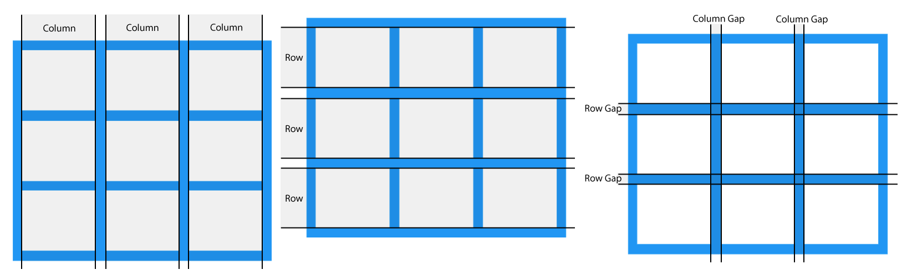
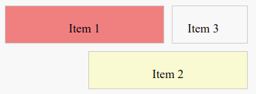
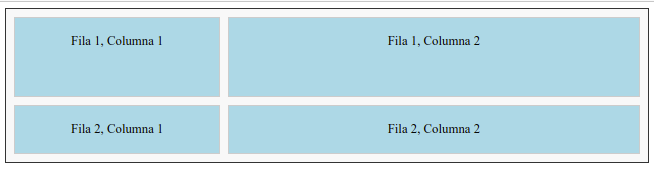

---

title: 3.5.- CSS Grid
layout: default
parent: 3.- CSS
nav_order: 40
has_children: true

---


# CSS Grid


CSS Grid és eina important  per al disseny de pàgines web modernes. Ens permet organitzar continguts en **files** i **columnes** d'una manera senzilla i poderosa. 
Amb CSS Grid, podem aconseguir **dissenys responsius** i **estructures complexes** amb menys esforç que altres mètodes.

CSS Grid és una eina potent per crear **layouts** moderns, simplificant tasques que abans requerien mètodes més complexos com float o frameworks externs.

- **Nota:** Un **layout** és la distribució i organització dels elements dins d'una pàgina web.

### Avantatges de CSS Grid

- **Bidimensionalitat**: Pots controlar simultàniament files i columnes.
- **Flexibilitat**: Permet crear dissenys complexos amb facilitat.
- **Disseny responsiu**: Els layouts s'adapten automàticament al tamany del dispositiu.
- **Més senzill**: Redueix la necessitat d'usar `float`, `position` o frameworks externs.
  
- També permet utilitzar unitats modernes com `fr` i `minmax`, que simplifiquen la distribució proporcional de l'espai.


### Comparació amb Flexbox

| **CSS Grid**                | **Flexbox**             |
|-----------------------------|-------------------------|
| Bidimensional (files i columnes). | Unidimensional (fila o columna). |
| Ideal per a layouts complets. | Ideal per a disposició d'elements individuals. |
| Utilitza cel·les i àrees definides. | Treballa amb eixos alineats. |


**Nota:** En molts casos, es poden combinar CSS Grid i Flexbox per aprofitar els avantatges de cada sistema segons la necessitat del disseny.

---

## Conceptes de CSS Grid

CSS Grid és un **sistema de disseny bidimensional** que et permet dividir un contenidor en **files** i **columnes** per a posicionar els elements (ítems) dins de les cel·les. 

El posicionament o flux per defecte dels elements en un grid és:
 - De dalt a baix i d'esquerra a dreta. Si no hi ha espai suficient en una fila, passen a la següent.
 - Els elements s'ordenen segons l'ordre en què apareixen en l'HTML.
 - **Si no hi ha cap regla CSS** que especifique la **posició de l'elemen**t, aquest **s'ubicarà en la primera cel·la disponible**, el que ens permet que CSS Grid siga ideal per crear dissenys inicials ràpids sense la necessitat d'especificar posicionaments detallats.





Els espais entre cada fila i columna s'anomenen gap. Aquesta imatge mostra un grid amb 3 files i 3 columnes, amb un gap de 10px.

podem modificar el tamany del gap amb la propietat 
- `gap`: modifica el tamany del gap per a files i columnes.
- `row-gap`: modifica el tamany per a files.
- `column-gap` per a columnes.

 També podem combinar `row-gap` i `column-gap` per especificar separacions diferents entre files i columnes.


---

## **Components bàsics de CSS Grid**


### 1. **Grid Container**
El **Grid Container** és l'element pare que conté la graella. Quan apliquem la propietat `display: grid` a un element HTML, aquest es converteix en un contenidor de graella, activant el comportament de CSS Grid.

**Exemple:**
```css
.container {
    display: grid; /* Activa el comportament de graella */
    border: 1px solid #333;
    padding: 10px;
}
```

Els elements fills del contenidor automàticament es converteixen en **Grid Items**.

---

### 2. **Grid Items**
Els **Grid Items** són els fills directes del **Grid Container**. Cada element que es troba dins del contenidor es posiciona automàticament seguint les regles del grid.

**Exemple:**
```html
<div class="container">
    <div>Element 1</div>
    <div>Element 2</div>
    <div>Element 3</div>
</div>
```

- Amb aquest codi, els tres elements fills (`<div>`) són automàticament **Grid Items** i poden ser posicionats dins de la graella.
-  **Si no es defineix cap posició específica, els ítems ocuparan les cel·les en l'ordre en què apareixen a l'HTML**.

---

### 3. **Grid Lines**
Les **Grid Lines** són les línies que defineixen les vores de les files i columnes. 

 Es numeren automàticament des de l'inici fins al final del grid, començant pel número **1**. Aquestes línies ens permeten posicionar els **Grid Items** de manera molt precisa.

Es a dir:

- Cada **columna** està delimitada per dues línies verticals (es diuen **Column Lines**).
- Cada **fila** està delimitada per dues línies horitzontals (es diuen **Row Lines**).
  
  - Si tenim tres columnes, tindrem **quatre línies verticals**: `1 | 2 | 3 | 4`.
  - Si tenim dues files, tindrem **tres línies horitzontals**: `1 — 2 — 3`.

Les línies numerades són molt útils per posicionar elements amb precisió.


### **Exemple pràctic amb línies numerades**

Aquest exemple defineix un grid de **tres columnes** de 100px i **dues files** de 50px. També afegim un espai de **10px** entre les cel·les.

**HTML:**
```html
<div class="container">
    <div class="item1">Item 1</div>
    <div class="item2">Item 2</div>
    <div>Item 3</div>
</div>
```

- Els ítems es posicionen automàticament si no s'especifica cap regla, però es poden ajustar amb les línies numerades.


**CSS:**

```css
.container {
    display: grid;
    grid-template-columns: 100px 100px 100px; /* Tres columnes de 100px cadascuna */
    grid-template-rows: 50px 50px;           /* Dues files de 50px cadascuna */
    gap: 10px;                               /* Espai entre les cel·les */
    border: 2px solid #333;
    padding: 10px;
    background-color: #f8f8f8;
}

/* Posicionar els elements al grid */
.item1 {
    grid-column: 1 / 3; /* De la línia vertical 1 a la 3 (ocupa dues columnes) */
    grid-row: 1 / 2;    /* De la línia horitzontal 1 a la 2 (ocupa una fila) */
    background-color: lightcoral;
    text-align: center;
}

.item2 {
    grid-column: 2 / 4; /* De la línia vertical 2 a la 4 (ocupa dues columnes) */
    grid-row: 2 / 3;    /* De la línia horitzontal 2 a la 3 (ocupa una fila) */
    background-color: lightgoldenrodyellow;
    text-align: center;
}

.container > div {
    padding: 20px;
    border: 1px solid #ccc;
}
```


Si dibuixem el grid, tindríem les línies numerades així:

**Grid amb columnes i files:**
```
    1       2       3       4   (Column Lines)
1   +-------+-------+-------+
    | Item1 | Item1 |       |
2   +-------+-------+-------+
    |       | Item2 | Item2 |
3   +-------+-------+-------+
    (Row Lines)
```


Al Navegador es veuria:




Nota: `Item3` no està posicionat, no hi ha una regla CSS que esecifique la seua posició en el grid, per tant, ocuparà la primera cel·la disponible. En aquest cas, la fila 1 i la columna 3.


---

### 4. **Grid Tracks**
Els **Grid Tracks** són els espais (les files i columnes) que hi ha entre les línies del grid (**Grid Lines**). En altres paraules, són les àrees on es col·loquen els elements dins del **Grid Container**.

- **Files**: Els espais horitzontals que es defineixen amb la propietat `grid-template-rows`.
- **Columnes**: Els espais verticals que es defineixen amb la propietat `grid-template-columns`.

Les propietats `grid-template-rows` i `grid-template-columns` ens permeten configurar la mida de cada fila i columna de manera precisa. Cada valor d'aquestes propietats especifica la mida d'un **Grid Track**.

**Valors que poden prendre les pistes:**

1. **Unitats fixes** (`px`, `em`, `%`): 
   - Permeten definir un tamany fix per a una fila o columna.
     - **`px` (píxels)**: Una unitat absoluta que representa una mida fixa en píxels a la pantalla. És independent de la mida del text o del contenidor.
     - **`em`**: Una unitat relativa basada en la mida de la lletra de l'element pare. Per exemple, si la mida de la lletra de l'element pare és `16px`, `1em` equivaldrà a `16px`. Si es defineix `2em`, serà el doble, és a dir, `32px`. 
     - **`%` (percentatge)**: Una unitat relativa que es calcula com una proporció del tamany del contenidor pare. Si el contenidor té una amplària de `500px` i una columna s'estableix a `50%`, aquesta columna ocuparà `250px`.
   

   **Nota:** Aquestes unitats fixes són ideals per crear dissenys estàtics o per mantenir proporcions fixes en elements visuals.

   - **Exemple**: 


   ```css
     
        .container {
       display: grid;
       grid-template-columns: 100px 2em 50%; /* Tres columnes amb unitats fixes diferents */
   }

   .container > div {
       border: 1px solid #333;
       padding: 10px;
   }
   
     ```
     
   - **Primera columna (100px)**: Tindrà sempre una amplària fixa de 100 píxels.
   - **Segona columna (2em)**: La mida dependrà de la mida de la lletra de l'element pare. Si la mida de lletra és 16px, aquesta columna tindrà una amplària de 32px.
   - **Tercera columna (50%)**: L'amplària d'aquesta columna serà la meitat de l'amplària del contenidor. Si el contenidor fa 500px, aquesta columna tindrà 250px..

3. **Fraccions** (`fr`): 
   - Reparteixen l’espai disponible en proporcions.
   - L'ús de fr és especialment útil per a **dissenys responsius** o quan volem repartir l'espai disponible proporcionalment.
   
   **Exemple**:
  
    ```css     
    grid-template-columns: 1fr 2fr;

    ```

     
- L’espai es divideix en tres parts iguals.
- La primera columna ocupa **1 fracció** de l'espai disponible. (**1fr**).
- La segona columna ocupa **2 fraccions** de l'espai disponible. (**2fr**).

4. **Altura automàtica** (`auto`): 
   - La mida de la fila o columna s’ajusta al contingut que conté.

**Exemple**:

```css
     grid-template-rows: auto 100px;

 ```
- La primera fila tindrà una altura automàtica, adaptant-se al contingut.
- La segona fila tindrà una altura fixa de 100 píxels.

---

**Exemple**

 **HTML:**
```html
<div class="container">
    <div>Fila 1, Columna 1</div>
    <div>Fila 1, Columna 2</div>
    <div>Fila 2, Columna 1</div>
    <div>Fila 2, Columna 2</div>
</div>
```

**CSS:**
```css
.container {
    display: grid;
    grid-template-columns: 1fr 2fr; /* Primera columna: 1 fracció, Segona columna: 2 fraccions */
    grid-template-rows: 100px auto; /* Primera fila fixa de 100px, Segona fila automàtica */
    gap: 10px; /* Espai de 10px entre cel·les */
    border: 2px solid #333;
    padding: 10px;
    background-color: #f8f8f8;
}

.container > div {
    background-color: lightblue;
    padding: 20px;
    text-align: center;
    border: 1px solid #ccc;
}
```

En aquest exemple:

- **Columnes:**
   - `grid-template-columns: 1fr 2fr;`
     - Primera columna: Ocupa **1 fracció** de l'espai disponible.
     - Segona columna: Ocupa **2 fraccions** de l'espai disponible.
     - Si l'amplada total del contenidor és de 300px:
       - La primera columna serà de 100px.
       - La segona columna serà de 200px.

- **Files:**
   - `grid-template-rows: 100px auto;`
     - Primera fila: Té una alçada fixa de **100px**.
     - Segona fila: L'alçada s'ajustarà automàticament segons el contingut.

- **Espai entre cel·les:**
   - `gap: 10px;`
     - Hi ha **10 píxels** entre les files i columnes.

---



---


**Visualització del Grid**

Amb les configuracions anteriors, el grid es veu així:

```
    1fr     2fr
+---------+---------+
|  F1,C1  |  F1,C2  |  100px
+---------+---------+
|  F2,C1  |  F2,C2  |  auto (altura segons contingut)
+---------+---------+
```

- **F1,C1**: Primera fila, primera columna.
- **F1,C2**: Primera fila, segona columna.
- **F2,C1**: Segona fila, primera columna.
- **F2,C2**: Segona fila, segona columna.

---

En resum:

Els **Grid Tracks** són un concepte bàsic per dominar **CSS Grid**. Amb propietats com `grid-template-columns`, `grid-template-rows`, `fr` i `valors automàtics`, podem crear dissenys f**lexibles i responsius** amb menys esforç. 
Aquesta flexibilitat fa que CSS Grid siga una eina molt usada per al disseny de layouts moderns.

## Propietats Principals del Contenidor Grid

El **Contenidor Grid** és l'element que defineix la graella i el seu comportament. Les propietats principals ens permeten configurar com es distribueixen les columnes, les files, i els espais entre cel·les.


### 1. **display**
Activa el mode de graella:
 `grid`: Crea una graella de bloc, on els elements fills es disposen en files i columnes.
- `inline-grid`: Crea una graella en línia, útil per incorporar-la dins de textos o elements en línia.
- 
**Exemple:**

```css
.container {
    display: grid;
}
```


**Nota**: Aquesta propietat és imprescindible per convertir un contenidor en un Grid Container. Sense `display: grid`, cap altra propietat de CSS Grid tindrà efecte.

---

### 2. **grid-template-columns i grid-template-rows**
Defineixen el numero i la mida de les columnes i files.

- `grid-template-columns`: Defineix l’amplària de cada columna.
- `grid-template-rows`: Defineix l’altura de cada fila.

**Exemple:**

```css
.container {
    display: grid;
    grid-template-columns: 1fr 2fr; /* Dues columnes: una fracció i dues fraccions */
    grid-template-rows: 100px auto; /* Una fila fixa i una automàtica */
}
```

- La primera columna ocupa **1 fracció** de l’espai disponible.
- La segona columna ocupa **2 fraccions** de l’espai disponible.
- La primera fila té una alçada **fixa de 100px**.
- La segona fila s’ajusta automàticament al contingut amb **auto**.


També es poden utilitzar valors com `minmax()` o `repeat()` per crear layouts més flexibles 
---

### 3. **gap, row-gap i column-gap**
Controlen l'espai entre files i columnes.

- `gap`: Espai general entre cel·les, tant horitzontalment com verticalment.
- `row-gap`: Espai entre les files.
- `column-gap`: Espai entre les colum

**Exemple**:

```css
.container {
    display: grid;
    grid-template-columns: repeat(3, 1fr);
    gap: 20px; /* Espai entre totes les cel·les */
    row-gap: 10px; /* Espai entre files */
    column-gap: 15px; /* Espai entre columnes */
}
```

Les propietats anteriors fan que sigui molt més fàcil controlar els marges entre les cel·les sense utilitzar margin.

Si només especifiques gap, aplica el mateix valor tant a row-gap com a column-gap.

---

### 4. **grid-auto-rows i grid-auto-columns**
Defineixen mides predeterminades per a files i columnes que es creen automàticament.

`grid-auto-rows`: Defineix l’alçada predeterminada per a files generades automàticament.
`grid-auto-columns`: Defineix l’amplària predeterminada per a columnes generades automàticament.

**Exemple:**

```css
.container {
    display: grid;
    grid-auto-rows: 50px;
    grid-auto-columns: 100px;
}
```

Utilitzarem estes propietats quan els Grid Items s’afegeixen dinàmicament i no es defineixen explícitament amb `grid-template-rows` o `grid-template-columns`.


---

### 5. **grid-template-areas**
La propietat **grid-template-area`** en **CSS Grid** permet assignar **noms semàntics** a diferents parts del grid, facilitant l'organització i la lectura del codi. Amb aquesta tècnica, podem definir una estructura de layout de manera clara i visual, associant noms a zones específiques del grid.

Aquesta propietat és **útil per a layouts complexos amb múltiples àrees**, ja que fa que el codi siga més llegible i fàcil de mantenir.


**- Avantatges de grid-template-areas**

- **Claredat del codi**: Els noms de les àrees fan que el layout siga fàcil de comprendre fins i tot per a desenvolupadors que no van crear el codi.
- **Flexibilitat**: Pots reorganitzar ràpidament el layout canviant la disposició de les àrees.
- **Accessibilitat millorada:** Assignar noms descriptius a les zones pot ajudar a identificar millor les funcions dels elements dins del layout.


**Exemple:**
```html
<div class="container">
    <header class="header">Capçalera</header>
    <nav class="menu">Menú</nav>
    <main class="main">Contingut</main>
    <footer class="footer">Peu de pàgina</footer>
</div>
```


Els elements `header`, `nav`, `main` i `footer` estan identificats amb classes que coincideixen amb els noms de les àrees del grid.


```css
.container {
    display: grid;
    grid-template-areas:
        "header header header"
        "menu main main"
        "footer footer footer";
    grid-template-columns: 1fr 2fr;
    grid-template-rows: auto 1fr auto;
}

.header { grid-area: header; }
.menu { grid-area: menu; }
.main { grid-area: main; }
.footer { grid-area: footer; }
```

Al codi anterior:

- **`grid-template-areas`**
Defineix una distribució visual clara del layout utilitzant noms per a les àrees.
- Cada línia representa una fila del grid, i cada nom correspon a una àrea específica.

**Per Exemple:**
- `"header header header"`: La capçalera ocupa tres columnes a la primera fila.
- `"menu main main"`: El menú ocupa una columna, i el contingut principal ocupa dues columnes a la segona fila.
- `"footer footer footer"`: El peu de pàgina ocupa tres columnes a la tercera fila.


- **`grid-template-columns`**
Defineix l’amplària de les columnes:
- La primera columna ocupa **1 fracció**.
- La segona columna ocupa **2 fraccions**, sent més ampla.


- **`grid-template-rows`**
Defineix l’altura de les files:
- La primera i la tercera fila tenen una altura automàtica (`auto`), adaptant-se al contingut.
- La segona fila és flexible (`1fr`), ocupant l'espai disponible.

---

- **Assignació de les àrees**
Amb **`grid-area`**, cada element es col·loca a la seua àrea definida:
- `.header { grid-area: header; }`: Col·loca la capçalera a l'àrea `"header"`.
- `.menu { grid-area: menu; }`: Col·loca el menú a l'àrea `"menu"`.
- `.main { grid-area: main; }`: Col·loca el contingut a l'àrea `"main"`.
- `.footer { grid-area: footer; }`: Col·loca el peu de pàgina a l'àrea `"footer"`.

---

La distribucio quedaria:


+---------+---------+---------+
| header  | header  | header  |  (Primera fila)
+---------+---------+---------+
| menu    |  main   |  main   |  (Segona fila)
+---------+---------+---------+
| footer  | footer  | footer  |  (Tercera fila)
+---------+---------+---------+


---

## Propietats per als Elements Grid

### 1. **grid-column i grid-row**
Posicionen els elements referenciant les línies del grid, permetent controlar quines columnes i files ocupa un element dins de la graella.

Aquestes propietats són útils per crear layouts precisos sense necessitat de modificar l'ordre dels elements a l'HTML.

**Exemple:**
```css
.item1 {
    grid-column: 1 / 3; /* Des de la columna 1 fins a la 3 */
    grid-row: 1 / 2;    /* Des de la fila 1 fins a la 2 */
}
```

L'anterior configuració posiciona l'element a una **àrea específica del grid**, ocupant dos columnes i una fila.

---

### 2. **grid-area**
Propietat abreujada per a `grid-column` i `grid-row`. Especifica en una sola línia les línies de columna i fila on es posiciona l'element dins del grid.

També es pot utilitzar juntament amb noms definits a `grid-template-areas` per simplificar encara més la configuració.

**Exemple:**
```css
.item1 {
    grid-area: 1 / 1 / 3 / 3; /* Des de la línia 1,1 fins a 3,3 */
}
```

---

### 3. **justify-self i align-self**


Permeten alinear els elements dins de les seues pròpies cel·les de manera horitzontal i vertical.

- `justify-self`: Controla l'alineació horitzontal (inici, centre, final).
- `align-self`: Controla l'alineació vertical (inici, centre, final).

Si no s'especifica, es pren el valor predeterminat, que fa que l'element ompli tota la cel·la.

**Exemple:**
```css
.item1 {
    justify-self: center; /* Centra horitzontalment */
    align-self: start;    /* Alinea al principi verticalment */
}
```

---

## Exemple Complet de Layout

Aquest és un exemple d'una pàgina completa utilitzant **CSS Grid**:

```html
<div class="container">
    <header>Capçalera</header>
    <nav>Menú</nav>
    <main>Contingut Principal</main>
    <aside>Barra Lateral</aside>
    <footer>Peu de pàgina</footer>
</div>
```

```css
.container {
    display: grid;
    grid-template-areas:
        "header header"
        "menu main"
        "menu sidebar"
        "footer footer"; /* Distribució de les àrees */
    grid-template-columns: 1fr 3fr; /* Columna estreta i columna ampla */
    grid-template-rows: auto 1fr 1fr auto; /* Files automàtiques i flexibles */
    gap: 10px; /* Espai entre cel·les */
}

header { grid-area: header; background: lightblue; }
nav { grid-area: menu; background: lightgreen; }
main { grid-area: main; background: lightcoral; }
aside { grid-area: sidebar; background: lightgoldenrodyellow; }
footer { grid-area: footer; background: lightgray; }

```
A l'exemple:

- `grid-template-areas`: Assigna noms semàntics a les zones del layout, facilitant la comprensió del disseny.
- `grid-template-columns` i `grid-template-rows`: Defineixen la mida de les columnes i files.
- **Estils específics per a cada àrea**: Assignen colors de fons diferents per identificar clarament les zones.

---

El layout quedaria:

```css
+---------+---------+
| header  | header  |  (Primera fila)
+---------+---------+
| menu    |  main   |  (Segona fila)
+---------+---------+
| menu    | sidebar |  (Tercera fila)
+---------+---------+
| footer  | footer  |  (Quarta fila)
+---------+---------+
```


### **Taula-Resum de les Propietats de CSS Grid**


Per descomptat, aquí tens la taula en format Markdown:

```markdown
| **Propietat**           | **Funció**                                                               |
|--------------------------|-------------------------------------------------------------------------|
| `display`               | Activa el mode grid (`grid`, `inline-grid`).                            |
| `grid-template-columns` | Defineix l’amplària de les columnes.                                    |
| `grid-template-rows`    | Defineix l’altura de les files.                                         |
| `gap`                   | Espai entre cel·les (files i columnes).                                 |
| `grid-template-areas`   | Assigna noms a zones del grid per facilitar la disposició dels elements.|
| `grid-column`           | Posiciona un element referenciant línies de columna.                    |
| `grid-row`              | Posiciona un element referenciant línies de fila.                       |
| `justify-self`          | Alinea horitzontalment un element dins de la seua cel·la.               |
| `align-self`            | Alinea verticalment un element dins de la seua cel·la.                 |
```

