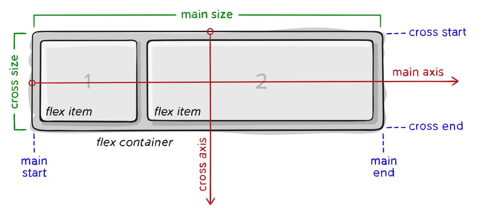

---
title: 3.5.- Flexbox
layout: default
parent: 3.- CSS
nav_order: 50
has_children: true

---


# **Flexbox: Model de Disposició Modern**

El mòdul **Flexbox Layout** (o *Flexible Box*) és un sistema de disseny modern que permet **distribuir, alinear i redimensionar elements** d’una manera molt més flexible que el CSS tradicional.

Flexbox resol problemes típics del disseny web:

* alineacions difícils
* repartiment d’espais desiguals
* centrat vertical
* columnes que s’adapten automàticament
* layouts que responen a pantalles de diferents mides

A diferència dels layouts clàssics:

* els elements **block** s’organitzen verticalment,
* els elements **inline** s’organitzen horitzontalment,

Flexbox **no està lligat a cap direcció fixa**: decideixes l’orientació i els elements s’adapten.

> **Flexbox és ideal per a components i layouts de mida mitjana.**
> Per a estructures més grans, utilitzarem **CSS Grid**.

---

## **1. Conceptes bàsics de FlexBox**

Per utilitzar Flexbox, un element ha de convertir-se en **contenidor flex**:

```css
.container {
  display: flex;
}
```

A partir d’este moment:

* aquest element és un **flex container**
* els seus fills directes són **flex items**

### **1.1 Els eixos de Flexbox**

Flexbox funciona amb dos eixos:



#### **Main Axis (eix principal)**

És l’eix on Flexbox col·loca els elements.
La seua direcció depén de `flex-direction`.

#### **Cross Axis (eix transversal)**

És perpendicular al main axis i s’utilitza per a alineacions verticals o horitzontals, segons el cas.

---

## **2. Propietats del Contenidor Flex**

Aquestes propietats modifiquen el comportament general dels elements (els *flex items*).

---

### **2.1 `flex-direction` — Direcció dels elements**


Defineix com s’ordenen els elements:

```css
.container {
  flex-direction: row | row-reverse | column | column-reverse;
}
```

* **row** (per defecte): horitzontal, d’esquerra a dreta
* **row-reverse**: horitzontal invertida
* **column**: vertical, de dalt cap avall
* **column-reverse**: vertical invertida

---

### **2.2 `flex-wrap` — Permet trencar línia**


Per defecte, Flexbox posa tots els elements en una sola línia.
Si no caben, poden encapsar-se:

```css
.container {
  flex-wrap: nowrap | wrap | wrap-reverse;
}
```

---

### **2.3 `flex-flow` — Abreviatura utilíssima**

Combinació de `flex-direction` i `flex-wrap`:

```css
flex-flow: <direcció> <wrap>;
```

Exemple:

```css
flex-flow: row wrap;
```

---

### **2.4 `justify-content` — Alineació horitzontal (eix principal)**


Organitza espais i distribució en el *main axis*:

* `flex-start`
* `flex-end`
* `center`
* `space-between`
* `space-around`
* `space-evenly`

---

### **2.5 `align-items` — Alineació en el Cross Axis**


Controla l’alineació perpendicular al main axis:

* `stretch` *(per defecte)*
* `flex-start`
* `flex-end`
* `center`
* `baseline`

---

### **2.6 `align-content` — Alineació de múltiples línies**


Només afecta contenidors amb *wrap*.

Valors: `stretch`, `center`, `flex-start`, `flex-end`, `space-between`, `space-around`, etc.

---

### **2.7 `gap` — Espai entre elements**


Equivalent al `gap` de CSS Grid.

```css
gap: 10px;        /* mateix valor per a files i columnes */
gap: 10px 20px;   /* files / columnes */
```

---

## **3. Propietats dels Elements Flex (*flex items*)**

Aquestes propietats es posen en **els fills** del contenidor flex.


---

### **3.1 `order` — Reordenar visualment**


No canvia el codi HTML, només la posició visual.

```css
.item {
  order: 5;
}
```

---

### **3.2 `flex-grow` — Capacitat de créixer**


Reparteix proporcionalment l’espai disponible:

```css
.a { flex-grow: 1; }
.b { flex-grow: 2; }  /* creix el doble que .a */
```

---

### **3.3 `flex-shrink` — Capacitat de contraure’s**


Determina com es redueix un element quan hi ha poc espai.

* `1` → es pot contraure (per defecte)
* `0` → no es contraurà

---

### **3.4 `flex-basis` — Mida inicial**

Defineix la mida base d’un item *abans* de repartir espais.

```css
.a { flex-basis: 100px; }
.b { flex-basis: 20%; }
```

---

### **3.5 `flex` — Abreviatura recomanada**

Equival a:

```
flex: <grow> <shrink> <basis>;
```

Exemple:

```css
flex: 1;           /* grow=1, shrink=1, basis=0 */
flex: 2 1 100px;   /* grow=2, shrink=1, basis=100px */
flex: none;        /* 0 0 auto */
```

---

### **3.6 `align-self` — Alineació individual**


Permet que un element es comporte diferent als altres:

```css
.item {
  align-self: flex-end;
}
```

---

##  **Resum**

### **Contenidor**

* `display:flex` activa Flexbox.
* `flex-direction` decideix l’orientació.
* `flex-wrap` permet que els elements salten de línia.
* `justify-content` → organitza al llarg del main axis.
* `align-items` → alineació en el cross axis.
* `gap` → espai entre elements.

### **Elements**

* `order` → canvia posició visual.
* `flex-grow` → com creix.
* `flex-shrink` → com es contraurà.
* `flex-basis` → mida inicial.
* `flex` → configuració completa abreujada.
* `align-self` → alineació individual.

---

