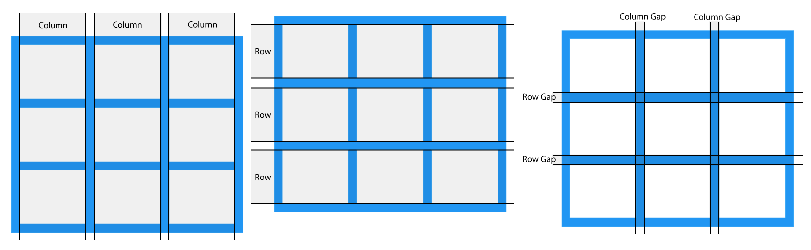
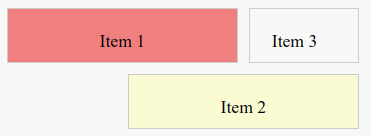

---

title: 3.6.- CSS Grid
layout: default
parent: 3.- CSS
nav_order: 60
has_children: true

---

# CSS Grid

CSS Grid és una eina molt important per al disseny de pàgines web modernes. Ens permet organitzar continguts en **files** i **columnes** de manera clara, estructurada i potent.

Amb CSS Grid podem crear **layouts complets** d’una pàgina web, definint com es distribueixen els elements tant en horitzontal com en vertical, amb menys esforç que altres mètodes tradicionals.

CSS Grid facilita la creació de **dissenys responsius** i **estructures complexes**, evitant l’ús excessiu de tècniques antigues com `float` o solucions basades en frameworks externs.

* **Nota:** Un **layout** és la distribució i organització dels elements dins d’una pàgina web.

---

### Avantatges de CSS Grid

* **Bidimensionalitat**
  Permet treballar simultàniament amb **files i columnes**, cosa que facilita la creació de layouts complets.

* **Flexibilitat**
  Fa possible definir estructures complexes amb poques regles CSS i de manera molt visual.

* **Disseny responsiu**
  Els layouts es poden adaptar fàcilment a diferents mides de pantalla utilitzant unitats flexibles.

* **Codi més net i senzill**
  Redueix la necessitat d’utilitzar `float`, `position` o estructures HTML artificials.

* **Unitats modernes**
  Permet utilitzar unitats com `fr` i funcions com `minmax()`, que faciliten el repartiment proporcional de l’espai disponible.

---

### Comparació amb Flexbox

| **CSS Grid**                             | **Flexbox**                                         |
| ---------------------------------------- | --------------------------------------------------- |
| Sistema bidimensional (files i columnes) | Sistema unidimensional (fila o columna)             |
| Ideal per a layouts complets             | Ideal per a organitzar elements dins d’un component |
| Utilitza cel·les i àrees definides       | Treballa amb eixos d’alineació                      |

**Nota:** En molts casos, CSS Grid i Flexbox **no són excloents**. Es poden combinar per aprofitar els avantatges de cada sistema segons la necessitat del disseny.

---

## Conceptes de CSS Grid

CSS Grid és un **sistema de disseny bidimensional** que permet dividir un contenidor en **files** i **columnes** per posicionar els elements (ítems) dins de les cel·les.

Aquest sistema permet controlar al mateix temps la distribució **horitzontal** i **vertical** dels elements dins d’un layout.

### Flux per defecte dels elements en un grid

Quan no s’indica cap regla específica de posicionament, CSS Grid col·loca els elements seguint un **flux automàtic**:

* Els elements es col·loquen **d’esquerra a dreta**, omplint una fila.
* Quan una fila no té espai suficient, els elements passen a la **fila següent**.
* Els elements s’ordenen segons **l’ordre en què apareixen a l’HTML**.
* **Si no hi ha cap regla CSS** que especifique la **posició d’un element**, aquest **s’ubicarà en la primera cel·la disponible**.

Aquest comportament fa que CSS Grid siga ideal per crear **dissenys inicials ràpids**, sense la necessitat d’especificar manualment la posició de tots els elements.

---



En la imatge anterior es mostra un grid amb **3 files i 3 columnes**.
Els espais entre cada fila i cada columna s’anomenen **gap**.

### Espais entre files i columnes (gap)

El **gap** controla la separació entre les cel·les del grid.

Podem modificar el tamany del **gap** amb les propietats següents:

* `gap`: defineix el mateix espai tant per a files com per a columnes.
* `row-gap`: defineix el tamany del gap entre les files.
* `column-gap`: defineix el tamany del gap entre les columnes.

També podem combinar `row-gap` i `column-gap` per especificar separacions diferents entre files i columnes.

---

## **Components bàsics de CSS Grid**

### 1. **Grid Container**

El **Grid Container** és l’element pare que conté la graella. Quan apliquem la propietat **`display: grid`** a un element HTML, aquest es converteix en un **contenidor de grid**, activant el comportament de CSS Grid.

**Exemple:**

```css
.container {
    display: grid; /* Activa el comportament de graella */
    border: 1px solid #333;
    padding: 10px;
}
```

Els elements fills directes del contenidor es converteixen automàticament en **Grid Items**.


---

### 2. **Grid Items**

Els **Grid Items** són els **fills directes** del **Grid Container**. Només aquests elements participen en el sistema de graella i es col·loquen dins de les cel·les del grid.

Cada **Grid Item** es posiciona automàticament seguint les regles definides pel contenidor.

**Exemple:**

```html
<div class="container">
    <div>Element 1</div>
    <div>Element 2</div>
    <div>Element 3</div>
</div>
```

En aquest exemple:

* Els tres elements fills (`<div>`) del contenidor són automàticament **Grid Items**.
* Aquests elements es col·loquen dins de la graella seguint el **flux automàtic** del grid.
* **Si no es defineix cap posició específica**, els ítems ocuparan les cel·les **en l’ordre en què apareixen a l’HTML**.

Aquest comportament permet construir un layout funcional sense necessitat de definir la posició exacta de cada element des del principi.

---

### 3. **Grid Lines**

Les **Grid Lines** són les **línies de separació** que delimiten les **columnes** i les **files** d’un grid.
Aquestes línies inclouen **tant les separacions internes com les vores externes del grid**.

En CSS Grid:

* **Les columnes i les files no es numeren.**
* **El que es numera són les línies que les separen.**

Les **Grid Lines** es numeren automàticament començant pel número **1**, des de l’inici fins al final del grid. Aquesta numeració permet posicionar els **Grid Items** amb molta precisió.

---

**Column Lines i Row Lines**

* Cada **columna** està situada **entre dues línies verticals**, anomenades **Column Lines**.
* Cada **fila** està situada **entre dues línies horitzontals**, anomenades **Row Lines**.

Les línies de les vores del grid **també compten** com a Grid Lines.

---


En CSS Grid, **les columnes i les files ocupen espai**, però **les Grid Lines són els límits d’aquests espais**.
Per això, sempre hi ha **una línia al començament i una altra al final** del grid.

* **Columnes**

Si el grid té **3 columnes**, la situació és aquesta:

```
| col 1 | col 2 | col 3 |
```

Per delimitar aquestes columnes, necessitem:

```
1 | 2 | 3 | 4
```

* La **línia 1** marca l’inici del grid.
* La **línia 4** marca el final del grid.
* Les línies **2** i **3** separen les columnes entre elles.

Per això:

* **3 columnes → 4 línies verticals**

---

* **Files**

Si el grid té **2 files**, la situació és aquesta:

```
-----
fila 1
-----
fila 2
-----
```

Les línies horitzontals que les delimiten són:

```
1
-----
2
-----
3
```

* La **línia 1** marca la part superior del grid.
* La **línia 3** marca la part inferior del grid.
* La **línia 2** separa les dues files.

Per això:

* **2 files → 3 línies horitzontals**

---

* **Relació amb `grid-column` i `grid-row`**

Quan escrivim:

```css
grid-column: 1 / 3;
```

No estem indicant columnes, sinó:

* **Des de la línia 1**
* **Fins a la línia 3**

És a dir, l’element ocupa **l’espai comprés entre aquestes dues línies**, que correspon a **dues columnes**.

---


> **Recorda:** les columnes i les files són espais. Les Grid Lines són els límits d’aquests espais.


### **Exemple pràctic amb línies numerades**

Aquest exemple defineix un grid amb **tres columnes** de `100px` i **dues files** de `50px`.
També s’afegeix un espai de **10px** entre les cel·les.

**HTML:**

```html
<div class="container">
    <div class="item1">Item 1</div>
    <div class="item2">Item 2</div>
    <div>Item 3</div>
</div>
```

En aquest exemple:

* Els ítems es col·loquen automàticament si no s’especifica cap regla.
* Alguns ítems es posicionen manualment utilitzant les línies numerades.

---

**CSS:**

```css
.container {
    display: grid;
    grid-template-columns: 100px 100px 100px; /* Tres columnes de 100px cadascuna */
    grid-template-rows: 50px 50px;           /* Dues files de 50px cadascuna */
    gap: 10px;                               /* Espai entre les cel·les */
    border: 2px solid #333;
    padding: 10px;
    background-color: #f8f8f8;
}

/* Posicionar els elements al grid */
.item1 {
    grid-column: 1 / 3; /* De la línia vertical 1 a la 3 (ocupa dues columnes) */
    grid-row: 1 / 2;    /* De la línia horitzontal 1 a la 2 (ocupa una fila) */
    background-color: lightcoral;
    text-align: center;
}

.item2 {
    grid-column: 2 / 4; /* De la línia vertical 2 a la 4 (ocupa dues columnes) */
    grid-row: 2 / 3;    /* De la línia horitzontal 2 a la 3 (ocupa una fila) */
    background-color: lightgoldenrodyellow;
    text-align: center;
}

.container > div {
    padding: 20px;
    border: 1px solid #ccc;
}
```

---

### Representació del grid amb línies numerades

Si dibuixem el grid, les línies quedarien així:

```
    1       2       3       4   (Column Lines)
1   +-------+-------+-------+
    | Item1 | Item1 |       |
2   +-------+-------+-------+
    |       | Item2 | Item2 |
3   +-------+-------+-------+
    (Row Lines)
```

---

Al navegador, el resultat visual seria:



**Nota:**
`Item3` no té cap regla de posicionament definida. Per tant, ocuparà **la primera cel·la disponible**, que en aquest cas correspon a **fila 1, columna 3**.

---

>**RECORDA:**
> **En CSS Grid no es numeren columnes ni files.
> Es numeren les línies que les separen.**


---


### 4. **Grid Tracks**

Els **Grid Tracks** són els **espais que hi ha entre les Grid Lines**.
Aquests espais són, precisament, **les files i les columnes del grid**.

Dit d’una altra manera:

* Les **Grid Lines** són els límits.
* Els **Grid Tracks** són els espais compresos entre aquests límits.
* És dins dels **Grid Tracks** on es col·loquen els elements del grid.

---

**Tipus de Grid Tracks**

Segons la seua orientació, els Grid Tracks poden ser:

* **Files (rows)**
  Espais horitzontals que es defineixen amb la propietat `grid-template-rows`.

* **Columnes (columns)**
  Espais verticals que es defineixen amb la propietat `grid-template-columns`.

Cada valor que indiquem en `grid-template-rows` o `grid-template-columns` **defineix la mida d’un Grid Track**.

---

**Definició de la mida dels Grid Tracks**

Les propietats `grid-template-rows` i `grid-template-columns` permeten establir **com de grans són les files i les columnes** del grid.

Cada valor escrit correspon a **un track**.

---

**Valors que poden prendre els Grid Tracks**

* **Unitats fixes (`px`, `em`, `%`)**

  Aquestes unitats permeten definir una mida concreta per a files o columnes.

  * **`px` (píxels)**
    Unitat absoluta. La mida no depén ni del contingut ni del contenidor.

  * **`em`**
    Unitat relativa basada en la mida de la lletra de l’element pare.
    Per exemple, si la mida de lletra és `16px`:

    * `1em` → `16px`
    * `2em` → `32px`

  * **`%` (percentatge)**
    Unitat relativa que es calcula respecte al tamany del contenidor.

  **Nota:**
  Aquestes unitats són útils quan volem **dimensions previsibles o fixes** dins del layout.

  **Exemple:**

  ```css
  .container {
      display: grid;
      grid-template-columns: 100px 2em 50%; /* Tres columnes amb unitats diferents */
  }

  .container > div {
      border: 1px solid #333;
      padding: 10px;
  }
  ```

  En aquest cas:

  * **Primera columna (`100px`)**: sempre fa 100 píxels.
  * **Segona columna (`2em`)**: depén de la mida de la lletra de l’element pare.
  * **Tercera columna (`50%`)**: ocupa la meitat de l’amplària del contenidor.

---

* **Fraccions (`fr`)**

  La unitat **`fr`** reparteix **l’espai disponible** del contenidor de manera proporcional.

  * No defineix una mida fixa.
  * Distribueix l’espai restant després de calcular altres mides.

  És especialment útil per crear **layouts flexibles i responsius**.

  **Exemple:**

  ```css
  grid-template-columns: 1fr 2fr;
  ```

  En aquest cas:

  * L’espai es divideix en **3 parts iguals**.
  * La primera columna ocupa **1 part**.
  * La segona columna ocupa **2 parts**.

---

* **Mida automàtica (`auto`)**

  El valor **`auto`** fa que la mida del track **s’adapte al contingut**.

  És molt habitual en files, especialment quan no sabem quina altura tindrà el contingut.

  **Exemple:**

  ```css
  grid-template-rows: auto 100px;
  ```

  * La primera fila s’ajusta al contingut.
  * La segona fila té una altura fixa de `100px`.

---

**Exemple complet amb Grid Tracks**

**HTML:**

```html
<div class="container">
    <div>Fila 1, Columna 1</div>
    <div>Fila 1, Columna 2</div>
    <div>Fila 2, Columna 1</div>
    <div>Fila 2, Columna 2</div>
</div>
```

**CSS:**

```css
.container {
    display: grid;
    grid-template-columns: 1fr 2fr; /* Columnes en proporció 1:2 */
    grid-template-rows: 100px auto; /* Fila fixa i fila automàtica */
    gap: 10px;
    border: 2px solid #333;
    padding: 10px;
    background-color: #f8f8f8;
}

.container > div {
    background-color: lightblue;
    padding: 20px;
    text-align: center;
    border: 1px solid #ccc;
}
```

---

**Interpretació de l’exemple**

* **Columnes**

  * Primera columna: `1fr` → una part de l’espai.
  * Segona columna: `2fr` → dues parts de l’espai.
  * Si el contenidor fa 300px:

    * Columna 1 → 100px
    * Columna 2 → 200px

* **Files**

  * Primera fila: `100px` (altura fixa).
  * Segona fila: `auto` (s’adapta al contingut).

* **Separació**

  * `gap: 10px` crea 10 píxels d’espai entre files i columnes.

---


---

**Visualització del grid**

```
    1fr     2fr
+---------+---------+
|  F1,C1  |  F1,C2  |  100px
+---------+---------+
|  F2,C1  |  F2,C2  |  auto (altura segons contingut)
+---------+---------+
```

---

**En resum**

Els **Grid Tracks** són els **espais entre les Grid Lines**.
Definir correctament els tracks amb `grid-template-columns`, `grid-template-rows`, `fr` i `auto` ens permet crear **layouts flexibles, clars i responsius** amb molt poc codi.


## Propietats principals del Contenidor Grid

El **Contenidor Grid** és l’element que defineix la graella i el seu comportament.
Les propietats del contenidor permeten controlar **com es creen les files i columnes**, **com es reparteix l’espai** i **com s’organitzen les diferents zones del layout**.

---

### 1. **display**

Aquesta propietat activa el mode de graella en un element.

* `grid`
  Crea una graella de tipus bloc. Els elements fills es disposen en files i columnes.

* `inline-grid`
  Crea una graella en línia, útil quan el grid forma part d’un text o d’un element inline.

**Exemple:**

```css
.container {
    display: grid;
}
```

**Nota:**
Sense `display: grid`, l’element **no és un Grid Container** i **cap altra propietat de CSS Grid tindrà efecte**.

---

### 2. **grid-template-columns i grid-template-rows**

Defineixen **el nombre i la mida** de les columnes i de les files del grid.

* `grid-template-columns`: estableix l’amplària de cada columna.
* `grid-template-rows`: estableix l’altura de cada fila.

**Exemple:**

```css
.container {
    display: grid;
    grid-template-columns: 1fr 2fr; /* Dues columnes: una fracció i dues fraccions */
    grid-template-rows: 100px auto; /* Una fila fixa i una automàtica */
}
```

En aquest cas:

* La primera columna ocupa **1 fracció** de l’espai disponible.
* La segona columna ocupa **2 fraccions** de l’espai disponible.
* La primera fila té una altura fixa de **100px**.
* La segona fila s’ajusta automàticament al contingut amb **auto**.

També es poden utilitzar funcions com `repeat()` o `minmax()` per crear layouts més flexibles.

---

### 3. **gap, row-gap i column-gap**

Controlen l’espai **entre les files i les columnes** del grid.

* `gap`: defineix el mateix espai per a files i columnes.
* `row-gap`: defineix l’espai entre les files.
* `column-gap`: defineix l’espai entre les columnes.

**Exemple:**

```css
.container {
    display: grid;
    grid-template-columns: repeat(3, 1fr);
    gap: 20px; /* Espai entre totes les cel·les */
    row-gap: 10px; /* Espai entre files */
    column-gap: 15px; /* Espai entre columnes */
}
```

Aquestes propietats permeten controlar la separació entre cel·les **sense utilitzar `margin`**.

Si només s’indica `gap`, el mateix valor s’aplica tant a `row-gap` com a `column-gap`.

---

### 4. **grid-auto-rows i grid-auto-columns**

Defineixen la mida per defecte de les files o columnes que es creen **automàticament**.

* `grid-auto-rows`: altura de les files generades automàticament.
* `grid-auto-columns`: amplària de les columnes generades automàticament.

**Exemple:**

```css
.container {
    display: grid;
    grid-auto-rows: 50px;
    grid-auto-columns: 100px;
}
```

Aquestes propietats són útils quan els **Grid Items s’afegeixen dinàmicament** i no s’han definit explícitament totes les files o columnes.

---

### 5. **grid-template-areas**

La propietat **`grid-template-areas`** permet definir el layout utilitzant **noms semàntics** per a les diferents zones del grid.

Aquesta tècnica facilita:

* La lectura del codi
* La comprensió del layout
* El manteniment i la reorganització de la pàgina

**Avantatges:**

* **Claredat del codi**: el layout es pot entendre d’un cop d’ull.
* **Flexibilitat**: canviar l’estructura és tan senzill com modificar l’ordre de les àrees.
* **Millor organització semàntica** del disseny.

**HTML:**

```html
<div class="container">
    <header class="header">Capçalera</header>
    <nav class="menu">Menú</nav>
    <main class="main">Contingut</main>
    <footer class="footer">Peu de pàgina</footer>
</div>
```

**CSS:**

```css
.container {
    display: grid;
    grid-template-areas:
        "header header header"
        "menu main main"
        "footer footer footer";
    grid-template-columns: 1fr 2fr 2fr;
    grid-template-rows: auto 1fr auto;
}

.header { grid-area: header; }
.menu   { grid-area: menu; }
.main   { grid-area: main; }
.footer { grid-area: footer; }
```

---

Al codi anterior intervenen tres elements clau del contenidor grid:


* **`grid-template-areas`**
  Defineix l’estructura visual del layout mitjançant **noms d’àrees**.

  * Cada línia del valor de `grid-template-areas` representa **una fila del grid**.
  * Cada paraula dins de la línia identifica **una àrea concreta**.
  * Repetir un mateix nom indica que aquella àrea **s’estén per diverses columnes o files**.

  **Exemples:**

  * `"header header header"`
    La capçalera ocupa **totes les columnes** de la primera fila.
  * `"menu main main"`
    El menú ocupa **la primera columna**, mentre que el contingut principal ocupa **les dues columnes restants**.
  * `"footer footer footer"`
    El peu de pàgina ocupa **tota la tercera fila**.

---

* **`grid-template-columns`**
  Defineix **l’amplària de les columnes** del grid.

  * La primera columna ocupa **1 fracció** de l’espai disponible.
  * La segona i la tercera columna ocupen **2 fraccions cadascuna**, per tant són més amples.

  Aquest repartiment fa que la zona de contingut principal tinga més espai que el menú.

---

* **`grid-template-rows`**
  Defineix **l’altura de les files** del grid.

  * La primera i la tercera fila tenen una altura **automàtica (`auto`)**, adaptant-se al contingut.
  * La segona fila és **flexible (`1fr`)** i ocupa l’espai vertical disponible.

---

* **Assignació de les àrees amb `grid-area`**
  Amb la propietat **`grid-area`**, cada element HTML s’assigna a l’àrea definida en `grid-template-areas`.

  * `.header { grid-area: header; }` → col·loca la capçalera a l’àrea `"header"`.
  * `.menu { grid-area: menu; }` → col·loca el menú a l’àrea `"menu"`.
  * `.main { grid-area: main; }` → col·loca el contingut a l’àrea `"main"`.
  * `.footer { grid-area: footer; }` → col·loca el peu de pàgina a l’àrea `"footer"`.

  Això permet separar clarament **l’estructura del layout** del **contingut HTML**.

---

Amb aquesta configuració, la distribució del layout és la següent:

```
+---------+---------+---------+
| header  | header  | header  |  (Primera fila)
+---------+---------+---------+
| menu    |  main   |  main   |  (Segona fila)
+---------+---------+---------+
| footer  | footer  | footer  |  (Tercera fila)
+---------+---------+---------+
```


---

## Propietats per als Elements Grid

Les propietats dels **Grid Items** permeten controlar **on es col·loca cada element** dins del grid i **com s’alinea dins de la seua cel·la**, sense necessitat de modificar l’ordre de l’HTML.

---

### 1. **grid-column i grid-row**

Les propietats **`grid-column`** i **`grid-row`** permeten posicionar un element **referenciant les Grid Lines** del grid.

Amb aquestes propietats indiquem **entre quines línies** s’ha de col·locar un element, i per tant:

* quantes columnes ocupa
* quantes files ocupa

Això permet crear layouts precisos sense alterar l’ordre dels elements en l’HTML.

**Exemple:**

```css
.item1 {
    grid-column: 1 / 3; /* De la línia vertical 1 a la 3 */
    grid-row: 1 / 2;    /* De la línia horitzontal 1 a la 2 */
}
```

En aquest cas:

* L’element s’estén **des de la línia 1 fins a la línia 3** en l’eix horitzontal, ocupant **dues columnes**.
* En l’eix vertical, ocupa **una sola fila**.

L’element queda col·locat en una **àrea concreta del grid** definida per aquestes línies.

---

### 2. **grid-area**

La propietat **`grid-area`** és una forma abreujada de definir alhora `grid-row` i `grid-column`.

Permet indicar, en una sola línia, les **quatre línies** que delimiten l’espai ocupat per un element:

* línia inicial de fila
* línia inicial de columna
* línia final de fila
* línia final de columna

També es pot utilitzar amb **noms d’àrees** definits amb `grid-template-areas`.

**Exemple:**

```css
.item1 {
    grid-area: 1 / 1 / 3 / 3; /* De les línies 1,1 fins a 3,3 */
}
```

Aquest valor indica que l’element ocupa l’espai comprés:

* entre la línia 1 i la 3 de files
* entre la línia 1 i la 3 de columnes

---

### 3. **justify-self i align-self**

Aquestes propietats permeten **alinear un element dins de la seua pròpia cel·la** del grid.

* **`justify-self`** controla l’alineació **horitzontal**.
* **`align-self`** controla l’alineació **vertical**.

Si no s’especifica cap valor, l’element ocupa **tota la cel·la**.

**Exemple:**

```css
.item1 {
    justify-self: center; /* Centra horitzontalment */
    align-self: start;    /* Alinea al principi verticalment */
}
```

Aquestes propietats són útils quan volem ajustar la posició d’un element **sense modificar la mida del track**.

---

## Exemple complet de layout amb CSS Grid

Aquest exemple mostra una pàgina completa estructurada amb **CSS Grid** utilitzant àrees semàntiques.

**HTML:**

```html
<div class="container">
    <header>Capçalera</header>
    <nav>Menú</nav>
    <main>Contingut Principal</main>
    <aside>Barra Lateral</aside>
    <footer>Peu de pàgina</footer>
</div>
```

**CSS:**

```css
.container {
    display: grid;
    grid-template-areas:
        "header header"
        "menu main"
        "menu sidebar"
        "footer footer";
    grid-template-columns: 1fr 3fr;
    grid-template-rows: auto 1fr 1fr auto;
    gap: 10px;
}

header  { grid-area: header;  background: lightblue; }
nav     { grid-area: menu;    background: lightgreen; }
main    { grid-area: main;    background: lightcoral; }
aside   { grid-area: sidebar; background: lightgoldenrodyellow; }
footer  { grid-area: footer;  background: lightgray; }
```

En aquest exemple:

* **`grid-template-areas`** defineix les zones del layout de manera visual i semàntica.
* **`grid-template-columns`** i **`grid-template-rows`** estableixen la mida de columnes i files.
* Cada element s’assigna a una àrea concreta amb **`grid-area`**.
* Els colors permeten identificar clarament cada zona.

---

### Resultat visual del layout

```
+---------+---------+
| header  | header  |  (Primera fila)
+---------+---------+
| menu    |  main   |  (Segona fila)
+---------+---------+
| menu    | sidebar |  (Tercera fila)
+---------+---------+
| footer  | footer  |  (Quarta fila)
+---------+---------+
```


## En resum

CSS Grid és un **sistema de disseny bidimensional** que ens permet organitzar elements en **files i columnes** dins d’un **Grid Container**. Quan activem el grid amb `display: grid`, els fills directes passen a ser **Grid Items** i es col·loquen segons el **flux automàtic** (d’esquerra a dreta i, quan s’ompli una fila, baixen a la següent).

El grid es defineix amb **línies (Grid Lines)**, que són els límits entre files i columnes i també inclouen les vores externes. Entre aquestes línies hi ha els **Grid Tracks**, que són els espais reals que formen les files i columnes, i als quals els podem donar mida amb unitats com `px`, `%`, `em`, `fr` o `auto`.

Per construir layouts més complets i llegibles, podem usar `grid-template-areas` per crear zones amb noms (capçalera, menú, etc.) i assignar-hi cada element amb `grid-area`. A nivell d’ítems, `grid-column` i `grid-row` permeten posicionar elements amb precisió utilitzant línies, i `justify-self` i `align-self` serveixen per alinear-los dins de la seua pròpia cel·la.

---

**Taula-Resum de les Propietats de CSS Grid**

| **Propietat**           | **Funció**                                                               |
| ----------------------- | ------------------------------------------------------------------------ |
| `display`               | Activa el mode grid (`grid`, `inline-grid`).                             |
| `grid-template-columns` | Defineix l’amplària de les columnes.                                     |
| `grid-template-rows`    | Defineix l’altura de les files.                                          |
| `gap`                   | Espai entre cel·les (files i columnes).                                  |
| `grid-template-areas`   | Assigna noms a zones del grid per facilitar la disposició dels elements. |
| `grid-column`           | Posiciona un element referenciant línies de columna.                     |
| `grid-row`              | Posiciona un element referenciant línies de fila.                        |
| `justify-self`          | Alinea horitzontalment un element dins de la seua cel·la.                |
| `align-self`            | Alinea verticalment un element dins de la seua cel·la.                   |
