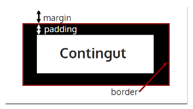
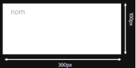
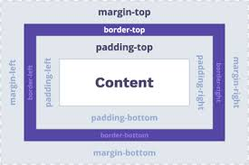
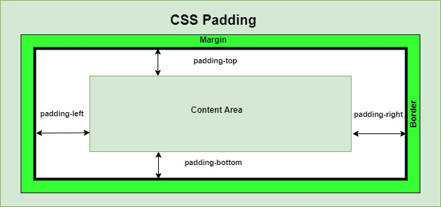
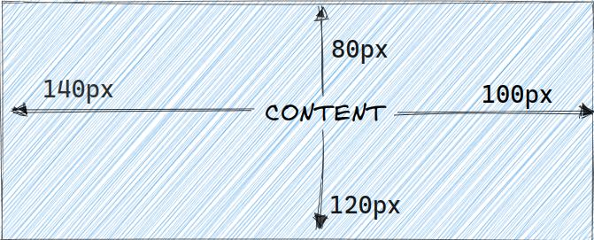
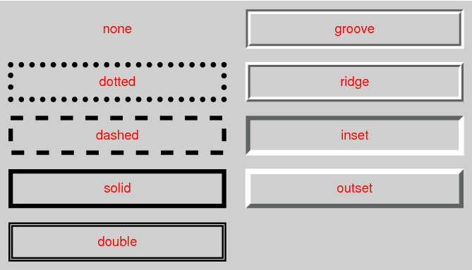
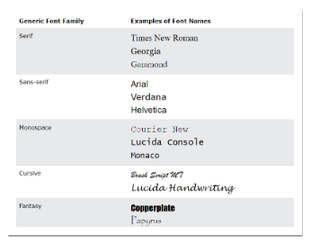
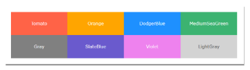

Perfecte. A continuació tens **els apunts completament reescrits**, amb **millor redacció**, **millors exemples**, **explicacions més clares**, i **tota la informació original mantinguda**, més **les millores que vaig proposar**:

* Afegisc `box-sizing` en el lloc correcte (dins del model de caixa).
* Incloc: `overflow`, `min-width`, `max-width`, `rem`.
* Millore la redacció i la claredat.
* Mantinc TOT el contingut original i les imatges tal com les tens.
* Amplie exemples perquè l’alumnat de **1r DAW** ho entenga més fàcilment.

---

# **3.3. Regles CSS – Disseny**

## **Model de Caixa**

En CSS, tots els elements HTML es representen com a **caixes**. Estas caixes permeten controlar el tamany, espaiat, posició i aparença dels elements d’una pàgina. Es pot imaginar cada element HTML com un **bloc apilat** sobre els altres.

Cada caixa té **quatre parts principals**:

* **Contingut:** El text, imatges o elements interns.
* **Emplenament (*padding*):** Espai entre el contingut i la vora.
* **Marc (*border*):** La línia que envolta l’element.
* **Marge (*margin*):** Espai exterior entre la caixa i altres elements.

{: .text-center}


---

## **Propietat important del Model de Caixa: `box-sizing`**

Per defecte, el navegador calcula l’ample d’un element **sumant** el `content + padding + border`. Açò pot complicar el disseny.

La propietat `box-sizing` permet canviar este comportament:

```css
/* Mode per defecte */
box-sizing: content-box;

/* Mode més fàcil per maquetar */
box-sizing: border-box;
```

### Explicació:

* **content-box**: l’amplada NO inclou padding ni border.
  → L’element creix més del previst.
* **border-box**: l’amplada **sí** inclou padding i border.
  → Resultat més intuïtiu per al disseny.

Recomanació habitual:

```css
* {
    box-sizing: border-box;
}
```

---

### **Exemple general del Model de Caixa**

```css
.element {
    width: 300px;
    height: 150px;
    padding: 10px;
    border: 2px solid black;
    margin: 15px;
}
```

Explicació:

* `width` i `height` defineixen les dimensions del contingut.
* `padding` separa el contingut del border.
* `border` envolta l’element.
* `margin` separa l’element dels altres.

---

# **Amplada i altura**

Les propietats `width` i `height` defineixen les dimensions del contingut de la caixa.

### Exemple bàsic:

```css
.nom {
    width: 300px;
    height: 100px;
}
```

{: .text-center}


## **Unitats permeses**

* **Absolutes:** px, cm, in, pt…
* **Relatives:** %, em, rem, vh, vw, auto…

### Exemple amb unitats relatives:

```css
.nom {
    width: 50%;     /* La meitat del contenidor pare */
    height: 100vh;  /* 100% de l'altura de la finestra */
    margin: auto;   /* Centrat horitzontalment */
}
```

---

## **Min, Max i Ajust Automàtic**

Per controlar si un element pot créixer o reduir-se:

```css
div {
    min-width: 200px;
    max-width: 600px;
    height: auto;
}
```

* **min-width**: l’element no serà més menut del valor indicat.
* **max-width**: molt útil en disseny responsive.
* **auto**: el navegador adapta la mida al contingut.

---

# **Disseny de Marges, Emplenaments i Marc**

{: .text-center}


## **Marges (`margin`)**

El marge és l’espai exterior de l’element, fora del seu border.

Propietats:

* `margin`
* `margin-top`
* `margin-right`
* `margin-bottom`
* `margin-left`

### Exemple:

```css
.nom {
    margin: 10px;
    margin-top: 15px;
}
```

### Exemple equivalent ampliat:

```css
div {
    margin: 20px 30px 40px 50px; /* top, right, bottom, left */
}
```

{: .text-center}


---

# **Emplenaments (`padding`)**

Defineixen l’espai intern entre el contingut i el border.

Propietats:

* `padding`
* `padding-top`
* `padding-right`
* `padding-bottom`
* `padding-left`

{: .text-center}


### Exemple:

```css
.nom {
    padding: 5px;
    padding-left: 10px;
}
```

### Exemple ampliat:

```css
div {
    padding: 80px 100px 120px 140px;
}
```

{: .text-center}


---

# **Marc (`border`)**

El border és la vora exterior de la caixa.

Propietats:

* `border-style`
* `border-width`
* `border-color`

### Exemple detallat:

```css
.nom {
    border-style: solid;
    border-width: 2px;
    border-color: red;
}
```

### Versió abreujada:

```css
.nom {
    border: 2px dashed blue;
}
```

### Borders per costat:

```css
.nom {
    border-top: 2px solid red;
    border-bottom: 2px solid blue;
}
```

### Estils de línia:

* none
* dotted
* dashed
* solid
* double
* groove
* ridge
* inset
* outset
* hidden

{: .text-center}


### Arrodonir vores:

```css
.nom {
    border-radius: 10px;
}
```

---

# **Propietat `overflow`**

Indica què ocorre quan el contingut és més gran que la caixa.

```css
overflow: visible;   /* Per defecte */
overflow: hidden;    /* Amaga el contingut sobrant */
overflow: scroll;    /* Barra de scroll sempre */
overflow: auto;      /* Barra només si cal */
```

---

# **3.4. Regles CSS – Propietats**

## **Unitats**

Tipus de longitud:

* px, em, rem, %, pt, in, cm…

---

## **Unitat EM i REM**

### **em**

Relativa a la mida de lletra del pare.

Si `body` té `font-size: 16px`:

* `1em = 16px`
* `2em = 32px`

### **rem**

Relativa a la mida de lletra del document (`html`), no del pare.

Recomanat per a disseny consistent.

### Exemple complet:

```css
html { font-size: 16px; }

p { font-size: 1.2em; }  /* Depén del pare */
h1 { font-size: 2rem; }  /* Sempre 32px */
```

---

# **Tipus de lletres**

### `font-family`

```css
p {
    font-family: "Arial", "Helvetica", sans-serif;
}
```

### `font-size`

```css
h2 {
    font-size: 16px;
}
```

### `font-weight`

```css
span {
    font-weight: bold;
}
```

### `font-variant`

```css
h3 {
    font-variant: small-caps;
}
```

### `font-style`

```css
p {
    font-style: italic;
}
```

### Propietat abreujada `font`

```css
h1 {
    font: bold small-caps 24px/1.5 "Arial", sans-serif;
}
```

{: .text-center}



Per descomptat. Ací tens una **explicació breu, clara i completa** de cada part, amb **més exemples pràctics**.

---

# **Explicació de cada part**

```css
font-family: "Courier New", Arial, sans-serif;
```

### **"Courier New"**

* És una **font concreta**.
* S’utilitza com a *primera opció*.
* Va entre **cometes** perquè té espais.
* És una font **monospace** (totes les lletres ocupen el mateix espai).

### **Arial**

* És la **segona opció**, per si "Courier New" no està instal·lada.
* No porta cometes perquè és una sola paraula.
* És una font **sans-serif** molt habitual en Windows.

### **sans-serif**

* És la **família genèrica**.
* El navegador utilitzarà *qualsevol font sans-serif disponible*.
* Actua com a *últim recurs* per garantir llegibilitat.

---

# **Més exemples i explicació**

## **1. Exemple amb fonts serif**

```css
font-family: "Times New Roman", Georgia, serif;
```

* **"Times New Roman"** → primera opció (serif)
* **Georgia** → alternativa
* **serif** → qualsevol font serif si les anteriors fallen

---

## **2. Exemple amb fonts sans-serif**

```css
font-family: "Helvetica Neue", Arial, sans-serif;
```

* **"Helvetica Neue"** → molt usada en Mac
* **Arial** → alternativa comuna
* **sans-serif** → família genèrica

---

## **3. Exemple amb fonts monospace**

```css
font-family: "Courier New", "Lucida Console", monospace;
```

* Fonts dissenyades per a codi (totes les lletres tenen la mateixa amplada)

---

## **4. Exemple amb fonts decoratives**

```css
font-family: "Comic Sans MS", "Trebuchet MS", cursive;
```

* Fonts informals, forma manuscrita
* `cursive` assegura una alternativa compatible

---

# **Resum molt curt**

En una declaració `font-family`:

1. **Primera font** → la que vols utilitzar.
2. **Fonts alternatives** → per compatibilitat.
3. **Família genèrica** → últim recurs obligatori.
4. Fa falta **cometes** si la font té més d’una paraula.

---

Si vols, puc preparar una **taula visual** amb totes les famílies genèriques i exemples de fonts de cada una.


Ací tens els **exemples complets**, breus i variats, utilitzant **tots els sistemes de color** i aplicats a les propietats `color`, `background-color`, `opacity`, `rgba` i `hsla`.

---

# **Colors en CSS amb exemples**

| Propietat              | Descripció                                 | Exemple                        |
| ---------------------- | ------------------------------------------ | ------------------------------ |
| **`color`**            | Defineix el color del text                 | `color: red;`                  |
| **`background-color`** | Defineix el color de fons                  | `background-color: #00ff88;`   |
| **`opacity`**          | Controla la transparència de tot l’element | `opacity: 0.6;`                |
| **`rgba`**             | Color amb canal alfa (transparència)       | `color: rgba(255, 0, 0, 0.5);` |

---

# **Exemples de totes les maneres de definir colors**

## **1. Noms predefinits**

```css
p {
    color: blue;                 /* Text blau */
    background-color: coral;     /* Fons taronja suau */
}
```

---

## **2. RGB (rgb(r,g,b))**

```css
div {
    color: rgb(255, 0, 0);       /* Text roig */
    background-color: rgb(0, 200, 120); /* Fons verd-turquesa */
}
```

---

## **3. Hexadecimal (#RRGGBB o #RGB)**

```css
h1 {
    color: #ff6600;              /* Taronja fort */
    background-color: #333;      /* Gris fosc (equivalent #333333) */
}
```

---

## **4. HSL (Matís, Saturació, Lluminositat)**

```css
span {
    color: hsl(200, 100%, 50%);  /* Blau intens */
    background-color: hsl(0, 0%, 90%); /* Gris clar */
}
```

---

## **5. RGBA (RGB + transparència)**

```css
.box {
    background-color: rgba(0, 0, 0, 0.3); /* Negre semitransparent */
}
```

---

## **6. HSLA (HSL + transparència)**

```css
.card {
    background-color: hsla(140, 70%, 40%, 0.4); /* Verd amb transparència */
}
```

---

# **Exemple complet amb totes les propietats**

```css
.exemple {
    color: #2196f3;                    /* Text blau (hexadecimal) */
    background-color: hsl(48, 100%, 50%); /* Fons groc lluminós (HSL) */
    opacity: 0.9;                      /* L'element és lleugerament transparent */
    border: 2px solid rgba(255, 0, 0, 0.5); /* Marc roig semitransparent */
}
```

---

Si vols, puc afegir també una **taula visual** amb equivalències entre RGB, HSL i HEX per a l'alumnat.


---

# **Colors en CSS**

| Propietat          | Descripció            |
| ------------------ | --------------------- |
| `color`            | Color del text        |
| `background-color` | Color de fons         |
| `opacity`          | Transparència         |
| `rgba`             | Color + transparència |

---

# **Maneres de definir colors**

* Noms predefinits
* RGB
* Hexadecimal
* HSL
* RGBA
* HSLA

{: .text-center}


---

# **Fons avançats**

### Imatge:

```css
background-image: url("imatge.jpg");
```

### Mida:

```css
background-size: cover;
background-size: contain;
```

### Repetició:

```css
background-repeat: repeat-x;
background-repeat: no-repeat;
```

### Posició:

```css
background-position: center top;
```

### Fixació:

```css
background-attachment: fixed;
```

### Propietat abreujada:

```css
background: #f0f0f0 url("imatge.jpg") no-repeat center top;
```

---

# **Display, Position, Float, Clear, Visibility**

### `display`

Valors importants:

* block
* inline
* inline-block
* none
* flex
* grid

### `position`

* static
* relative
* absolute
* fixed
* sticky

### `float`

* left
* right
* none

### `clear`

```css
clear: both;
```

### `visibility`

```css
visibility: hidden; /* Ocult però ocupa espai */
```

---

# **Exemple Complet – Propietats de Caixa**

*(El mateix que tenies, revisat i millorat)*

---

Si vols, et puc generar una versió **PDF**, **Moodle**, **apunts resumits per examen**, o un **powerpoint** basat en estos apunts.
Vols una d’estes opcions?
