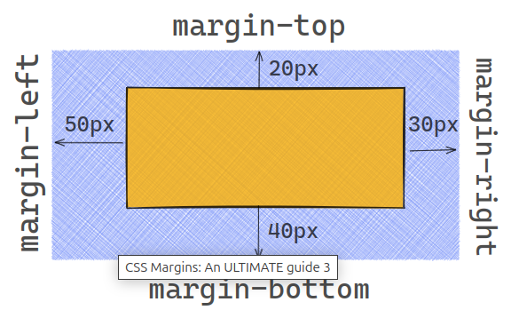

---

# 3.3. Regles CSS – Disseny

---

# **1. Model de Caixa**

En CSS, tots els elements HTML es representen com a **caixes**.
Una caixa determina:

* el contingut,
* l’espai intern (*padding*),
* la vora (*border*),
* l’espai extern (*margin*).

Això ens permet controlar el disseny d'una pàgina web de manera previsible.

**Parts del model de caixa:**

* **Contingut:** allò que mostra l’element (text, imatges...).
* **Padding:** espai entre el contingut i la vora.
* **Border:** contorn de l’element.
* **Margin:** espai exterior que separa l’element dels altres.

{: .text-center}


---

## **1.1. Propietat `box-sizing`**

Per defecte, l’ample total d’un element és:

```
width + padding + border
```

Però això pot dificultar el disseny.

La propietat `box-sizing` canvia este comportament:

```css
/* Comportament per defecte */
box-sizing: content-box;

/* Recomanat per a maquetació moderna */
box-sizing: border-box;
```

* **content-box:** `width` només és el contingut.
* **border-box:** `width` inclou contingut + padding + border.

Recomanació global:

```css
* {
    box-sizing: border-box;
}
```

---

## **1.2. Exemple general del Model de Caixa**

```css
.element {
    width: 300px;
    height: 150px;
    padding: 10px;
    border: 2px solid black;
    margin: 15px;
}
```

---

# **2. Dimensions**

## **2.1. Amplada i altura**

Les propietats `width` i `height` controlen el tamany del contingut d'una caixa.

```css
.nom {
    width: 300px;
    height: 100px;
}
```

{: .text-center}


---

## **2.2. Unitats**

Les unitats es classifiquen en:

### **Unitats absolutes**

* px
* cm
* in
* pt

### **Unitats relatives**

* %
* em
* rem
* vh
* vw
* auto

| **Unitat** | **Significat**       | **Explicació**                        |
| ---------- | -------------------- | ------------------------------------- |
| %          | Percentatge          | Relativa al contenidor pare.          |
| em         | Relativa al pare     | 1em = mida de lletra del pare.        |
| rem        | Relativa al document | 1rem = mida definida a `html`.        |
| vh         | Viewport height      | 1vh = 1% de l'altura de la finestra.  |
| vw         | Viewport width       | 1vw = 1% de l'amplada de la finestra. |
| auto       | Automàtica           | El navegador decideix la mida.        |

---

## **2.3. Exemple amb unitats relatives**

```css
.nom {
    width: 50%;
    height: 100vh;

    font-size: 1.2rem;
    padding: 2em;

    max-width: 80vw;
    min-height: 20vmin;

    margin: auto;
    border-radius: 1vmax;
}
```

---

## **2.4. Min, Max i auto**

```css
div {
    min-width: 200px;
    max-width: 600px;
    height: auto;
}
```

---

# **3. Espaiat**

---

## **3.1. Marges (`margin`)**

El marge és l'espai extern de l'element.

Propietats:

* `margin`
* `margin-top`
* `margin-right`
* `margin-bottom`
* `margin-left`

Exemples:

```css
.nom {
    margin: 10px;
    margin-top: 15px;
}
```

```css
div {
    margin: 20px 30px 40px 50px;
}
```

{: .text-center}


---

## **3.2. Emplenaments (`padding`)**

El padding és l’espai intern entre el contingut i el border.

Propietats:

* `padding`
* `padding-top`
* `padding-right`
* `padding-bottom`
* `padding-left`

Exemple:

```css
.nom {
    padding: 5px;
    padding-left: 10px;
}
```

```css
div {
    padding: 80px 100px 120px 140px;
}
```

{: .text-center}


---

## **3.3. Nota important: margin collapsing**

Els marges verticals contigus es **fusionen automàticament**.

Exemple:
Si un element té `margin-bottom: 30px` i el següent `margin-top: 20px`,
→ El marge vertical final serà **30px**, no 50px.

Este comportament només ocorre verticalment.

---

# **4. Marc i Forma**

## **4.1. Border**

Propietats:

* `border-style`
* `border-width`
* `border-color`

Exemple:

```css
.nom {
    border: 2px dashed blue;
}
```

Borders per costat:

```css
.nom {
    border-top: 2px solid red;
    border-bottom: 2px solid blue;
}
```

Estils de línia:

* none
* dotted
* dashed
* solid
* double
* groove
* ridge
* inset
* outset
* hidden

{: .text-center}


---

## **4.2. Arrodonir vores**

```css
.nom {
    border-radius: 10px;
}
```

---

## **4.3. Ombra (`box-shadow`)**

```css
.caixa {
    box-shadow: 10px 10px 20px rgba(0,0,0,0.25);
}
```

---

# **5. Desbordament (`overflow`)**

Controla què passa si el contingut no cap dins l'element.

```css
overflow: visible;
overflow: hidden;
overflow: scroll;
overflow: auto;
```

Exemple complet (HTML + CSS) → *mantinc el que ja tenies, perfectament redactat i ordenat.*

---

# **6. Text i Tipografies**

## **6.1. `font-family`**

Defineix quina lletra s’usa.
Es recomana oferir alternatives i una família genèrica final.

```css
p {
    font-family: "Arial", "Helvetica", sans-serif;
}
```

---

## **6.2. `font-size`, `em` i `rem`**

```css
html { font-size: 16px; }

p  { font-size: 1.2em; }
h1 { font-size: 2rem; }
```

---

## **6.3. `font-weight`**

```css
span {
    font-weight: bold;
}
```

---

## **6.4. `font-style`**

Defineix l'estil de la lletra:

* normal
* italic (variant real)
* oblique (inclinació artificial)

---

## **6.5. `font-variant`**

```css
h3 {
    font-variant: small-caps;
}
```

Comportament:

* Si la font no té small caps reals → les simula.
* Si una font no té italic → es substitueix per oblique.

---

## **6.6. Propietat abreujada `font`**

```css
h1 {
    font: bold small-caps 24px/1.5 "Arial", sans-serif;
}
```

---

# **7. Colors en CSS**

Propietats:

| Propietat          | Funció                         |
| ------------------ | ------------------------------ |
| `color`            | Color del text                 |
| `background-color` | Color de fons                  |
| `opacity`          | Transparència de tot l’element |
| `rgba`             | Color amb alfa                 |

Exemple:

```css
.box {
    opacity: 0.5;
    background-color: rgba(255,0,0,0.3);
}
```

**Veure Annex 1 per a totes les formes de definir colors.**

---

# **8. Fons (`background`)**

## **8.1. Imatge**

```css
background-image: url('imatge.jpg');
```

## **8.2. Mida**

```css
background-size: cover;
background-size: contain;
background-size: 50% 50%;
```

## **8.3. Repetició**

```css
background-repeat: no-repeat;
background-repeat: repeat-x;
```

## **8.4. Posició**

```css
background-position: center top;
```

## **8.5. Fixació**

```css
background-attachment: fixed;
```

## **8.6. Abreujada**

```css
background: #f0f0f0 url('imatge.jpg') no-repeat center top;
```

## **8.7. Múltiples fons (nova millora)**

```css
body {
    background-image: url("núvols.png"), url("muntanya.png");
    background-position: center, bottom;
    background-repeat: no-repeat, repeat-x;
}
```

---

# **9. Propietats de comportament**

## **9.1. `display`**

Valors importants:

* block
* inline
* inline-block
* none
* flex
* grid

## **9.2. `position`**

* static
* relative
* absolute
* fixed
* sticky

## **9.3. `float` i `clear`**

```css
float: left;
clear: both;
```

## **9.4. `visibility`**

```css
visibility: visible;
visibility: hidden;
```

---

# **10. Exemple final**

(*mantinc exactament el teu exemple complet amb caixes i CSS, ja està correcte i ben posicionat al final del tema*)

---

# **Annex 1 – Com definir colors en CSS**

(*Mantinc l’annex complet exactament com l’havíem perfeccionat*)

---

