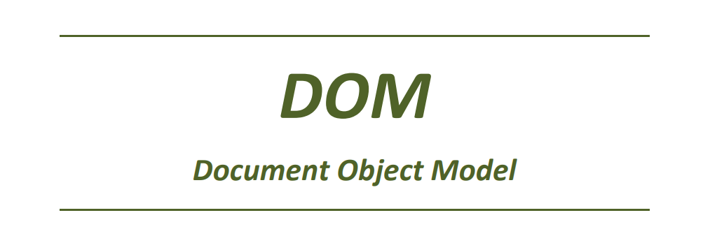

## El DOM (Document Object Model)

Fins ara hem treballat amb dos parts separades:

* HTML, que definix l’estructura de la pàgina
* JavaScript, que treballa amb dades i amb lògica

Però en una aplicació web real, estes dos parts han de connectar.

Necessitem poder accedir als elements HTML des de JavaScript per:

* llegir informació
* modificar-la
* crear nous elements
* eliminar-los
* reaccionar a accions de l’usuari

Per a això utilitzem el **DOM**.

---

## Del HTML al DOM

Quan escrivim HTML, el navegador no treballa amb el text tal com està escrit.

Per exemple:

```html
<body>
    <h1>Hola</h1>
    <p>Benvinguts</p>
</body>
```

El navegador transforma este codi en una estructura jeràrquica.

Aquesta estructura s’organitza com un arbre:

* `body` és el node principal
* dins de `body` hi ha `h1` i `p`
* cada element és un node

---

## Representació del DOM

A continuació es pot veure aquesta estructura en forma d’arbre:

{: .text-center }


---

En este punt hem de tindre clar:

No treballem amb el text HTML, sinó amb objectes que representen els elements.

---

## Què és el DOM

Quan el navegador carrega una pàgina HTML, construïx una estructura interna formada per objectes.

Per exemple, si tenim:

```html
<h1 id="titol">Hola</h1>
<p>Benvinguts</p>
```

el navegador crea:

* un objecte que representa el `<h1>`
* un objecte que representa el `<p>`
* els seus atributs
* el seu contingut

Aquesta estructura és el **DOM**.

Per tant, JavaScript no treballa amb el text HTML, sinó amb **objectes que representen els elements de la pàgina**.

---

## `document`: punt d’entrada

Per accedir a aquesta estructura utilitzem:

```javascript
document
```

`document` és un objecte global que representa tota la pàgina.

També es pot entendre com l’arrel de l’arbre DOM.

A partir de `document` podem:

* buscar elements
* crear-los
* modificar-los

Tot el treball amb el DOM comença ací.

---

## Selecció d’elements

Per poder modificar un element, primer cal seleccionar-lo.

La forma més habitual és utilitzar `querySelector`.

```javascript
document.querySelector(...)
```

### Exemple

```html
<h1 id="titol">Hola</h1>
```

```javascript
const titol = document.querySelector("#titol");
console.log(titol);
```

```javascript
// Eixida:
<h1 id="titol">Hola</h1>
```

El que es guarda en la variable `titol` no és el text “Hola”, sinó l’element complet.

És un objecte del DOM que representa l’element `<h1>`.

Això és important perquè després podem accedir a propietats com:

```javascript
titol.textContent
titol.innerHTML
```

També podem utilitzar altres selectors:

```javascript
document.querySelector("h1");
document.querySelector(".destacat");
```

---

## Selecció múltiple

Per seleccionar diversos elements utilitzem:

```javascript
document.querySelectorAll(...)
```

```javascript
const elements = document.querySelectorAll("li");
console.log(elements);
```

```javascript
// Eixida:
NodeList(3) [...]
```

En este cas obtenim una col·lecció d’elements.

---

## Lectura i modificació de contingut

Una vegada tenim un element, podem llegir o modificar el seu contingut.

```javascript
const titol = document.querySelector("#titol");

console.log(titol.textContent);
titol.textContent = "Benvinguts";
```

```javascript
// Eixida:
Hola
```

`textContent` treballa amb text.

Si assignem un valor, es reemplaça el contingut existent.

---

## Inserció de HTML

Quan necessitem inserir codi HTML utilitzem `innerHTML`.

```javascript
const caixa = document.querySelector("#caixa");
caixa.innerHTML = "<p>Hola món</p>";
```

Si fem:

```javascript
caixa.textContent = "<p>Hola</p>";
```

el navegador mostrarà literalment:

```text
<p>Hola</p>
```

En canvi:

```javascript
caixa.innerHTML = "<p>Hola</p>";
```

interpreta el contingut i crea un element real.

---

## Modificació d’atributs

Els atributs dels elements també es poden llegir i modificar.

```html

```

```javascript
const foto = document.querySelector("#foto");

console.log(foto.src);
console.log(foto.alt);

foto.src = "nova.jpg";
foto.alt = "Imatge nova";
```

```javascript
// Eixida:
[URL completa]
Imatge inicial
```

---

## Creació d’elements

Per crear un element utilitzem `createElement`.

```javascript
const paragraf = document.createElement("p");
paragraf.textContent = "Hola";
```

En este punt l’element existix, però encara no forma part del document visible.

---

## Inserció en el DOM

Per afegir l’element a la pàgina utilitzem `appendChild`.

```javascript
document.body.appendChild(paragraf);
```

Només després d’este pas l’element apareix en la pàgina.

Açò implica que crear un element i inserir-lo són dos operacions diferents.

---

## Eliminació d’elements

Per eliminar un element:

```javascript
const element = document.querySelector("#missatge");
element.remove();
```

---

## Esdeveniments

Els esdeveniments permeten executar codi en resposta a accions de l’usuari.

```html
<button id="boto">Fes clic</button>
```

```javascript
const boto = document.querySelector("#boto");

boto.addEventListener("click", () => {
    console.log("Has fet clic");
});
```

```javascript
// Eixida (en fer clic):
Has fet clic
```

La funció no s’executa en el moment de definir l’esdeveniment.

S’executa quan es produïx el clic.

Per això és important no cridar la funció en eixe moment:

```javascript
boto.addEventListener("click", saludar());
```

Açò executaria la funció immediatament.

La forma correcta és passar la referència:

```javascript
boto.addEventListener("click", saludar);
```

---

## Generació de HTML a partir de dades

Este és el punt clau per al següent tema.

```html
<ul id="llista"></ul>
```

```javascript
const noms = ["Anna", "Marc", "Pau"];

const llista = document.querySelector("#llista");

noms.forEach(nom => {
    const li = document.createElement("li");
    li.textContent = nom;
    llista.appendChild(li);
});
```

Resultat:

```html
<li>Anna</li>
<li>Marc</li>
<li>Pau</li>
```

En este procés:

* partim de dades (array)
* recorrem les dades
* generem elements HTML
* els inserim en el DOM

Este mecanisme és la base del que posteriorment automatitzarem amb Alpine.

---

## Relació amb Alpine

En este tema hem treballat el DOM de forma manual:

* seleccionem elements
* creem elements
* els inserim

Amb Alpine este procés es simplifica:

* les dades definixen l’estat
* el HTML es genera automàticament

Però per entendre què fa Alpine, és imprescindible haver entés abans el funcionament del DOM.

---

## Resum

* el DOM és la representació en objectes del HTML
* `document` és el punt d’entrada
* `querySelector` permet seleccionar elements
* `textContent` modifica text
* `innerHTML` interpreta HTML
* `createElement` crea elements
* `appendChild` els inserix
* `remove` elimina elements
* `addEventListener` gestiona esdeveniments
* podem generar HTML a partir de dades

---
