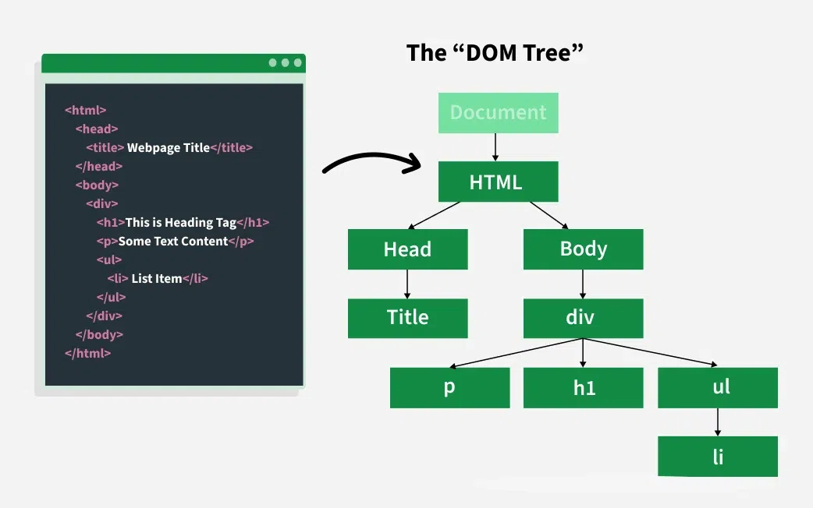

---

title: 2.- Document Object Model (DOM)
parent: 5.- JavaScript
layout: default
nav_order: 20
has_children: true

---

# Document Object Model

Les sigles **DOM** signifiquen *Document Object Model*, o el que és el mateix, l'estructura del document HTML.

- El DOM és una **API de W3C** que permet que els programes i els scripts d’una pàgina web actualitzen i accedisquen tant als continguts, els estils i l’estructura d’un document **HTML** o **XML**. 

- Per tant, **el DOM ens permet accedir dinàmicament a les pàgines web**, interactuar i respondre a les accions dels usuaris (com prémer un botó, moure el ratolí, fer clic en una part del document, escriure un text, etc.), sense haver de **recarregar** la pàgina.

Una pàgina **HTML** està formada per múltiples etiquetes **HTML**, anidades una dins de l'altra, formant un arbre d'etiquetes relacionades entre si, que es denomina **arbre DOM** (o simplement **DOM**).




Quan ens referim al **DOM**, ens referim a aquesta estructura d'arbre, que ens permet accedir i modificar els elements de l'**HTML** des de **JavaScript**, afegint noves etiquetes, modificant o eliminant altres, canviant els seus atributs **HTML**, afegint classes, canviant el contingut de text, etc.

En **JavaScript**, la forma d'accedir al **DOM** és a través d'un objecte anomenat `document`, que representa l'arbre **DOM** de la pàgina. En el seu interior poden existir diversos tipus d'elements, però principalment seran **ELEMENT** o **NODE**.

---

## Principals Conceptes del DOM

### Document
El **document** és l'objecte principal del **DOM**, que representa tot el document **HTML** o **XML** carregat al navegador. És el punt d'entrada principal per accedir als altres elements del **DOM**.

```javascript
// Accedim a l'objecte document
const doc = document;
// Podem utilitzar-lo per accedir a altres elements
const titol = doc.getElementById('titol');
```
A l’exemple, accedim a l'objecte `document`, que representa el document **HTML** actual. Després, utilitzem el mètode `getElementById` per obtenir una referència al títol de la pàgina utilitzant el seu identificador `"titol"`.

### Node
En el **DOM**, cada element, atribut o text del document és considerat un **node**. Això inclou no només els elements **HTML**, sinó també els nodes de text i els atributs associats amb els elements.

```javascript
// Accedim a un node de text
const textNode = document.createTextNode('Este és un text');
// Creem un element
const element = document.createElement('div');
// Afegim el node de text com a fill de l'element
element.appendChild(textNode);
```

### Element
Els **elements** són un tipus especial de **node** que representa les etiquetes **HTML** com `<div>`, `<p>`, `<span>`, etc. Cada element pot tindre atributs i contingut de text associat.

```javascript
// Creem un nou element div
const divElement = document.createElement('div');
// Afegim un atribut a l'element
divElement.setAttribute('id', 'nouDiv');
// Afegim contingut de text a l'element
divElement.textContent = 'Aquest és un nou div';
// Afegim l'element al document
document.body.appendChild(divElement);
```

### Atribut
Un **atribut** és una característica específica d'un element **HTML**, com l'atribut `id` o `class`. Els atributs proporcionen informació addicional sobre l'element i poden ser utilitzats per identificar o estilitzar l'element.

```javascript
// Accedim a un element pel seu id
const element = document.getElementById('meuElement');
// Canviem un atribut de l'element
element.setAttribute('alt', 'Nova descripció');
```

### Nivell d'Element
El **nivell d'element** fa referència a la relació jeràrquica entre els elements del document, que es representa com un arbre en el **DOM**. Cada element té un **pare** (excepte el `document`), i pot tindre **fills** i **germans**.

```javascript
// Accedim al pare d'un element
const fill = document.getElementById('fill');
const pare = fill.parentNode;
console.log('El pare de l\'element fill és:', pare.tagName);
```

### Selecció d'Elements
La **selecció d'elements** és la capacitat de trobar i accedir als elements del **DOM** utilitzant mètodes com `getElementById`, `getElementsByClassName`, `getElementsByTagName`, `querySelector` i `querySelectorAll`.

```javascript
// Seleccionem un element per id
const elementId = document.getElementById('idElement');
// Seleccionem elements per classe
const elementsClasse = document.getElementsByClassName('classeElement');
// Seleccionem elements per etiqueta
const elementsEtiqueta = document.getElementsByTagName('p');
// Utilitzem selectors CSS
const elementSelector = document.querySelector('.selectorClasse');
const elementsSelector = document.querySelectorAll('p');
```

### Manipulació del DOM
La **manipulació del DOM** és la capacitat de modificar l'estructura, l'estil i el contingut del document, afegint o eliminant elements, canviant atributs i text, modificant estils **CSS**, etc.

```javascript
// Creem un nou element
const nouElement = document.createElement('div');
// Afegim el nou element com a fill d'un altre element
pare.appendChild(nouElement);
// Eliminem un element
pare.removeChild(fill);
```

### Esdeveniments del DOM
Els **esdeveniments** són accions que es produeixen en el navegador, com clics de ratolí, premses de tecles o càrregues de pàgines.

```javascript
// Afegim un esdeveniment de clic a un element
const meuElement = document.getElementById('meuElement');
meuElement.addEventListener('click', function() {
    alert('S\'ha clicat l\'element!');
});

---


