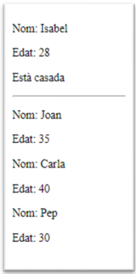

---

title: 4.- JsRender
parent: 5.- JavaScript
layout: default
nav_order: 40
has_children: true

---

# JsRender

**JsRender** és una biblioteca JavaScript que ens permet generar HTML de manera senzilla utilitzant plantilles. Forma part de la família **JsViews**, que també inclou eines com **JsViews** per a la vinculació de dades (data binding).

Amb JsRender podem crear contingut dinàmic d'una manera eficient gràcies a la seua sintaxi flexible.

---

## Sintaxi bàsica de JsRender

### 1. Interpolació de dades

La **interpolació** és el procés de substituir variables dins d’una plantilla pels seus valors reals. Es fa servir la sintaxi:

```js
{{:variable}}
```

**Exemple:**

```html
<script id="myTemplate" type="text/x-jsrender">
  <div>
    <p>El meu nom és {{:nom}} i tinc {{:edat}} anys.</p>
  </div>
</script>
```

Quan es renderitza la plantilla, `{{:nom}}` i `{{:edat}}` es substitueixen pels valors corresponents de l’objecte de dades.

**Nota**: Si alguna variable no existeix, JsRender no mostrarà res en eixe lloc del text.

---

### 2. Sentències condicionals

JsRender permet mostrar contingut diferent segons una condició, es a dir, podem utilitzar sentències condicionals per controlar quin contingut es renderitza a la plantilla

Utilitzem:

```js
{{if condició}} ... {{else}} ... {{/if}}
```

**Exemple:**

```html
<script id="myTemplate" type="text/x-jsrender">
  {{if edat >= 18}}
    <p>Major d'edat</p>
  {{else}}
    <p>Menor d'edat</p>
  {{/if}}
</script>
```

En este cas, si la propietat `edat` és major o igual a 18, es renderitzarà *Major d'edat*; en cas contrari, *Menor d'edat*.

---

### 3. Iteració sobre arrays

Si volem mostrar una llista d’elements d’un array, podem utilitzar:

```js
{{for array}} ... {{/for}}
```

**Exemple:**

```html
<script id="myTemplate" type="text/x-jsrender">
  <ul>
    {{for persones}}
      <li>{{:nom}} - {{:edat}}</li>
    {{/for}}
  </ul>
</script>
```

La plantilla recorre l’array `persones` i mostra cada objecte dins d’un element `<li>` amb el seu nom i edat.

---

### 4. Iteració sobre les propietats d’un objecte

També podem recórrer totes les propietats d’un objecte amb:

```js
{{props objecte}} ... {{/props}}
```

**Exemple:**

```html
<script id="myTemplate" type="text/x-jsrender">
  <ul>
    {{props persona}}
      <li>{{:prop}}: {{:~val}}</li>
    {{/props}}
  </ul>
</script>
```

En este cas, per a cada propietat de l’objecte `persona`, es mostrarà una línia amb el nom de la propietat (`prop`) i el seu valor (`val`).

---

## Com utilitzar JsRender pas a pas

### Pas 1: Incloure la biblioteca JsRender i jQuery

Podem incloure JsRender amb un CDN al nostre document HTML:

```html
<script src="https://cdnjs.cloudflare.com/ajax/libs/jsrender/1.0.13/jsrender.min.js"></script>
```

També necessitarem jQuery, ja que JsRender s’integra amb ell:

```html
<script src="https://cdnjs.cloudflare.com/ajax/libs/jquery/3.7.1/jquery.min.js"></script>
```

---

### Pas 2: Crear una plantilla HTML

Definim una plantilla dins d’una etiqueta `<script>` amb un tipus especial. Aquest tipus impedeix que el navegador execute el contingut com a JavaScript.

```html
<script id="plantilla-persona" type="text/x-jsrender">
  <div>
    <p>Nom: {{:nom}}</p>
    <p>Edat: {{:edat}}</p>
  </div>
</script>
```

---

### Pas 3: Renderitzar la plantilla amb dades

Per a renderitzar una plantilla JsRender, fem servir el mètode `$.templates()`, que **recupera la plantilla pel seu id** i la prepara per ser utilitzada. 
Després, utilitzem `.render(dades)` per generar el codi HTML amb les dades corresponents.

```html
<div id="sortida"></div>

<script>

  // Dades per a la plantilla
  var dades = {
    nom: "Jaume Aragó",
    edat: 30
  };

  // Renderitzar la plantilla amb les dades
  var plantilla = $.templates("#plantilla-persona");
  var htmlSortida = plantilla.render(dades);

  // Afegir l'HTML generat al DOM
  $("#sortida").html(htmlSortida);
</script>
```

> **Nota**: `$(selector).html(html)` és un mètode de jQuery que serveix per inserir codi HTML dins d’un element del DOM.

---

### Pas 4: Usar bucles i condicionals junts

Podem combinar la iteració amb condicions per mostrar contingut més dinàmic:

```html
<script id="plantilla-persones" type="text/x-jsrender">
  {{for persones}}
    <div>
      <p>Nom: {{:nom}}</p>
      <p>Edat: {{:edat}}</p>
    </div>
  {{/for}}
</script>

<div id="sortida"></div>

<script>
  // Dades per a la plantilla
  var dades = {
    persones: [
      { nom: "Jaume Aragó", edat: 30 },
      { nom: "Verònica Mascarós", edat: 25 },
      { nom: "Andrei Micleusanu", edat: 40 }
    ]
  };

  // Renderitzar la plantilla amb les dades
  var plantilla = $.templates("#plantilla-persones");
  var htmlSortida = plantilla.render(dades);

  // Afegir l'HTML generat al DOM
  $("#sortida").html(htmlSortida);
</script>
```

---

## Exemple complet amb JSON extern

També podem carregar les dades des d’un fitxer `.json` extern i renderitzar-les. Per a fer-ho, utilitzem `$.getJSON()`, un mètode de jQuery que **fa una petició GET i retorna les dades JSON com a objecte JavaScript**, ja parsejat.

### Arxiu `dades.json`

```json
{
  "persona": {
    "nom": "Isabel",
    "edat": 28,
    "casada": true
  },
  "persones": [
    {"nom": "Joan", "edat": 35},
    {"nom": "Carla", "edat": 40},
    {"nom": "Pep", "edat": 30}
  ]
}
```

### HTML principal

```html
<!DOCTYPE html>
<html lang="ca">
<head>
  <meta charset="UTF-8">
  <title>Exemple JsRender</title>
  <script src="https://cdnjs.cloudflare.com/ajax/libs/jquery/3.7.1/jquery.min.js"></script>
  <script src="https://cdnjs.cloudflare.com/ajax/libs/jsrender/1.0.13/jsrender.min.js"></script>
</head>
<body>
  <div id="persona"></div>
  <hr>
  <div id="persones"></div>

  <script id="plantilla-persona" type="text/x-jsrender">
    <div>
      <p>Nom: {{:nom}}</p>
      <p>Edat: {{:edat}}</p>
      {{if casada}}
        <p>Està casada</p>
      {{else}}
        <p>No està casada</p>
      {{/if}}
    </div>
  </script>

  <script id="plantilla-persones" type="text/x-jsrender">
    {{for persones}}
      <div>
        <p>Nom: {{:nom}}</p>
        <p>Edat: {{:edat}}</p>
      </div>
    {{/for}}
  </script>

  <script>
    // Quan el document estiga carregat
    $(function() {
       // Carreguem les dades JSON externes
      $.getJSON("dades.json", function(dades) {
        // Renderitzar una persona
        var plantillaPersona = $.templates("#plantilla-persona");
        var htmlPersona = plantillaPersona.render(dades.persona);
        $("#persona").html(htmlPersona);

        // Renderitzar la plantilla per a l'array de persones  
        var plantillaPersones = $.templates("#plantilla-persones");
        var htmlPersones = plantillaPersones.render(dades);
        $("#persones").html(htmlPersones);
      });
    });
  </script>
</body>
</html>
```
{: .text-center }



---

## Apèndix: mètodes relacionats amb JsRender i jQuery

### `$.templates(selector)`

Este mètode és propi de JsRender i serveix per accedir a una plantilla HTML definida dins del document. Es passa un selector (normalment l'id de la plantilla) i retorna un objecte que es pot renderitzar.

**Exemple:**
```js
var plantilla = $.templates("#plantilla-persona");
var html = plantilla.render(dades);
```

---

### `$.getJSON(url, callback)`

Mètode de jQuery que fa una petició GET a una URL i recupera dades en format JSON. El resultat es parseja automàticament i es passa a la funció de callback.

**Exemple:**
```js
$.getJSON("dades.json", function(dades) {
  console.log(dades);
});
```

---

### `$(selector).html(html)`

També de jQuery. Serveix per afegir codi HTML dins d'un element seleccionat del DOM.

**Exemple:**
```js
$("#sortida").html("<p>Hola!</p>");
```

---

### `$(function() { ... })`

Forma abreujada de jQuery per executar codi quan el document està carregat (equivalent a `DOMContentLoaded`).

**Exemple:**
```js
$(function() {
  alert("Document llest!");
});
```

---

