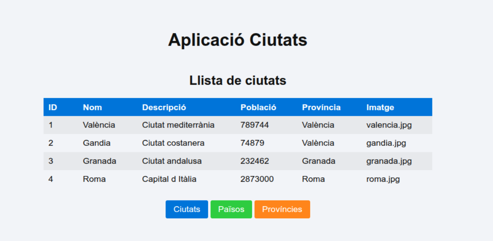
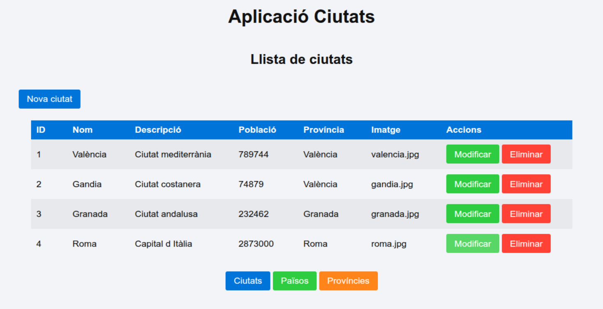

# POST 

En esta part afegirem la primera operació **POST** del projecte.

Fins ara, amb **GET**, només llegíem dades:

```text
GET /api/ciutats
```

Ara, amb **POST**, enviarem dades noves a la API perquè es guarden en la base de dades:

```text
POST /api/ciutats
```

En este primer pas treballarem només amb **ciutats**. Després podrem repetir la mateixa idea amb:

```text
POST /api/paisos
POST /api/provincies
```

---

## Punt de partida

La idea és passar d’una taula que només mostra dades a una taula preparada per al CRUD:

Partim de la vista que ja teníem amb **GET**, on només mostràvem la taula de ciutats.



Ara volem afegir botons per començar a preparar el CRUD.

L’objectiu és arribar a una vista semblant a esta:



En esta nova vista tindrem:

* un botó **Nova ciutat**
* una columna **Accions**
* botons **Modificar** i **Eliminar** en cada fila

En esta part només farem funcionar el botó **Nova ciutat** i el formulari de creació.

Els botons **Modificar** i **Eliminar** quedaran preparats visualment per a més avant.


### Idea general del canvi

Si mirem dins del fitxer 

```text

public/js/ciutats-vista.js
```

veurem que `vistaCiutats()` era la vista principal de ciutats.

És a dir, era la funció encarregada de mostrar la taula:

```javascript
function vistaCiutats() {
    return `...`;
}
```

Esta funció continuarà sent la vista principal de ciutats.

Ara l’ampliarem amb:

* un botó per anar al formulari de nova ciutat
* una columna nova d’accions

I afegirem una vista nova:

```javascript
function vistaNovaCiutat() {
    return `...`;
}
```

Esta segona vista mostrarà el formulari per crear una ciutat nova.

Per tant, dins de `ciutats-vista.js` tindrem dos vistes:

```text
vistaCiutats()       → mostra la taula
vistaNovaCiutat()    → mostra el formulari de creació
```

---


## Pas a pas


### 1. Crear el POST en `routes/ciutats.js`

En el fitxer:

```text
routes/ciutats.js
```

afig esta ruta abans de:

```javascript
module.exports = router;
```

```javascript
router.post('/', function(req, res) {
    db('CIUTAT')
        .insert({
            NOM: req.body.NOM,
            DESCRIPCIO: req.body.DESCRIPCIO,
            IMATGE: req.body.IMATGE,
            POBLACIO: req.body.POBLACIO,
            PROVINCIA_ID: req.body.PROVINCIA_ID
        })
        .then(function(resultat) {
            res.json({ missatge: 'Ciutat creada correctament' });
        })
        .catch(function(error) {
            res.status(500).json({ error: 'Error en la base de dades' });
        });
});
```

Esta ruta rep les dades amb:

```javascript
req.body
```

i les inserix en la taula:

```text
CIUTAT
```

---


#### 2. Modificar `vistaCiutats()` en `ciutats-vista.js`

En el fitxer:

```text
public/js/ciutats-vista.js
```

dins de `vistaCiutats()`, afegim el botó **Nova ciutat** després del títol:

```html
<p>
    <button onclick="mostrarNovaCiutat()">
        Nova ciutat
    </button>
</p>
```

També afegim una columna nova en la capçalera de la taula:

```html
<th>Accions</th>
```

I dins de cada fila afegim els botons:

```html
<td>
    <button class="success">Modificar</button>
    <button class="error">Eliminar</button>
</td>
```

Per tant, la part principal de la taula quedarà així:

```javascript
function vistaCiutats() {
    return `
        <section x-data="ciutatsApp()" x-init="carregarCiutats()">

            <h2>Llista de ciutats</h2>

            <p>
                <button onclick="mostrarNovaCiutat()">
                    Nova ciutat
                </button>
            </p>

            <table class="table">
                <thead>
                    <tr>
                        <th>ID</th>
                        <th>Nom</th>
                        <th>Descripció</th>
                        <th>Població</th>
                        <th>Província</th>
                        <th>Imatge</th>
                        <th>Accions</th>
                    </tr>
                </thead>

                <tbody>
                    <template x-for="ciutat in ciutats" :key="ciutat.ID">
                        <tr>
                            <td x-text="ciutat.ID"></td>
                            <td x-text="ciutat.NOM"></td>
                            <td x-text="ciutat.DESCRIPCIO"></td>
                            <td x-text="ciutat.POBLACIO"></td>
                            <td x-text="ciutat.PROVINCIA_NOM"></td>
                            <td x-text="ciutat.IMATGE"></td>
                            <td>
                                <button class="success">Modificar</button>
                                <button class="error">Eliminar</button>
                            </td>
                        </tr>
                    </template>
                </tbody>
            </table>

        </section>
    `;
}
```

`vistaCiutats()` continua sent la vista principal de ciutats. La diferència és que ara queda preparada per al CRUD.

---

### 3. Crear la vista del formulari

En el mateix fitxer:

```text
public/js/ciutats-vista.js
```

afig esta funció nova:

```javascript
function vistaNovaCiutat() {
    return `
        <section x-data="novaCiutatApp()">

            <h2>Nova ciutat</h2>

            <form @submit.prevent="afegirCiutat()">

                <label for="nom">Nom</label>
                <input id="nom" type="text" x-model="novaCiutat.NOM">

                <label for="descripcio">Descripció</label>
                <input id="descripcio" type="text" x-model="novaCiutat.DESCRIPCIO">

                <label for="poblacio">Població</label>
                <input id="poblacio" type="number" x-model="novaCiutat.POBLACIO">

                <label for="provincia">Província</label>
                <input id="provincia" type="number" x-model="novaCiutat.PROVINCIA_ID">

                <label for="imatge">Imatge</label>
                <input id="imatge" type="text" x-model="novaCiutat.IMATGE">

                <p>
                    <button type="submit">Guardar ciutat</button>
                    <button type="button"
                            class="warning"
                            onclick="mostrarCiutats()">
                        Cancel·lar
                    </button>
                </p>

            </form>

        </section>
    `;
}
```

Aquesta vista mostra el formulari de creació.

El formulari no recarrega la pàgina perquè utilitzem:

```html
@submit.prevent="afegirCiutat()"
```

Els camps es guarden en Alpine amb:

```html
x-model="novaCiutat.NOM"
```

>NOTA: En Alpine, x-model serveix per a crear un formulari reactiu. El valor del camp es guarda automàticament en l’objecte que indiquem.

---

### 4. Crear l’app Alpine del formulari

En el mateix fitxer:

```text
public/js/ciutats-vista.js
```

afegim este component:

```javascript
window.novaCiutatApp = function () {
    return {
        novaCiutat: {
            NOM: '',
            DESCRIPCIO: '',
            IMATGE: '',
            POBLACIO: '',
            PROVINCIA_ID: ''
        },

        afegirCiutat() {
            fetch('/api/ciutats', {
                method: 'POST',
                headers: {
                    'Content-Type': 'application/json'
                },
                body: JSON.stringify(this.novaCiutat)
            })
                .then(function (resposta) {
                    return resposta.json();
                })
                .then(function () {
                    mostrarCiutats();
                });
        }
    };
};
```

La funció `afegirCiutat()` fa el POST.

Envia les dades a:

```text
/api/ciutats
```

amb:

```javascript
method: 'POST'
```

i converteix l’objecte JavaScript a JSON amb:

```javascript
JSON.stringify(this.novaCiutat)
```

Quan acaba, torna a la vista principal:

```javascript
mostrarCiutats();
```

---


### 5. Afegir una funció nova en `spa.js`

En el fitxer:

```text
public/js/spa.js
```

afig esta funció:

```javascript
function mostrarNovaCiutat() {
    document.getElementById("spa").innerHTML = vistaNovaCiutat();
    Alpine.initTree(document.getElementById("spa"));
}
```

Aquesta funció canvia la vista actual i mostra el formulari de nova ciutat.

Si el teu contenidor encara es diu `app`, usa `app`. Però si ja l’has canviat a `spa`, ha de quedar com l’exemple anterior.


---


### 6. Tractament de les imatges

El camp `IMATGE` pot treballar de diverses maneres.

* **Opció A. Guardar només el nom d’una imatge local**

Podem tindre una carpeta:

```text
public/images/
```

I dins:

```text
castello.jpg
valencia.jpg
roma.jpg
```

En el formulari escrivim:

```text
castello.jpg
```

En la base de dades es guardarà:

```text
IMATGE = castello.jpg
```

Per mostrar-la, canviem esta línia de la taula:

```html
<td x-text="ciutat.IMATGE"></td>
```

per esta:

```html
<td>
    
</td>
```

Això generarà:

```html

```

---

* **Opció B. Organitzar imatges per carpetes**

També podem organitzar les imatges per tipus:

```text
public/images/ciutats/
public/images/paisos/
public/images/provincies/
```

Per exemple:

```text
public/images/ciutats/castello.jpg
```

En la base de dades podem guardar només:

```text
castello.jpg
```

I mostrar-la així:

```html
<td>
    
</td>
```

Aquesta opció és més ordenada si el projecte creix.

Si tenim una carpeta per a paisos, podem guardar:

```text
public/images/paisos/espanya.jpg
```

i la mostrar amb:

```html
<td>
    
</td>
``` 


---

* **Opció C. Guardar una URL completa**

També podem guardar una URL externa en la base de dades.

Per exemple:

```text
https://www.conociendoitalia.com/wp-content/uploads/2021/01/varenna_43.jpg
```

En eixe cas no hem d’afegir `images/`.

La taula hauria de mostrar-la així:

```html
<td>
    
</td>
```

Açò funciona si la web externa permet mostrar la imatge dins d’una altra pàgina.

Algunes webs poden bloquejar-ho. Si passa això, la URL pot obrir-se en una pestanya però no mostrar-se dins de la nostra aplicació.

---

* **Opció D. Acceptar imatges locals i URLs**

La millor opció flexible és permetre les dues formes:

* si el valor comença per `http`, és una URL externa
* si no comença per `http`, és una imatge local

Canvia:

```html
<td x-text="ciutat.IMATGE"></td>
```

per:

```html
<td>
    
</td>
```

Així:

```text
castello.jpg
```

es mostrarà com:

```text
images/ciutats/castello.jpg
```

I:

```text
https://example.com/imatge.jpg
```

es mostrarà directament com URL externa.


---

---

En el cas de tindre diverses carpetes d’imatges locals, per exemple:

```text
public/images/ciutats/
public/images/paisos/
public/images/provincies/
```

podem aplicar la mateixa idea en cada vista, canviant només la carpeta corresponent.


```html
<td>
    
</td>
```

Per a paisos:

   **: 'images/paisos/' + pais.IMATGE"**

 i per a províncies:

   **: 'images/provincies/' + provincia.IMATGE"**


i tenim varies carpetes per a una mateixa vista, la forma més neta és guardar la carpeta dins de la base de dades:

```text
public/
└── images/
    └── ciutats/
        ├── costera/
        │   └── castello.jpg
        ├── interior/
        │   └── morella.jpg
        └── capitals/
            └── valencia.jpg

```

En la base de dades es guardaria:

```text
IMATGE = costera/castello.jpg
```

